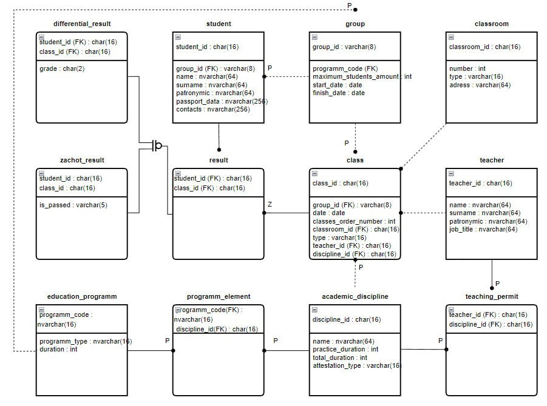

Выбранный вариант:

Создать программную систему, предназначенную для учебной части колледжа.
Она должна обеспечивать хранение сведений о каждом преподавателе, о
дисциплинах, которые он преподает, номере закрепленного за ним кабинета, о
расписании занятий. Существуют преподаватели, которые не имеют собственного
кабинета.

О студентах должны храниться следующие сведения: фамилия и имя, в какой
группе учится, какую оценку имеет в текущем семестре по каждой дисциплине.

Замдекана должен иметь возможность добавить сведения о новом преподавателе
или студенте, внести в базу данных семестровые оценки студентов каждой группы по
каждой дисциплине, удалить данные об уволившемся преподавателе и отчисленном из
колледжа студенте, внести изменения в данные об преподавателях и студентах, в том
числе поменять оценку студента по той или иной дисциплине.

В задачу диспетчера учебной части входит составление расписания.

### Ход работы

Вариант выбрал тот, модель для которого составлял на соответствующем предмете.
Схема:


Для лабораторной работы схему немного упростил, заменив zachot_result и differential_result
на одну таблицу result.

В первую очередь создал модель, перенёс туда все атрибуты и связи, которые были в схеме.
Потому настроил корректное M2M отношения для programm_element и teaching_permit.

После создал миграции.

Для view для всех сущностей использовал стандартный ModelViewSet,
а для сериализоваторов использовал ModelSerializer.

Когда начал настраивать urls, понял, что должен быть более простой способ указать все нужные
urls, погуглил, нашёл https://www.django-rest-framework.org/api-guide/routers/

Указал urls так:

```python
router = DefaultRouter()
router.register('educationprograms', EducationProgramViewSet)
router.register('academicdisciplines', AcademicDisciplineViewSet)
router.register('programelements', ProgramElementViewSet)
router.register('groups', GroupViewSet)
router.register('students', StudentViewSet)
router.register('classrooms', ClassroomViewSet)
router.register('teachers', TeacherViewSet)
router.register('classsessions', ClassSessionViewSet)
router.register('teachingpermits', TeachingPermitViewSet)
router.register('results', ResultViewSet)

urlpatterns = [
    path('api/', include(router.urls)),
]
```

Проверил что всё работает и создал пару сущностей.
Добавил в проект djoser, в settings добавил настройки:

```python
REST_FRAMEWORK = {
    'DEFAULT_AUTHENTICATION_CLASSES': [
        'rest_framework.authentication.TokenAuthentication',
    ],
    'DEFAULT_PERMISSION_CLASSES': [
        'rest_framework.permissions.IsAuthenticated',
    ],
}
```
После этого всё эндпоинты доступные только для авторизованных пользователей.

В urls добавил по документации djoser:

```python
re_path(r'^auth/', include('djoser.urls')),
re_path(r'^auth/', include('djoser.urls.authtoken')),
```

Проверил как работает djoser, понял, что из браузера работать неудобно, так как
нет возможности вводить токен. Чтобы решить проблему, подключил swagger,
потому что знал, что там можно указывать токены и что его всё равно нужно будет подключить.

Подключил swagger по инструкции из практического задания.
Случайно удалил permission_classes=(AllowAny,), из-за этого эндпоинт сваггера тоже был недоступен,
пока не добавил его обратно.

По умолчанию не выходило указывать токен. Чтобы это исправить добавил в settings.py:

```python
SWAGGER_SETTINGS = {
    'SECURITY_DEFINITIONS': {
        'Token': {
            'type': 'apiKey',
            'name': 'Authorization',
            'in': 'header',
        }
    },
}
```

После этого ввёл туда Token {тут токен от djoser} и всё заработало.
Потом написал readme file.