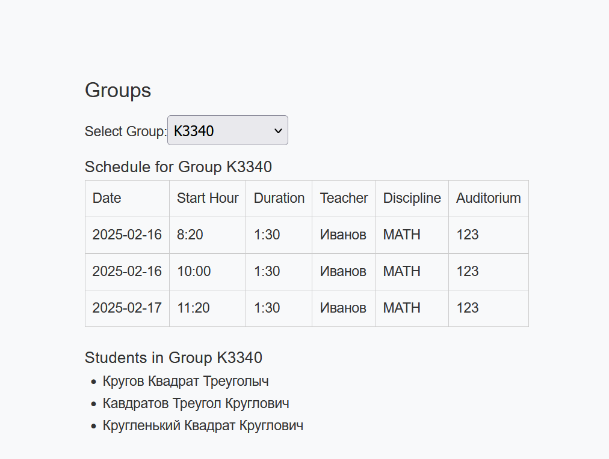
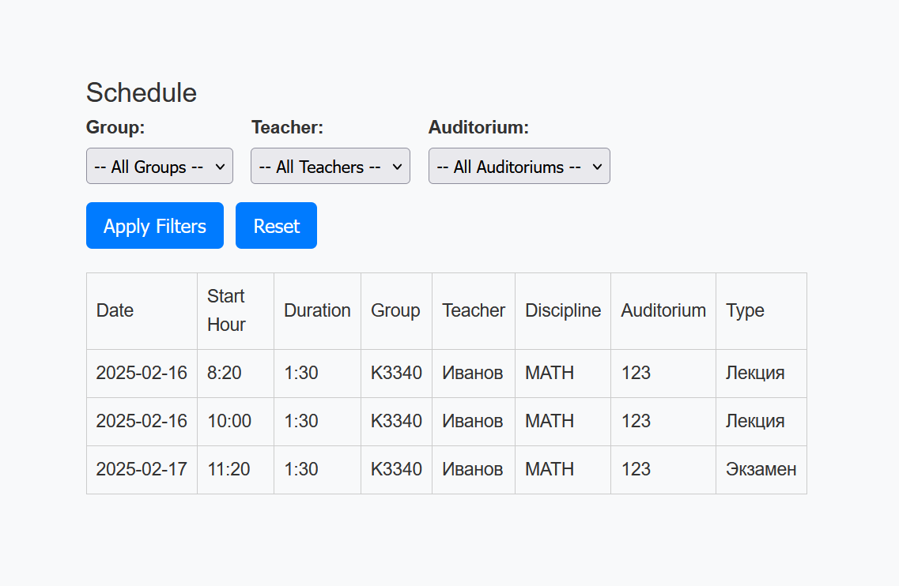
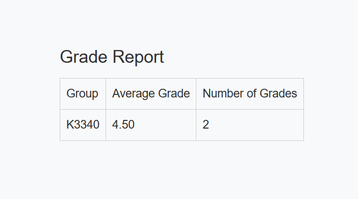

Выбранный вариант:

Создать программную систему, предназначенную для учебной части колледжа.
Она должна обеспечивать хранение сведений о каждом преподавателе, о
дисциплинах, которые он преподает, номере закрепленного за ним кабинета, о
расписании занятий. Существуют преподаватели, которые не имеют собственного
кабинета.

О студентах должны храниться следующие сведения: фамилия и имя, в какой
группе учится, какую оценку имеет в текущем семестре по каждой дисциплине.

Замдекана должен иметь возможность добавить сведения о новом преподавателе
или студенте, внести в базу данных семестровые оценки студентов каждой группы по
каждой дисциплине, удалить данные об уволившемся преподавателе и отчисленном из
колледжа студенте, внести изменения в данные об преподавателях и студентах, в том
числе поменять оценку студента по той или иной дисциплине.

В задачу диспетчера учебной части входит составление расписания.

В начале по документации https://vuejs.org/guide/quick-start.html
разобрался как создать проект.

На стандартную home страницу добавил кнопки для логина и логаута.
Чтобы логин корректно работал, при успешном логине токен записывается в localStorage.
После этого в api.js я добавляю токен в заголовок запроса.
В router/index.js добавил проверку на наличие токена в localStorage, если его нет,
то пользователь перенаправляется на страницу логина.

Во время проверки понял, что не был настроен CORS, добавил в settings.py третьей лабы:

```python
CORS_ORIGIN_ALLOW_ALL = False

CORS_ORIGIN_WHITELIST = (
    'http://localhost:5173',
)
```

После этого всё заработало.
Потом добавил страницу для преподователей, дал возможность их создавать и давать им права на преподавание.
Сделал отображение для дисциплин и программ обучения, с возможностью их редактирования.

Потом делал страницу групп, на которой было отображение студентов и расписание этой группы.


Это было сложно, так как нужно было отправлять много запросов для составления одной такой таблички,
так как для занятий отдавались ID учителей и аудиторий и их ещё нужно было преобразовать в нормальные данные.

Дальше я добавил такое же раписание на страницу к преподавателям, так как это требовалось по заданию.

После сделал отдельную страницу с расписанием на вообще всех.


Потом занялся сводной ведомостью. Тут было не до конца понятно что делать,
так как требовалось вычислять среднюю оценку на группу, а при этом оценка могла быть
даже не числом (зачтено/не зачтено). Решил для упрощения игнорировать нечисловые оценки.

