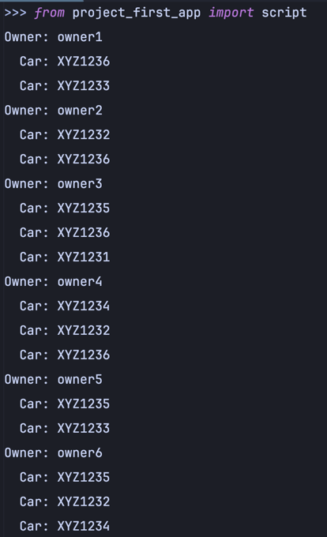

Напишите запрос на создание 6-7 новых автовладельцев и 5-6 автомобилей, каждому автовладельцу назначьте удостоверение и от 1 до 3 автомобилей.

### Листинг
```python
import random
from datetime import date, timedelta
from .models import Owner, Car, DriverLicense, Ownership


def random_date(start, end):
    return start + timedelta(
        days=random.randint(0, int((end - start).days))
    )


for i in range(1, 8):
    owner = Owner.objects.create_user(
        username=f'owner{i}',
        email=f'owner{i}@example.com',
        password='password123',
        birth_date=random_date(date(1960, 1, 1), date(2000, 12, 31)),
        passport=f'AB12345{i}',
        address=f'123 Main St, City {i}',
        nationality='Country'
    )

    DriverLicense.objects.create(
        owner_id=owner,
        type='B',
        issue_date=random_date(date(2000, 1, 1), date.today())
    )

cars = []
for j in range(1, 7):
    car = Car.objects.create(
        number=f'XYZ123{j}',
        brand='BrandName',
        model=f'Model{j}',
        color='Blue'
    )
    cars.append(car)

for owner in Owner.objects.all():
    owned_cars = random.sample(cars, random.randint(1, 3))
    for car in owned_cars:
        Ownership.objects.create(
            owner=owner,
            car=car,
            start_date=random_date(date(2010, 1, 1), date.today()),
            end_date=random_date(date(2010, 1, 1), date.today())
        )

for owner in Owner.objects.all():
    print(f'Owner: {owner.username}')
    for owning in Ownership.objects.filter(owner=owner):
        print(f'  Car: {owning.car.number}')
```
### Результат

