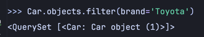
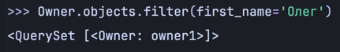
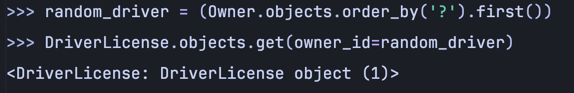
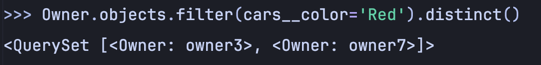
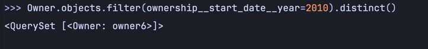

### 1. Выведете все машины марки “Toyota”
**Листинг**
```python
Car.objects.filter(brand='Toyota')
```

**Результат**
<br>


### 2. Найти всех водителей с именем “Олег”
**Листинг**
```python
Owner.objects.filter(first_name='Олег')
```

**Результат**
<br>


### 3. Взяв любого случайного владельца получить его id, и по этому id получить экземпляр удостоверения в виде объекта модели
**Листинг**
```python
random_driver = (Owner.objects.order_by('?').first())
DriverLicense.objects.get(owner_id=random_driver)
```

**Результат**
<br>


### 4. Вывести всех владельцев красных машин
**Листинг**
```python
Owner.objects.filter(cars__color='Red').distinct()
```

**Результат**
<br>


### 5. Найти всех владельцев, чей год владения машиной начинается с 2010
**Листинг**
```python
Owner.objects.filter(ownership__start_date__year=2010).distinct()
```

**Результат**
<br>
