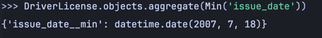
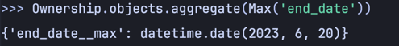
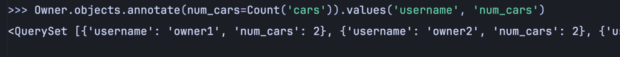
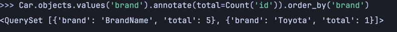
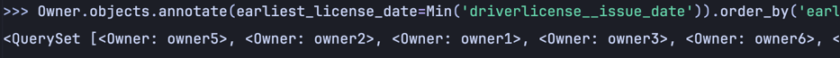

### 1. Вывод даты выдачи самого старшего водительского удостоверения
```python
from django.db.models import Min
DriverLicense.objects.aggregate(Min('issue_date'))
```

**Результат**
<br>


### 2. Укажите самую позднюю дату владения машиной, имеющую какую-то из существующих моделей в вашей базе
**Листинг**
```python
from django.db.models import Max
Ownership.objects.aggregate(Max('end_date'))
```

**Результат**
<br>


### 3. Выведите количество машин для каждого водителя
**Листинг**
```python
from django.db.models import Count
Owner.objects.annotate(num_cars=Count('cars')).values('username', 'num_cars')
```

**Результат**
<br>


### 4. Подсчитайте количество машин каждой марки
**Листинг**
```python
Car.objects.values('brand').annotate(total=Count('id')).order_by('brand')
```

**Результат**
<br>


### 5. Отсортируйте всех автовладельцев по дате выдачи удостоверения
**Листинг**
```python
Owner.objects.annotate(earliest_license_date=Min('driverlicense__issue_date')).order_by('earliest_license_date').distinct()
```

**Результат**
<br>
