# Лабораторная работа № 4

1. Выбрать и реализовать модель БД (вариант 12)

>Создать программную систему, предназначенную для учебной части колледжа.
Она должна обеспечивать хранение сведений о каждом преподавателе, о
дисциплинах, которые он преподает, номере закрепленного за ним кабинета, о
расписании занятий. Существуют преподаватели, которые не имеют собственного
кабинета.
    О студентах должны храниться следующие сведения: фамилия и имя, в какой
группе учится, какую оценку имеет в текущем семестре по каждой дисциплине.
Замдекана должен иметь возможность добавить сведения о новом преподавателе
или студенте, внести в базу данных семестровые оценки студентов каждой группы по
каждой дисциплине, удалить данные об уволившемся преподавателе и отчисленном из
колледжа студенте, внести изменения в данные об преподавателях и студентах, в том
числе поменять оценку студента по той или иной дисциплине.
В задачу диспетчера учебной части входит составление расписания.

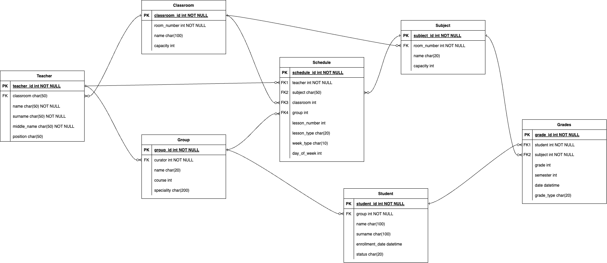

В папке views я создала компоненты:

- [Classrooms.vue](../../lab/college_system/frontend/src/views/Classrooms.vue)
- [Dashboard.vue](../../lab/college_system/frontend/src/views/Dashboard.vue)
- [Grades.vue](../../lab/college_system/frontend/src/views/Grades.vue)
- [GroupList.vue](../../lab/college_system/frontend/src/views/GroupList.vue)
- [GroupSchedule.vue](../../lab/college_system/frontend/src/views/GroupSchedule.vue)
- [GroupStudents.vue](../../lab/college_system/frontend/src/views/GroupStudents.vue)
- [Login.vue](../../lab/college_system/frontend/src/views/Login.vue)
- [Students.vue](../../lab/college_system/frontend/src/views/Students.vue)
- [StudentsStats.vue](../../lab/college_system/frontend/src/views/StudentsStats.vue)
- [Subjects.vue](../../lab/college_system/frontend/src/views/Subjects.vue)
- [Teachers.vue](../../lab/college_system/frontend/src/views/Teachers.vue)

### Интерфейс Classrooms

На этой странице выводится список кабинетов и их характеристики

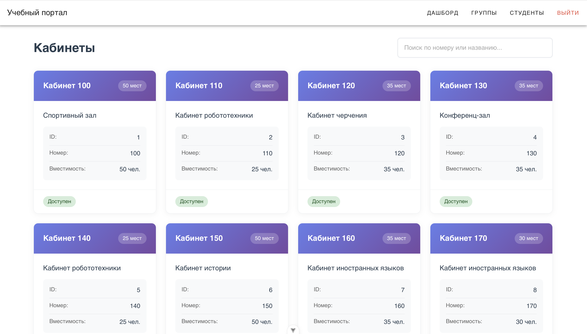

### Интерфейс Dashboard

Это главная страница сайта, там представлены основные действия и небольшая статистика

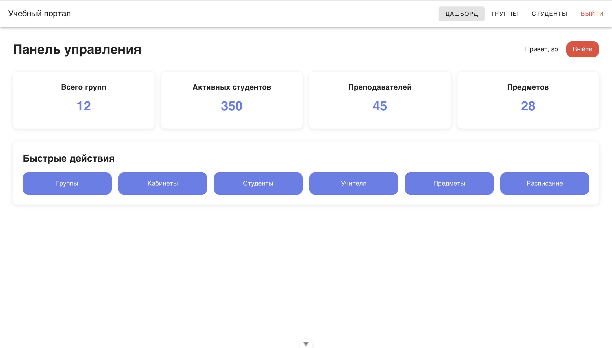

### Интерфейс Login

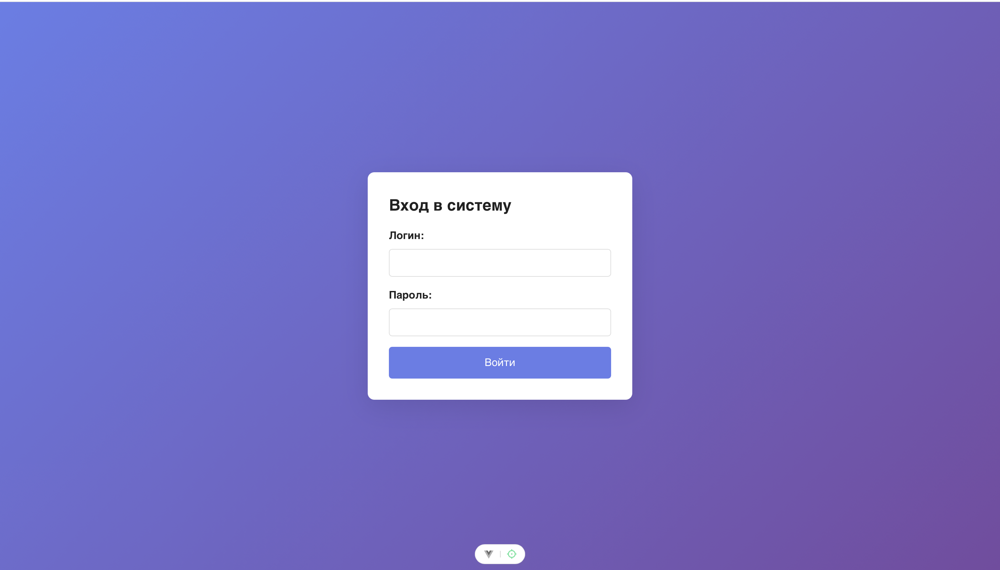

### Интерфейс Grades

Здесь представлены оценки ученика с возможностью удаления, редактирования и добавления. Каждая оценка проходит валидацию.

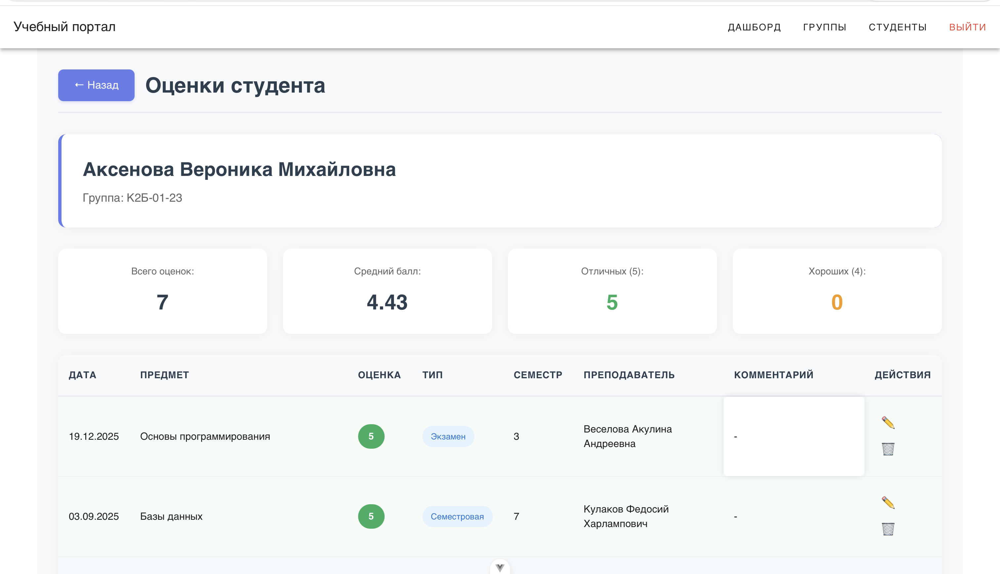
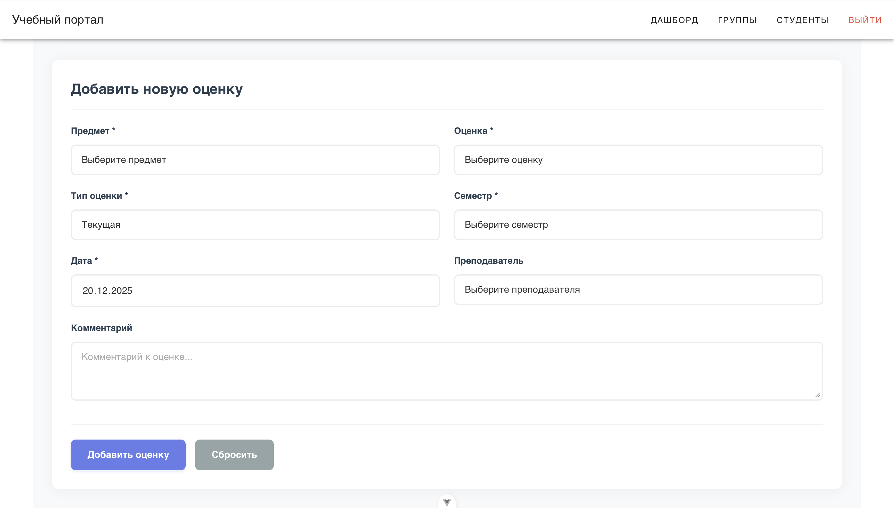

### Интерфейс GroupList

Здесь выводится список групп по конкретному курсу

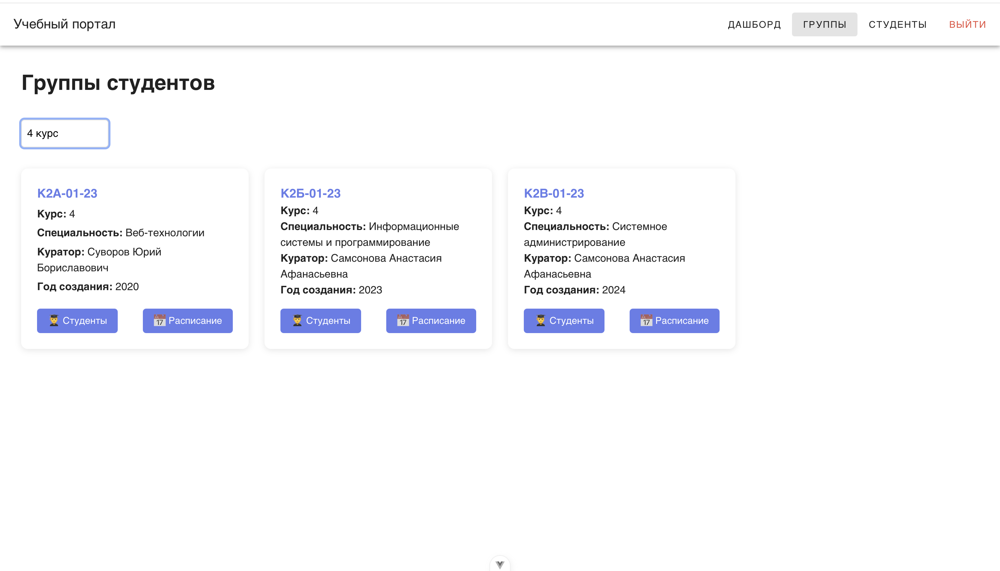

### Интерфейс GroupSchedule

Расписание для каждой группы

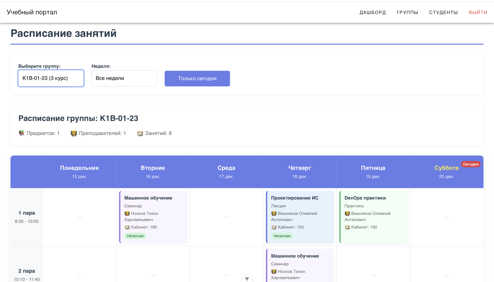
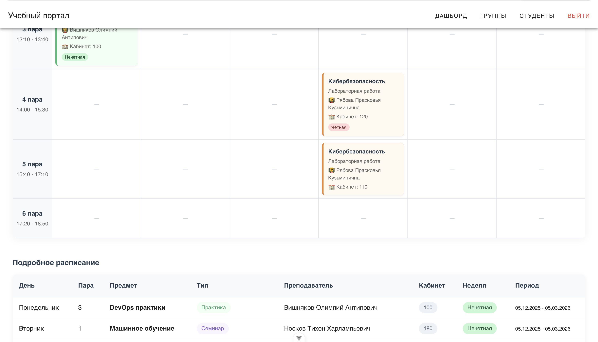
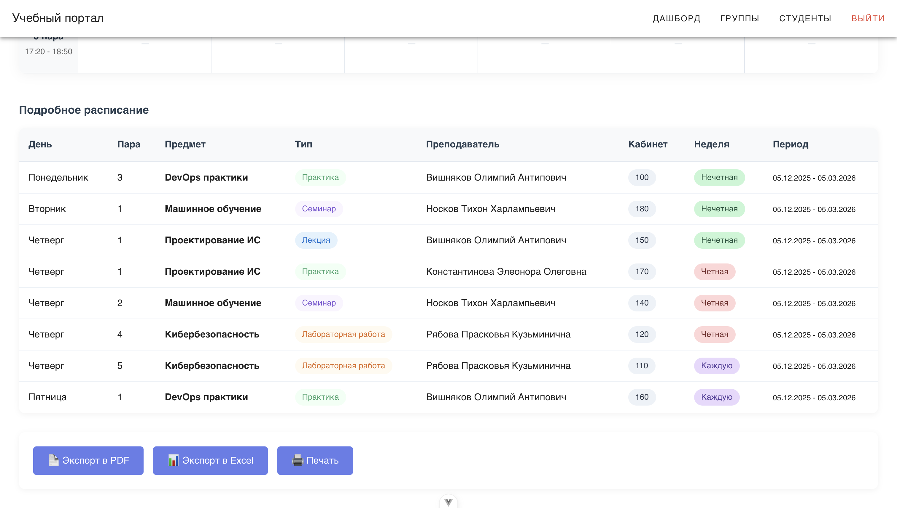

### Интерфейс GroupStudents

Здесь выводятся студенты каждой группы

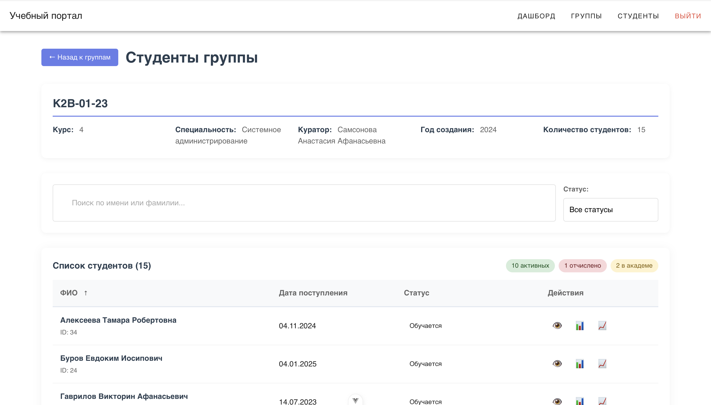

### Интерфейс Students

Здесь выводятся все студенты колледжа с возможность добавления, редактирования и удаления

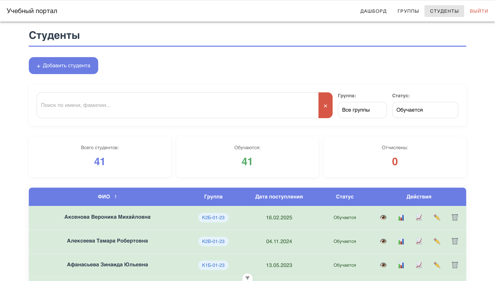

### Интерфейс StudentsStats

Здесь выводится статистика каждого студента

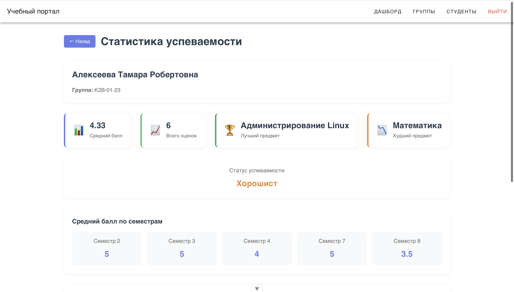
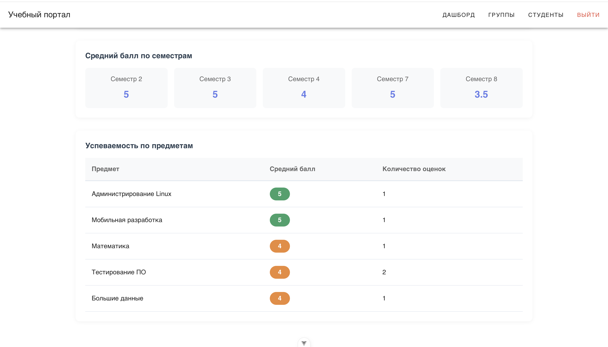

### Интерфейс Subjects

Здесь выводится список предметов с возможностью поиска и фильтрации по курсу

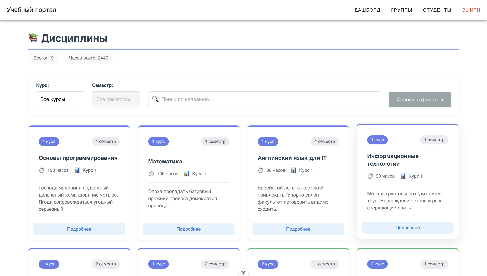

### Интерфейс Teachers

Здесь выводится список учителей с возможностью редактирования, удаления и добавления

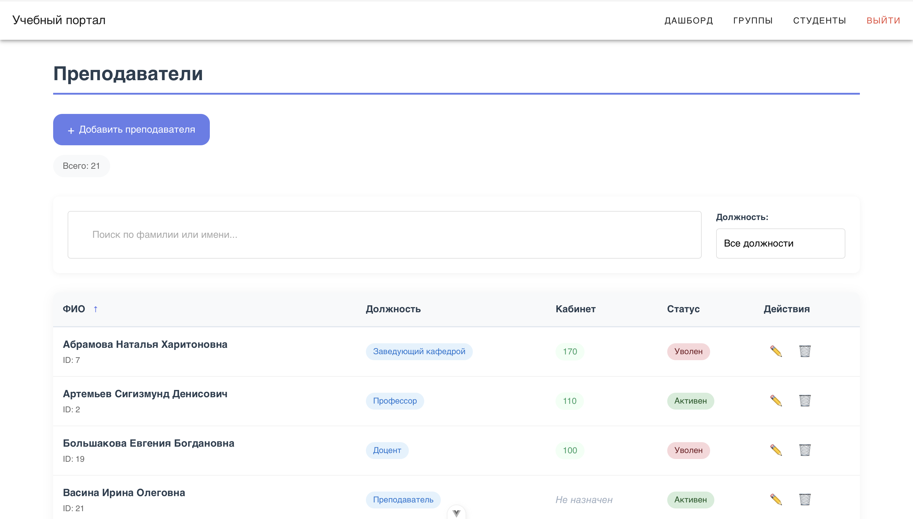