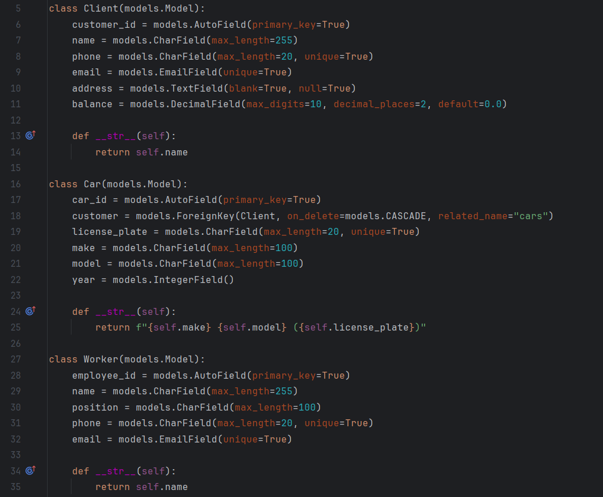
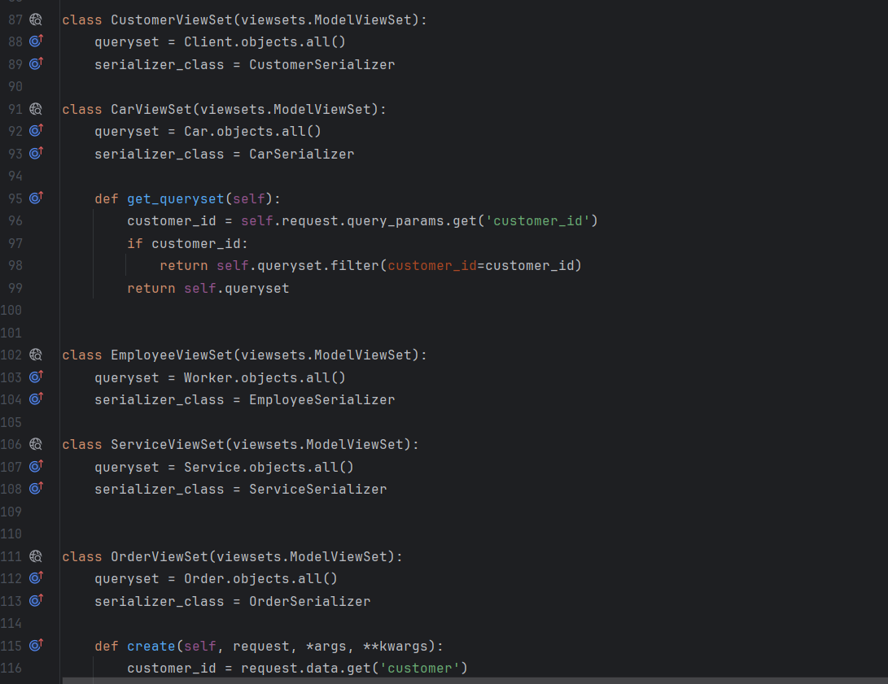
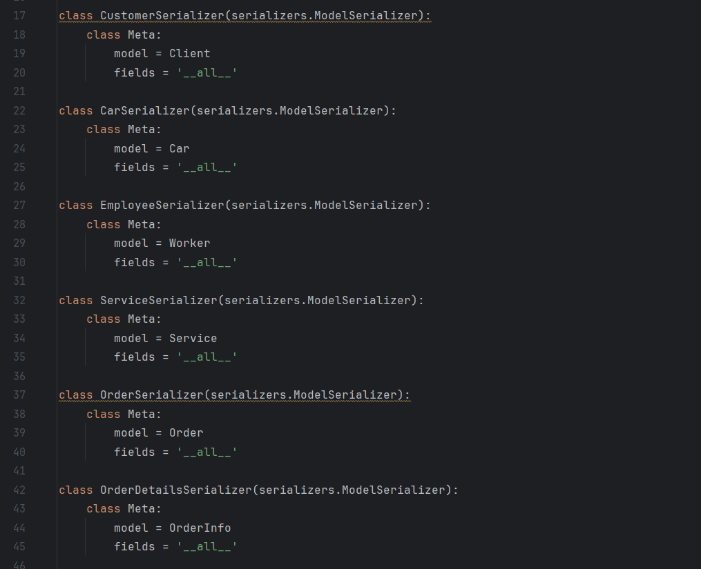
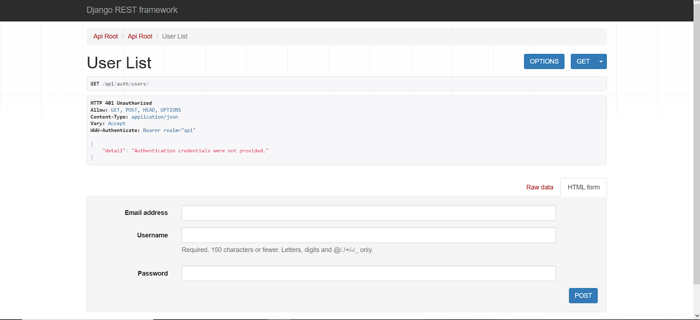

# Лабораторная работа 3. Реализация серверной части на django rest. Документирование API.

Цель работы: овладеть практическими навыками реализации серверной части (backend) приложений средствами Django REST framework.
1. Реализовать модель базы данных средствами DjangoORM:

В models.py создаем модели Клиент, Машина, Заказ, Рабочий и т.д

2. Реализовать логику работу API средствами Django REST Framework (используя методы сериализации):

Создаем представления в view.py

Добавляем сериализаторы в файл serializers.py

3. Подключить регистрацию / авторизацию по токенам / вывод информации о текущем пользователе средствами Djoser:

Для регистрации переходим по пути http://127.0.0.1:8000/api/auth/users/

