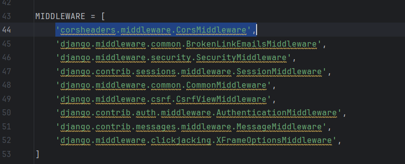
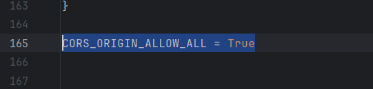
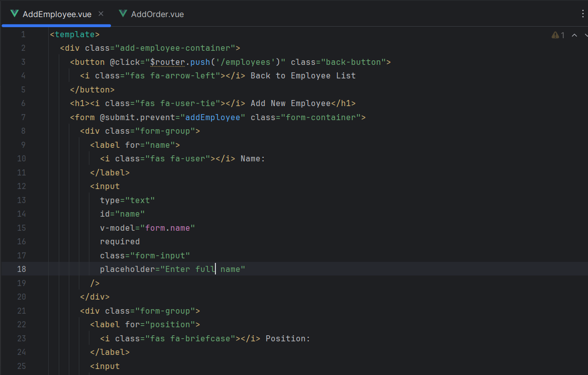
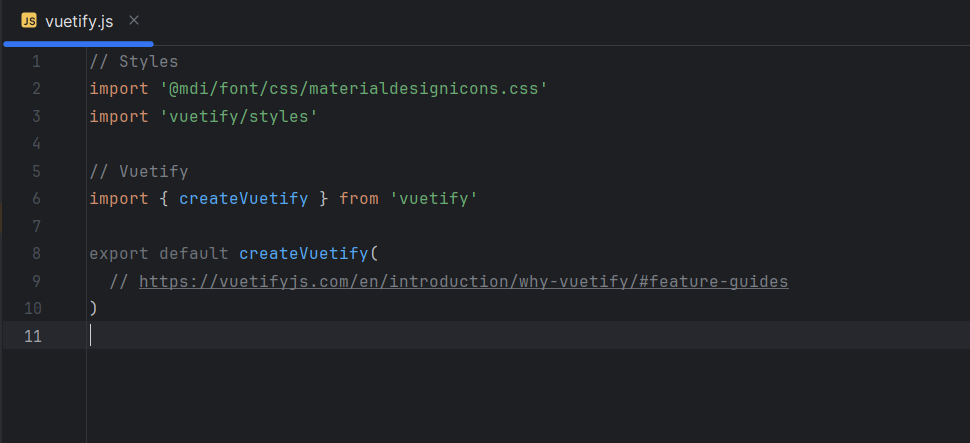

# Лабораторная работа 4. Реализация клиентской части средствами Vue.js.

1. Настроить для серверной части, реализованной в лабораторной работе №3 CORS (Cross-origin resource sharing)
```python
pip install django-cors-headers
```



2. Реализовать интерфейсы авторизации, регистрации и изменения учётных данных и настроить взаимодействие с серверной частью. Реализовать клиентские интерфейсы и настроить взаимодействие с серверной частью.



3. Подключить vuetify

