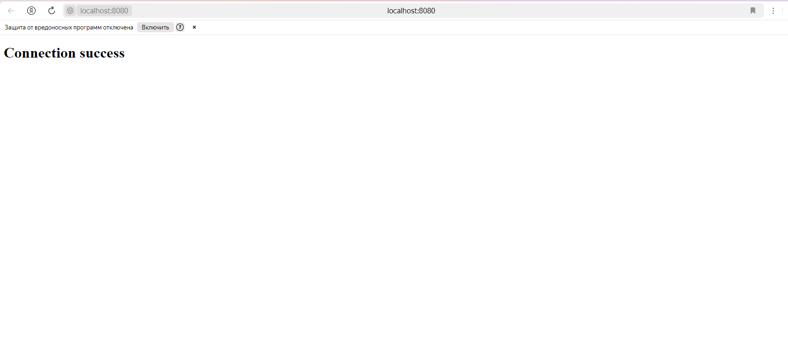

# Отправка html файла пользователю

Запускает сервер и ожидает запроса от пользователя по адресу http://localhost:8080/ 

## Описание работы

Переходим по данной ссылке http://localhost:8080/, на странице отображается наш html файл

