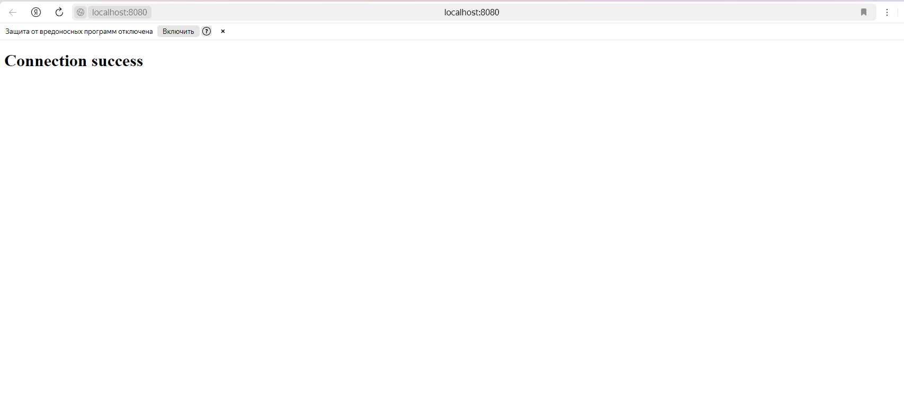

# Обрабатывает сообщения от пользователей

Записывает информацию о все клиентах в массив
Получает сообщение, проверяет его на корректность и отправляет его всем остальным клиентам
Обрабатывает выход пользователя из чата, при помощи команды "/leave"

## Описание работы

**Request** : "{a}" - ожидает сообщения в консоли

**Answer** : "{sender_number} + ": " + {message.text}" - при получении сообщения выводит номер отправителя и само сообщение.

