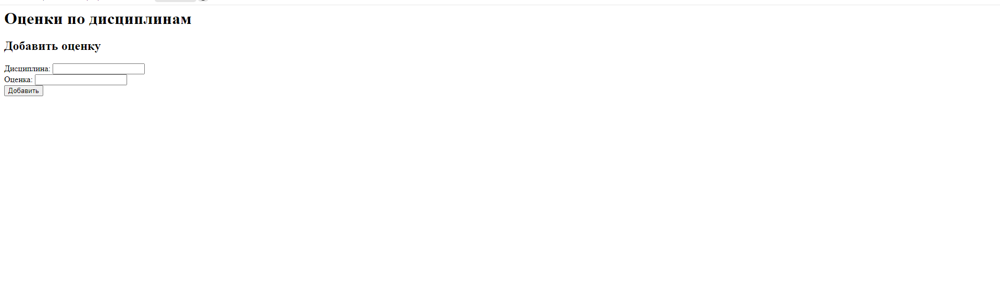
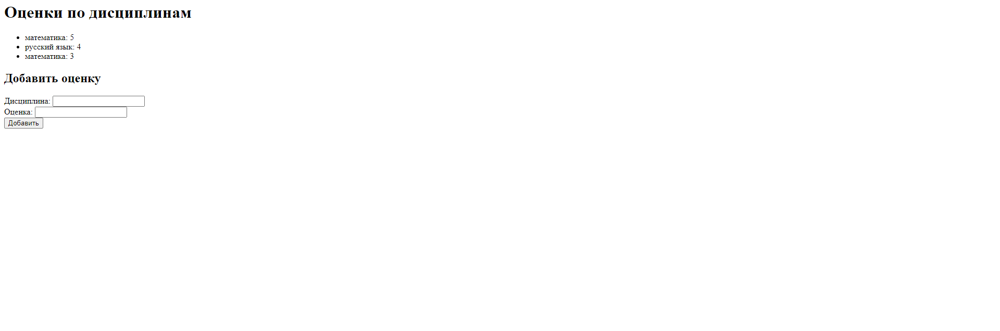

# Обрабатывает запросы с сайта и выводит оценки

Запускает сервер. 
Реализует обработчик GET и POST запросов и отправляет клиенту сгенерированную HTML страницу
## Описание работы

При обращении к данному URL https://localhost:8080/, выводит страницу с оценками

При вводе в форму значения дисциплины и оценки, записывает информация на странице (действует как школьный дневник, т.е к каждой оценке соответствует отдельная запись предмета)

