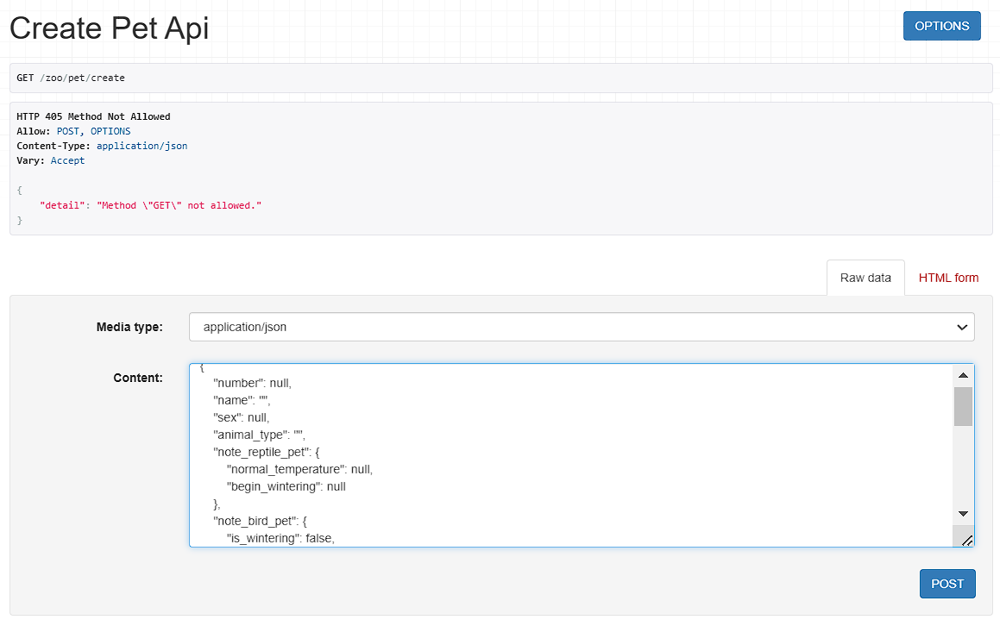

## zoo/pet/create

По данному url можно создаьт питомца

Сериализатор для создания модели отличается от сериализатора для просмотра. Не все поля представлены расширено. Также изменена логика создания объекта

```
class PetCreateSerializer(serializers.ModelSerializer):

    buy_pet = BuySerializer(required=False)
    rent_pet = RentSerializer(required=False)
    note_reptile_pet = NoteReptileSerializer(required=False)
    note_bird_pet = NoteBirdSerializer(required=False)

    class Meta:
        model = Pet
        fields =  ["number", "name", "sex", "animal_type", "note_reptile_pet", "note_bird_pet", "birtday", "is_buy", "buy_pet", "is_rented", "rent_pet", "valliere", "habited", "diet"]

    def create(self, validated_data):

        buy_data = validated_data.pop("buy_pet", None)
        rent_data = validated_data.pop("rent_pet", None)
        note_reptile_data = validated_data.pop("note_reptile_pet", None)
        note_bird_data = validated_data.pop("note_bird_pet", None)

        if validated_data["is_buy"] == True:
            if buy_data is None:
                raise serializers.ValidationError("У купленных питомцев должна быть информация о покупке")

        if validated_data["is_rented"] is not None:
            if rent_data is None:
                raise serializers.ValidationError("У питомцев в аренде должна быть информация о аренде")

        if validated_data["animal_type"] == "reptile":
            if note_reptile_data is None:
                raise serializers.ValidationError("Рептилии должны иметь справку")

        if validated_data["animal_type"] == "bird":
            if note_bird_data is None:
                raise serializers.ValidationError("Птицы должы иметь справку")

        pet = Pet.objects.create(**validated_data)

        if validated_data["is_buy"] == True:
            Buy.objects.create(pet=pet, **buy_data)

        if validated_data["is_rented"] is not None:
            Rent.objects.create(pet=pet, **rent_data)

        if validated_data["animal_type"] == "reptile":
            NoteReptile.objects.create(pet=pet, **note_reptile_data)

        if validated_data["animal_type"] == "bird":
            NoteBird.objects.create(pet=pet, **note_bird_data)

        return pet
```

Для каждого поля, указывающего наличие другого поля модели идёт проверка на соответсвтвие ограничениям. В случае их нарушения возникает ошибка. В случае успеха - создаётся сначала питомец, а затем связанные с ним объекты.

## Запрос к БД на базе ListAPIView:

```
class GetPetsAPIView(ListAPIView):
   serializer_class = PetSerializer
   queryset = Pet.objects.all()
```

Отображение страницы создания:
