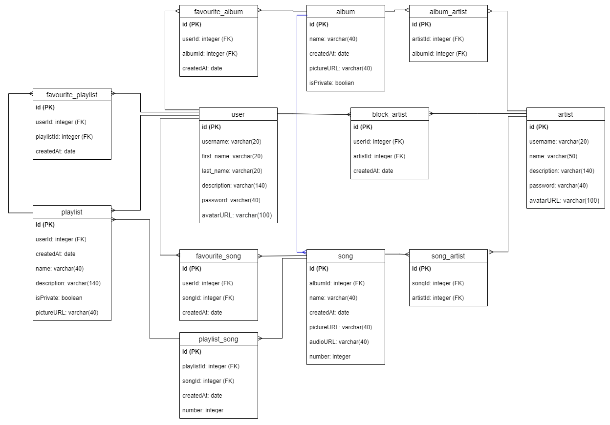
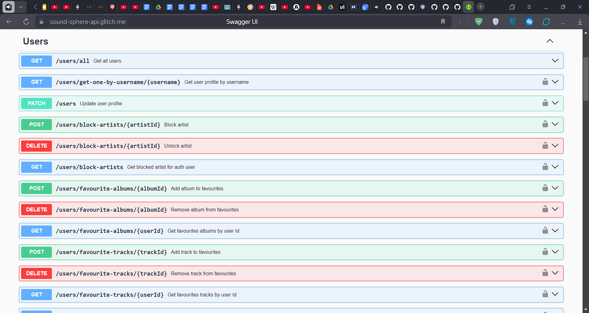
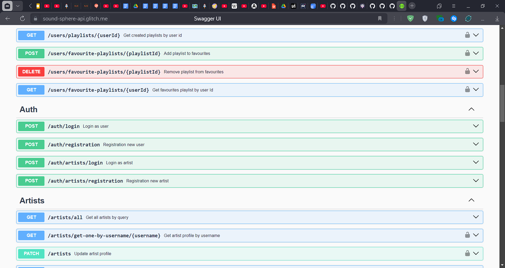
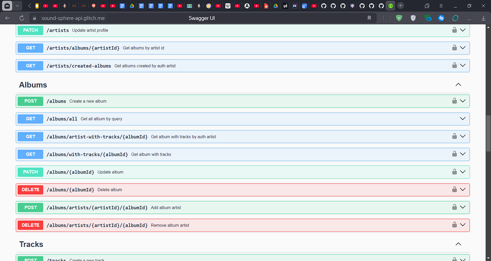
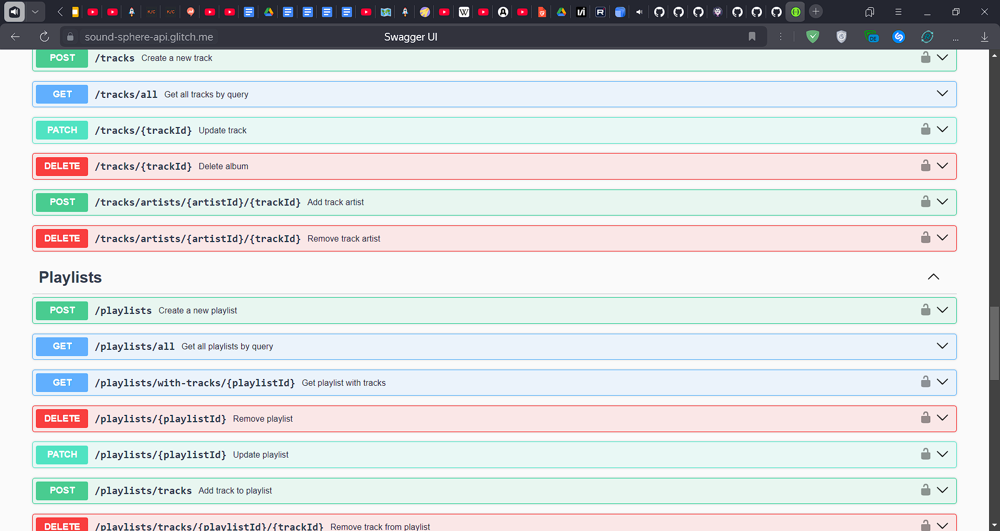

## Лабораторная работа 3: API муз. стримингового сервиса

### Описание

Сервер Rest Api, основные возможности: регистрация пользователей и артистов, артист может добавлять / удалять / редактировать альбомы с треками, пользователь может блокировать определённых артистов, создавать плейлисты с треками, добавлять альбомы, треки или плейлисты в избранное. Используемые технологии: NodeJs, NestJs, PostgreSQL, JWT

Схема базы данных:



Скриншоты документации swagger:






### Запустить локально

#### Установить зависимости

```bash
npm i 
```

#### Запустить сервер

```bash
npm run start:dev
```