# Лабораторная работа 4. Реализация клиентской части средствами Vue.js.

Вход
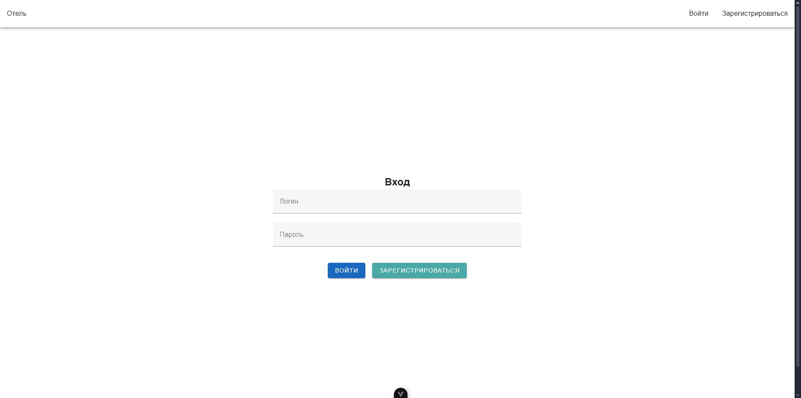

Регистрация

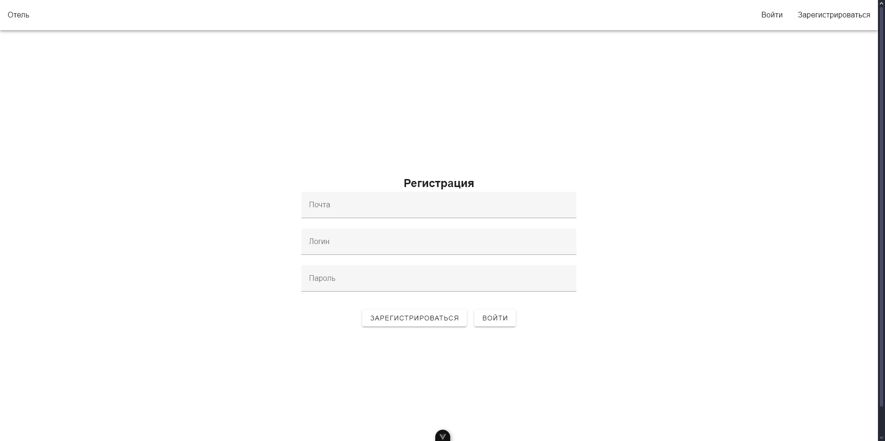

Список клиентов

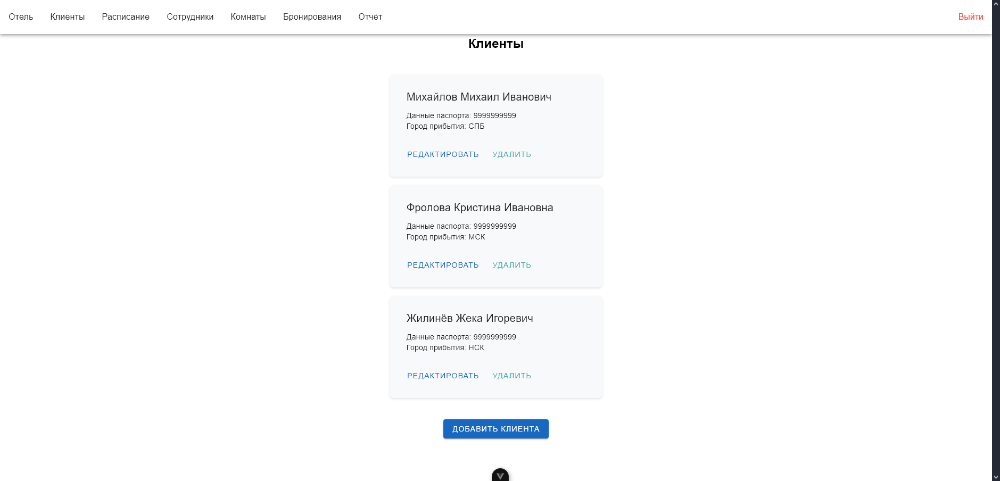

Окно для изменения клиента
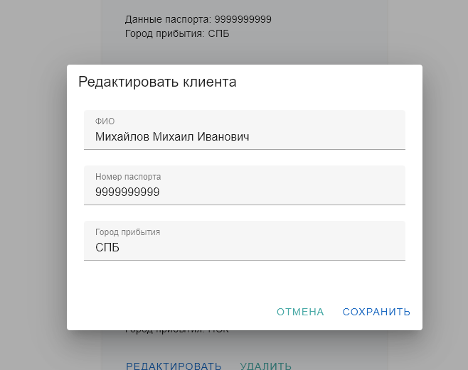

Окно для добавления клиента
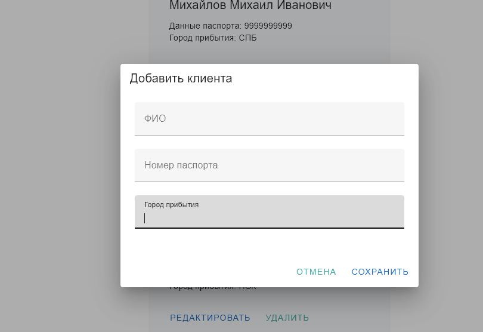

Расписание уборки
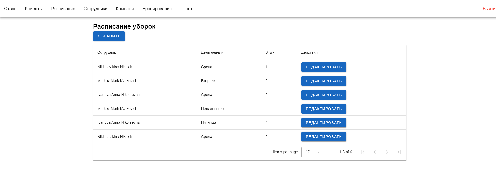

Окно для добавления расписания
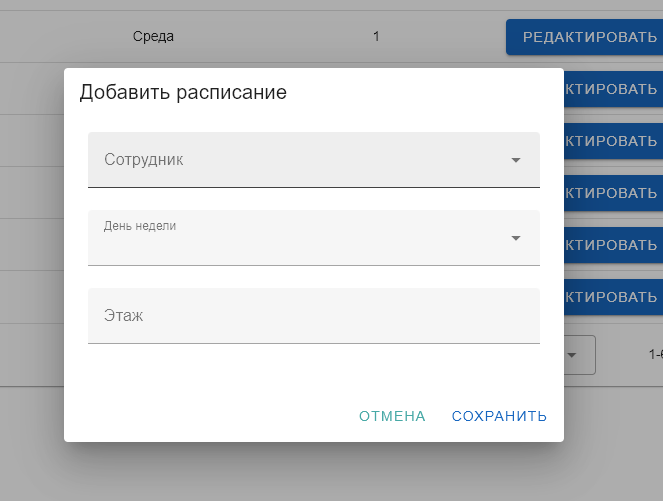

Окно для изменения расписания
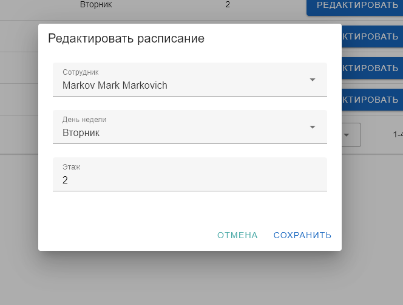

Список сотрудников
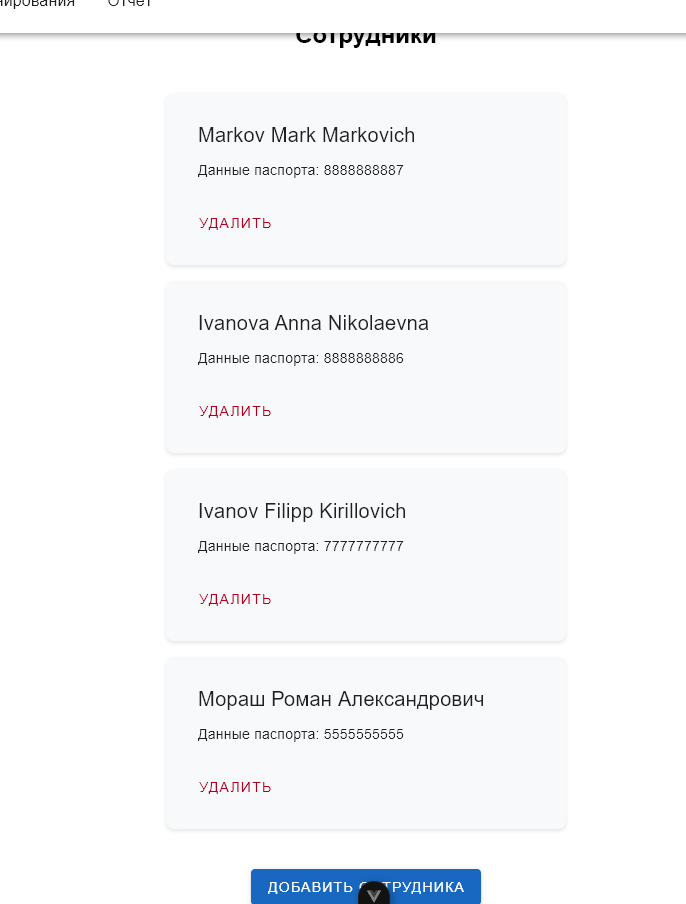

Окно для добавления сотрудника
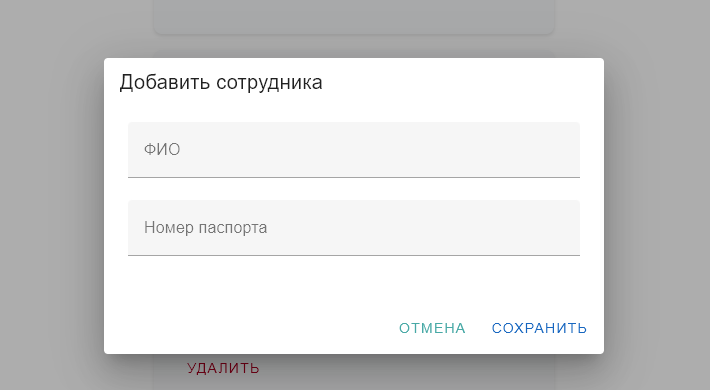

Список комнат
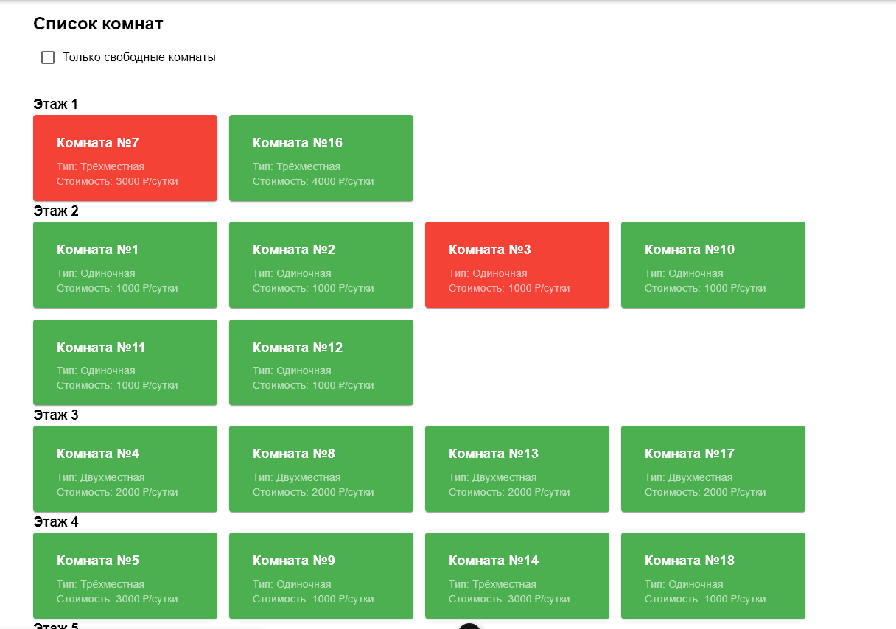

Детальная страница комнаты
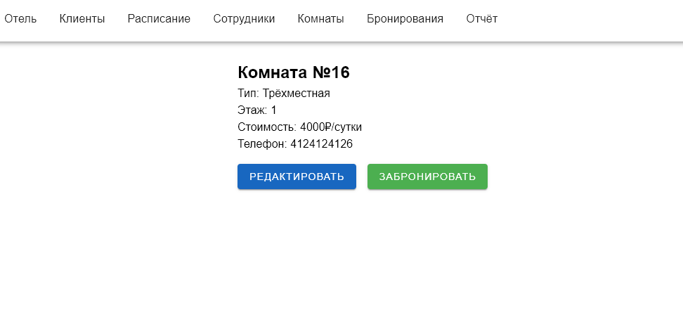

Забронировать комнату
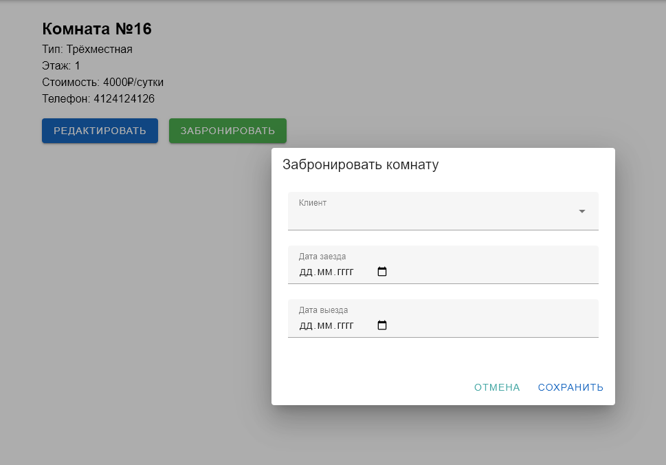

Изменить комнату
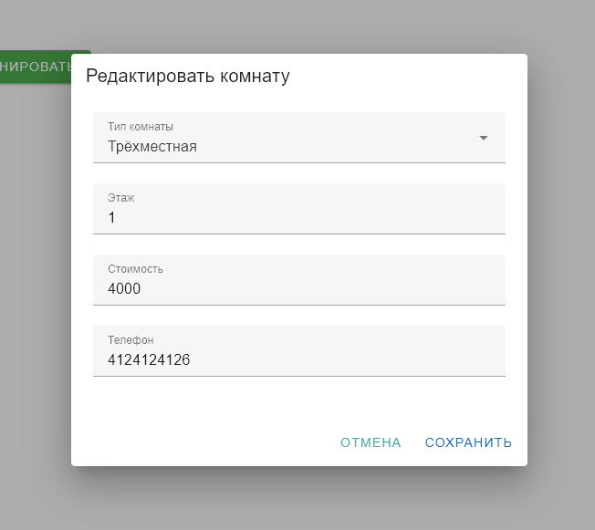

Список бронирований
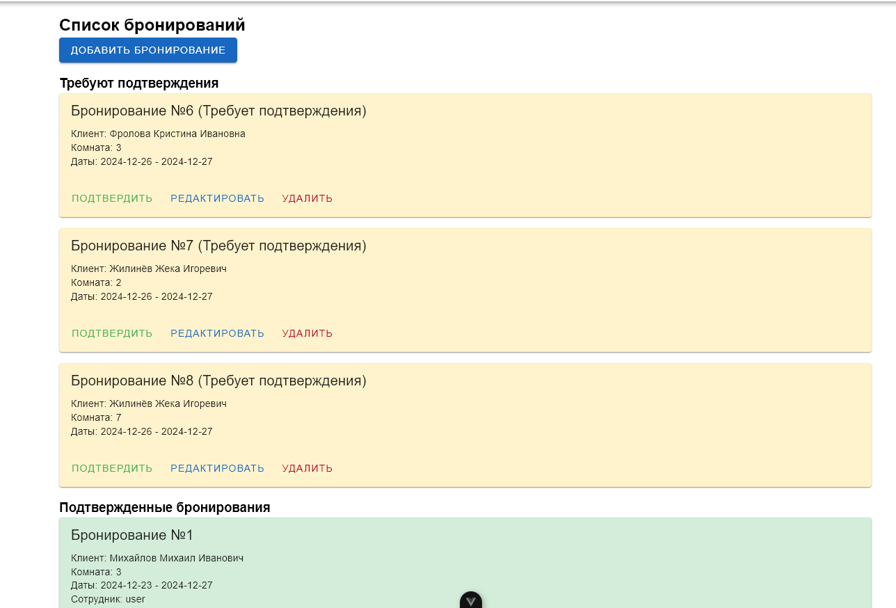

Добавить бронирование
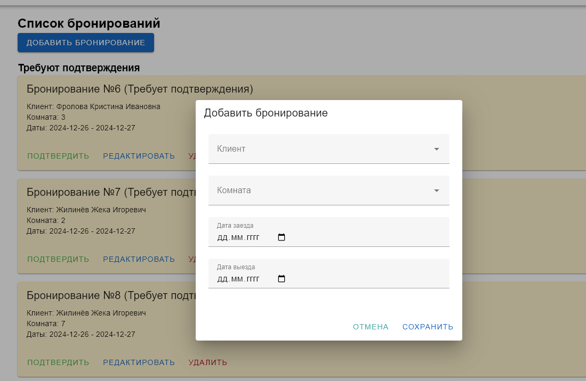

Редактировать бронирование
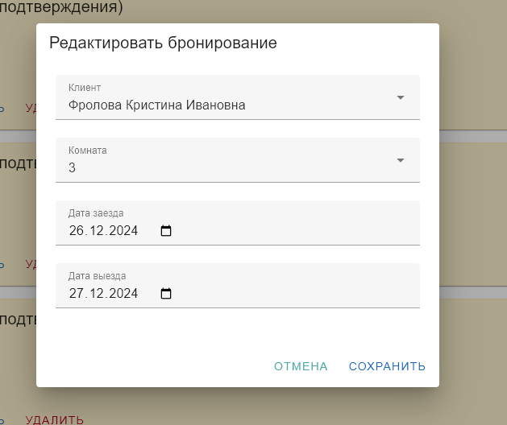

Отчёт за квартал
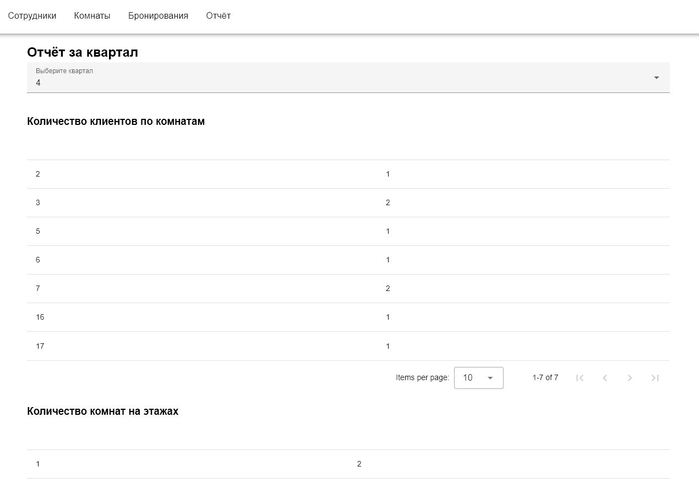
