# Лабораторная работа 1. Работа с сокетами

## Задание 1

**Цель:** Реализовать клиентскую и серверную часть приложения с использованием протокола UDP. Клиент отправляет серверу сообщение «Hello, server», сервер отображает его и отправляет в ответ «Hello, client».

### Описание решения

Для выполнения задания были созданы два файла:
- `server.py` — серверная часть приложения
- `client.py` — клиентская часть приложения

### Реализация сервера

Серверная часть выполняет следующие функции:

1. Создает UDP сокет с использованием `socket.SOCK_DGRAM`
2. Привязывается к адресу `localhost` и порту `12345`
3. Ожидает входящее сообщение от клиента методом `recvfrom()`
4. Выводит полученное сообщение в консоль
5. Отправляет ответное сообщение "Hello, client" клиенту
6. Закрывает соединение

### Реализация клиента

Клиентская часть выполняет следующие функции:

1. Создает UDP сокет
2. Отправляет сообщение "Hello, server" на адрес сервера методом `sendto()`
3. Ожидает ответ от сервера методом `recvfrom()`
4. Выводит полученное сообщение в консоль
5. Закрывает соединение

### Запуск приложения

Для проверки работы приложения необходимо:

1. Запустить сервер:
```bash
python3 server.py
```

2. В отдельном терминале запустить клиент:
```bash
python3 client.py
```

### Результаты выполнения

**Вывод сервера:**

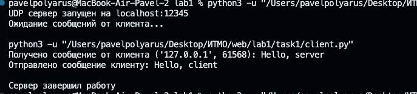

**Вывод клиента:**

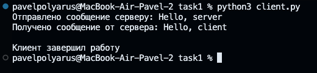

### Выводы

В ходе выполнения задания была реализована базовая модель клиент-серверного взаимодействия с использованием протокола UDP. Основные отличия UDP от TCP:

- UDP не требует установки соединения
- Отсутствует гарантия доставки пакетов
- Меньшие накладные расходы по сравнению с TCP
- Подходит для приложений, где скорость важнее надежности

## Задание 2

**Цель:** Реализовать клиентскую и серверную часть приложения с использованием протокола TCP. Клиент запрашивает выполнение математической операции (теорема Пифагора), параметры вводятся с клавиатуры, сервер обрабатывает данные и возвращает результат.

### Описание решения

Для выполнения задания были созданы два файла:
- `server.py` — серверная часть приложения
- `client.py` — клиентская часть приложения


### Реализация сервера

Серверная часть выполняет следующие функции:

1. Создает TCP сокет с использованием `socket.SOCK_STREAM`
2. Привязывается к адресу `localhost` и порту `12346`
3. Переходит в режим прослушивания методом `listen(1)`
4. Принимает входящее соединение от клиента методом `accept()`
5. Получает данные в формате JSON с параметрами `a` и `b`
6. Вычисляет гипотенузу по формуле: `c = √(a² + b²)`
7. Отправляет результат клиенту в формате JSON
8. Закрывает соединение

**Ключевые особенности TCP:**
- Требуется установка соединения (connection-oriented)
- Гарантия доставки данных
- Использование методов `listen()` и `accept()`
- Надежная передача данных

**Формат данных:**
Для обмена структурированными данными используется формат JSON:
```json
// Запрос от клиента
{
  "operation": "pythagorean",
  "a": 3.0,
  "b": 4.0
}

// Ответ от сервера
{
  "status": "success",
  "result": 5.0,
}
```

### Реализация клиента

Клиентская часть выполняет следующие функции:

1. Создает TCP сокет
2. Запрашивает у пользователя значения катетов `a` и `b`
3. Выполняет валидацию введенных данных
4. Устанавливает соединение с сервером методом `connect()`
5. Отправляет запрос в формате JSON методом `sendall()`
6. Получает результат от сервера методом `recv()`
7. Выводит результат вычисления на экран
8. Закрывает соединение

**Обработка ошибок:**
- Валидация числовых значений
- Проверка на положительные значения катетов
- Обработка ошибок подключения к серверу
- Обработка исключений при работе с сокетами

### Пример работы

**Входные данные:**
- Катет a = 3
- Катет b = 4

**Ожидаемый результат:**
- Гипотенуза c = 5

### Результаты выполнения

**Вывод сервера:**

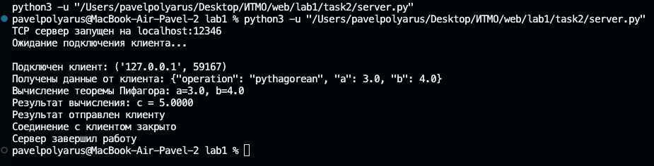

**Вывод клиента:**

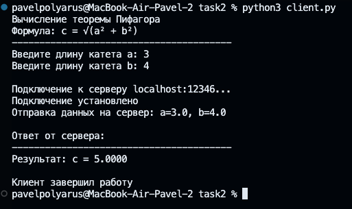

### Выводы

В ходе выполнения задания была реализована клиент-серверная модель с использованием протокола TCP для выполнения математических вычислений по теореме Пифагора.

**Основные отличия TCP от UDP (из задания 1):**

| Характеристика | TCP | UDP |
|----------------|-----|-----|
| Установка соединения | Требуется (`connect`, `accept`) | Не требуется |
| Гарантия доставки | Есть | Нет |
| Порядок пакетов | Сохраняется | Не гарантируется |
| Скорость | Медленнее | Быстрее |
| Надежность | Высокая | Низкая |
| Применение | Передача файлов, HTTP | Потоковое видео, DNS |

**Преимущества выбора TCP для данной задачи:**
- Гарантированная доставка математических данных
- Сохранение порядка передачи запроса и ответа
- Надежность при передаче вычислений
- Подходит для приложений, где точность важнее скорости

## Задание 3

**Цель:** Реализовать серверную часть приложения, которая отвечает на HTTP-запросы клиентов, возвращая HTML-страницу, загруженную из файла `index.html`.

### Описание решения

Для выполнения задания были созданы два файла:
- `server.py` — HTTP-сервер на базе библиотеки socket
- `index.html` — HTML-страница для отображения в браузере

### Реализация сервера

Серверная часть выполняет следующие функции:

1. **Создание и настройка сокета:**
   - Создает TCP сокет (`SOCK_STREAM`)
   - Устанавливает опцию `SO_REUSEADDR` для повторного использования адреса
   - Привязывается к адресу `localhost:8080`

2. **Обработка подключений:**
   - Слушает входящие соединения методом `listen(5)`
   - Принимает подключения от клиентов (браузеров)
   - Читает HTTP-запрос от клиента

3. **Загрузка HTML-контента:**
   - Проверяет существование файла `index.html`
   - Читает содержимое файла в кодировке UTF-8
   - При отсутствии файла формирует страницу ошибки 404

4. **Формирование HTTP-ответа:**
   - Создает статус-линию `HTTP/1.1 200 OK`
   - Добавляет необходимые заголовки:
     - `Content-Type: text/html; charset=utf-8`
     - `Content-Length` с размером контента
     - `Connection: close`
   - Присоединяет HTML-контент в качестве тела ответа

5. **Отправка ответа и закрытие соединения:**
   - Отправляет HTTP-ответ клиенту методом `sendall()`
   - Закрывает соединение с текущим клиентом
   - Продолжает ожидать новые подключения

### Особенности реализации

**Многопользовательский режим:**
Сервер работает в бесконечном цикле и может обрабатывать множественные последовательные подключения. После обработки каждого запроса соединение закрывается, но сервер продолжает принимать новые подключения.

**Обработка ошибок:**
- Проверка существования файла `index.html`
- Возврат страницы с ошибкой 404 при отсутствии файла
- Обработка исключений при работе с сокетами
- Корректное завершение работы при нажатии Ctrl+C

**Опция SO_REUSEADDR:**
Позволяет немедленно перезапустить сервер после его остановки, избегая ошибки "Address already in use".

### Реализация HTML-страницы

Файл `index.html` содержит:
- Структурированную HTML5-разметку
- Встроенные CSS-стили для оформления
- Информацию о проекте и HTTP-протоколе
- Адаптивный дизайн с градиентным фоном
- Описание работы сервера и технических деталей


### Результаты выполнения

**Вывод сервера в консоли:**

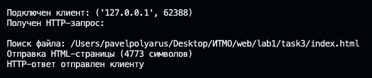

**Отображение страницы в браузере:**

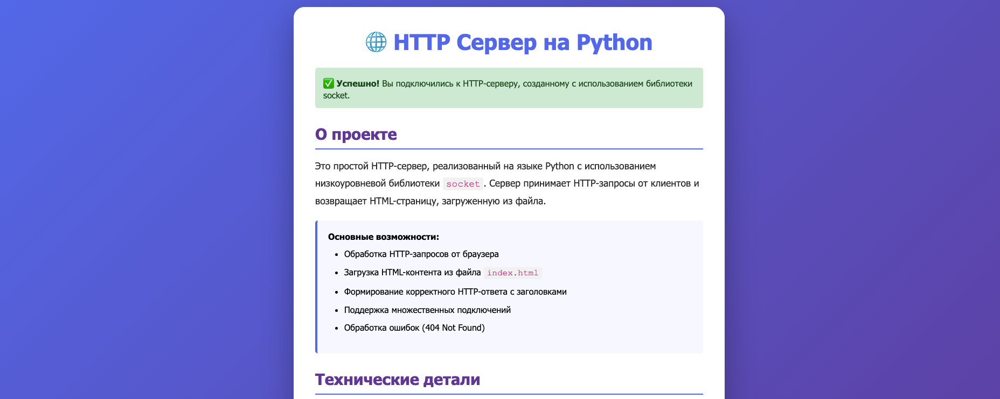


### Выводы

В ходе выполнения задания был реализован простой HTTP-сервер с использованием низкоуровневой библиотеки `socket`. Основные достижения:

1. **Понимание HTTP-протокола:**
   - Структура HTTP-запросов и ответов
   - Роль заголовков в передаче метаданных
   - Статус-коды и их значение

2. **Работа с файловой системой:**
   - Чтение HTML-файлов с диска
   - Обработка ошибок при отсутствии файлов
   - Корректная работа с кодировкой UTF-8

3. **Многопользовательская обработка:**
   - Последовательная обработка множественных подключений
   - Корректное закрытие соединений
   - Возможность работы в бесконечном цикле

4. **Практическое применение:**
   - Сервер может отдавать реальные HTML-страницы
   - Работает с любыми совре

## Задание 4

**Цель:** Реализовать многопользовательский чат с использованием протокола TCP и библиотеки threading.

### Описание решения

Для выполнения задания были созданы два файла:
- `server.py` — серверная часть многопользовательского чата
- `client.py` — клиентская часть для подключения к чату

**Принцип работы:**
1. Сервер создает основной сокет и ожидает подключений на `localhost:8080`
2. При подключении нового клиента создается отдельный поток для его обработки
3. Каждый клиент работает в своем потоке независимо от других
4. Сообщения от любого клиента рассылаются всем участникам чата (broadcast)
5. Клиент имеет два потока: один для приема сообщений от сервера, другой для отправки собственных сообщений

### Реализация сервера

#### Основные компоненты:

**1. Хранение данных о клиентах:**
```python
clients = {}  # Словарь {сокет: никнейм} для хранения подключенных клиентов
lock = threading.Lock()  # Блокировка для безопасного доступа из разных потоков
```

**2. Функция broadcast(msg):**
- Принимает сообщение в виде байтов
- Проходит по всем активным клиентам в словаре
- Отправляет сообщение каждому клиенту через его сокет
- При ошибке отправки игнорирует недоступных клиентов (обработка происходит в другом месте)

**3. Функция handle_client(client):**
- Выполняется в отдельном потоке для каждого клиента
- В бесконечном цикле принимает сообщения от клиента через `client.recv(1024)`
- Полученные сообщения немедленно рассылает всем участникам через `broadcast()`
- При получении пустого сообщения или ошибке вызывает `remove_client()`
- Завершает работу потока при отключении клиента

**4. Функция remove_client(client):**
- Безопасно удаляет клиента из словаря с использованием блокировки
- Получает никнейм отключившегося клиента
- Рассылает системное уведомление всем оставшимся участникам
- Закрывает сокет клиента

**5. Функция main():**
- Создает серверный TCP-сокет
- Привязывает его к адресу `localhost:8080`
- Переводит в режим прослушивания
- В бесконечном цикле принимает новые подключения
- Для каждого нового клиента:
  - Запрашивает никнейм (отправляет команду `NICKNAME`)
  - Получает никнейм от клиента
  - Добавляет клиента в словарь `clients`
  - Рассылает системное сообщение о присоединении
  - Запускает новый поток с функцией `handle_client()`

### Реализация клиента

#### Основные компоненты:

**1. Инициализация:**
```python
nickname = input("Введите свой никнейм: ")  # Запрос никнейма при запуске
client_socket = socket.socket(socket.AF_INET, socket.SOCK_STREAM)
client_socket.connect(("localhost", 8080))  # Подключение к серверу
```

**2. Функция receive():**
- В бесконечном цикле принимает сообщения от сервера через `client_socket.recv(1024)`
- Декодирует полученные байты в строку
- Если получена команда `NICKNAME`, отправляет свой никнейм серверу
- Все остальные сообщения выводит в консоль
- При ошибке связи выводит уведомление и закрывает сокет

**3. Функция write():**
- Выполняется в отдельном потоке параллельно с `receive()`
- В бесконечном цикле читает ввод пользователя через `input()`
- Формирует сообщение в формате `[никнейм]: текст`
- Кодирует строку в байты и отправляет на сервер

### Результат

Реализован полнофункциональный многопользовательский чат, который:
- Поддерживает неограниченное количество одновременных подключений
- Обеспечивает мгновенную доставку сообщений всем участникам
- Корректно обрабатывает подключения и отключения пользователей
- Использует эффективную многопоточную архитектуру
- Гарантирует потокобезопасность операций с общими данными


**Вывод сервера в консоли:**

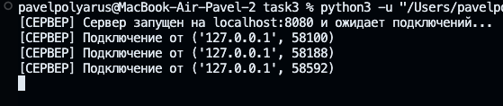

**Вывод клиентов в консоли:**

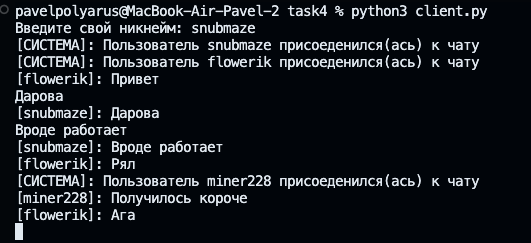
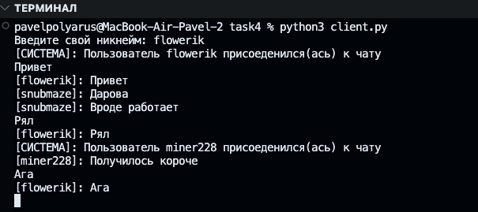
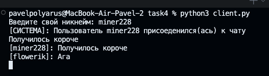

## Задание 5

**Цель:** Написать простой веб-сервер для обработки GET и POST HTTP-запросов с помощью библиотеки `socket` в Python. Сервер должен принимать и записывать информацию о дисциплине и оценке по дисциплине, а также отдавать информацию обо всех оценках по дисциплинам в виде HTML-страницы.

### Описание решения

Для выполнения задания был создан файл:
- `simple_server.py` — HTTP-сервер с поддержкой GET и POST запросов

Сервер реализован с использованием объектно-ориентированного подхода на основе класса `MyHTTPServer` и предоставляет следующие маршруты:
- `GET /grades/add` → форма для добавления оценки
- `POST /grades` → обработка и сохранение оценки
- `GET /grades` → отображение всех сохраненных оценок

**Принцип работы:**
1. Сервер создает TCP-сокет и прослушивает порт 8080
2. При получении запроса парсит Request Line, HTTP-заголовки и тело запроса
3. В зависимости от метода (GET/POST) и пути выполняет соответствующее действие
4. Хранит оценки в памяти в виде словаря `{дисциплина: список[оценка]}`
5. Формирует и отправляет HTML-ответ клиенту
 
### Архитектура решения

**Класс Request:**
Dataclass для хранения параметров HTTP-запроса (метод, URL, версия протокола, заголовки, тело). Предоставляет удобные свойства для доступа к разобранному URL и параметрам запроса.

**Класс MyHTTPServer:**
Основной класс сервера, который управляет всем жизненным циклом обработки HTTP-запросов.

**Ключевые методы:**

1. **`serve_forever()`** — запускает сервер в бесконечном цикле, принимает подключения клиентов и передает их на обработку.

2. **`parse_request(conn)`** — разбирает входящий HTTP-запрос:
   - Читает стартовую строку (метод, URL, версию)
   - Парсит заголовки
   - Для POST-запросов читает тело размером из заголовка `Content-Length`
   - Возвращает объект `Request` со всеми данными

3. **`handle_request(req)`** — маршрутизатор, определяющий какое действие выполнить:
   - `/grades/add` с методом GET → показывает форму
   - `/grades` с методом POST → сохраняет оценку
   - `/grades` с методом GET → показывает таблицу оценок
   - Остальное → возвращает 404

4. **`send_response(conn, resp)`** — формирует и отправляет HTTP-ответ клиенту с правильными заголовками и телом.

### Маршруты сервера

| Метод | Путь | Описание |
|-------|------|----------|
| GET | `/grades/add` | Форма для добавления оценки |
| POST | `/grades` | Сохранение новой оценки |
| GET | `/grades` | Просмотр всех оценок |

### HTML-страницы

**Форма добавления оценки:**
- Текстовое поле для ввода названия дисциплины
- Выпадающий список для выбора оценки (2, 3, 4, 5)
- Кнопка отправки формы
- Ссылка на страницу просмотра всех оценок

**Страница со всеми оценками:**
- HTML-таблица с колонками "Дисциплина" и "Оценка"
- Динамическое формирование строк на основе данных из словаря
- Сообщение "Оценок пока нет", если словарь пустой
- Ссылка для возврата к форме добавления

**Страница подтверждения:**
- Отображается после успешного добавления оценки
- Показывает добавленную дисциплину и оценку
- Кнопки для добавления еще одной оценки или просмотра всех

### Результаты выполнения

**Форма добавления оценки:**

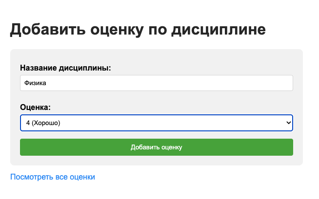

**Страница со всеми оценками:**

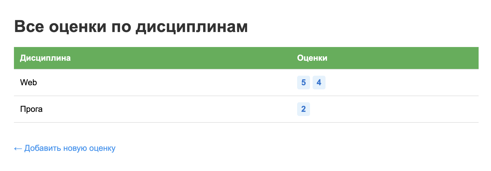

### Выводы

В ходе выполнения задания был реализован HTTP-сервер с полноценной обработкой GET и POST запросов на низком уровне с использованием библиотеки `socket`.

