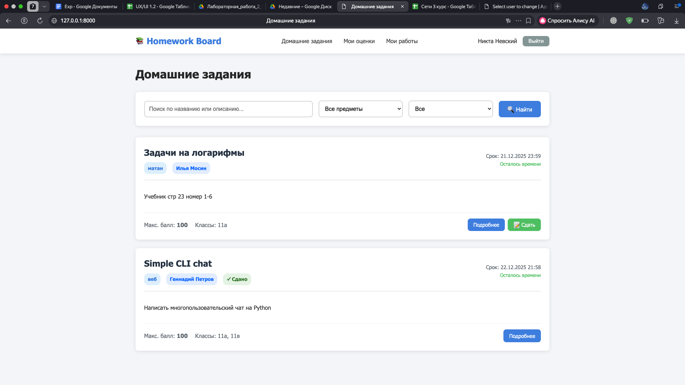
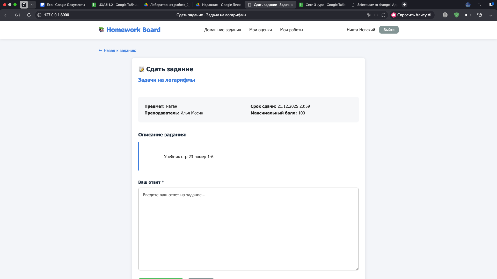
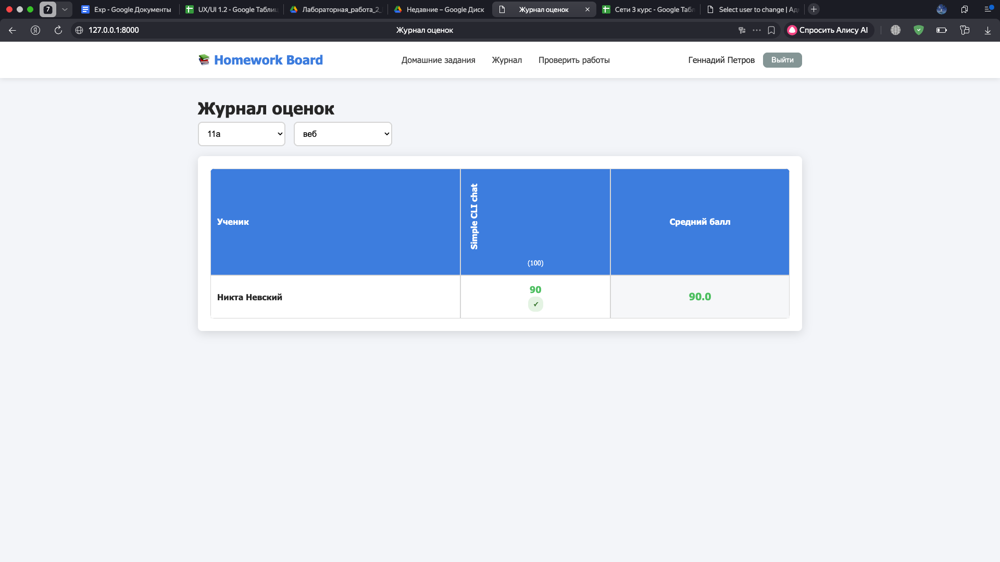
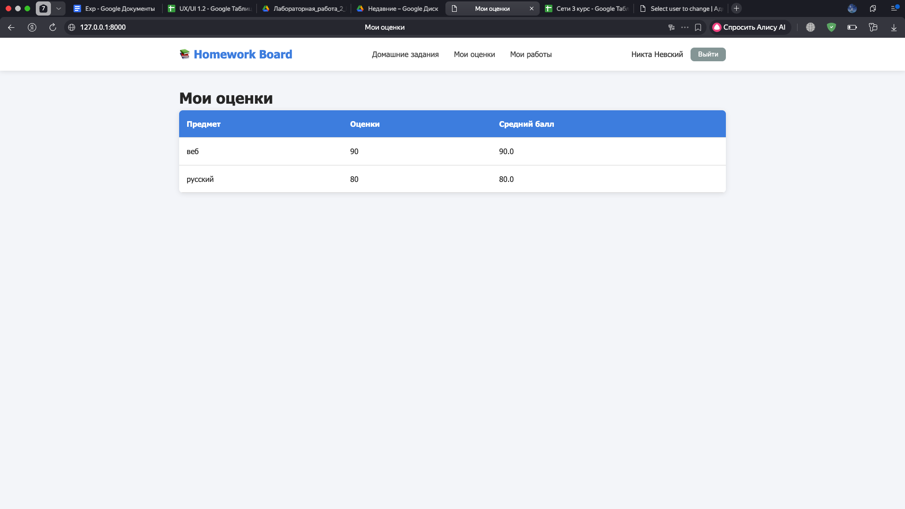

# Лабораторная работа №2  
## Разработка веб-приложения на Django

---

### Цель работы

Изучить основы разработки серверных веб-приложений с использованием фреймворка **Django** и СУБД **SQLite**, реализовать сайт для работы с домашними заданиями и электронным журналом оценок.

---

### Используемые технологии

- Язык программирования: **Python 3**
- Веб-фреймворк: **Django**
- СУБД: **SQLite**
- HTML / CSS
- Django Admin
- ORM Django

---

### Описание предметной области

Разрабатываемое веб-приложение предназначено для работы с домашними заданиями в учебном процессе.  
В системе присутствуют две основные роли пользователей:

- **Ученик**
- **Преподаватель (администратор)**

Для каждого домашнего задания хранится следующая информация:
- предмет;
- преподаватель;
- дата выдачи;
- период выполнения;
- текст задания;
- информация о штрафах;
- максимальный балл.

---

### Реализованный функционал

#### 1. Регистрация и аутентификация пользователей

В приложении реализована регистрация новых пользователей и система аутентификации на основе встроенного механизма Django.  
Каждому пользователю назначается роль (ученик или преподаватель), которая определяет доступный функционал.

---

#### 2. Просмотр домашних заданий

Ученик может просматривать список домашних заданий по всем дисциплинам.  
Для каждого задания отображается:
- название предмета;
- преподаватель;
- дата выдачи;
- срок выполнения;
- описание задания.

---

#### 3. Сдача домашних заданий

Ученик имеет возможность сдать домашнее задание в **текстовом виде** через клиентскую часть приложения.  
Информация о сдаче сохраняется в базе данных и привязывается к конкретному ученику и заданию.

---

#### 4. Выставление оценок

Преподаватель может выставлять оценки за выполненные задания.  
Оценивание реализовано **через клиентскую часть приложения**, без использования Django Admin, что обеспечивает более наглядную и удобную работу с журналом.

---

#### 5. Электронный журнал оценок

В клиентской части реализован **электронный журнал**, отображающий оценки учеников.

Функциональность журнала:
- доступен только преподавателю;
- фильтрация по классу;
- фильтрация по предмету;
- отображение оценок всех учеников выбранного класса;
- автоматический подсчёт среднего балла.

Ученик, в свою очередь, видит **только свои оценки** по всем предметам.

---

### Структура базы данных

В приложении используются следующие основные модели:

- **User** — пользователь системы  
- **Class** — учебный класс  
- **Subject** — учебный предмет  
- **Homework** — домашнее задание  
- **Submission** — сданная работа ученика  

Связи между моделями реализованы с использованием внешних ключей и связей Many-to-Many.

---

### Интерфейс приложения

В ходе выполнения работы были реализованы следующие страницы:

- страница входа и регистрации;
- список домашних заданий;
- страница сдачи домашнего задания;
- электронный журнал оценок (для преподавателя);
- страница просмотра оценок (для ученика).

---

### Скриншоты работы приложения

#### Страница списка домашних заданий

#### Страница сдачи домашнего задания

#### Электронный журнал преподавателя

#### Просмотр оценок учеником

---

### Вывод

В ходе выполнения лабораторной работы был разработан полнофункциональный веб-сайт с использованием фреймворка Django и СУБД SQLite.  
Реализованы регистрация пользователей, работа с домашними заданиями, сдача работ, выставление оценок и электронный журнал.

Полученные навыки позволяют создавать серверные веб-приложения с использованием Django, работать с ORM и проектировать структуру базы данных.

---
