# Лабораторная работа №4

## Обзор

В рамках этой лабораторной работы был рассмотрен Vue и JS, как инструменты для создания интерфейсов веб-приложения из 3
лабораторной работы. Был создан интерфейс для управления страховыми данными. Интерфейс включает страницы для просмотра,
добавления, редактирования и удаления данных из базы данных. Также был создан простой дизайн проекта.

## Ход работы

Ход работы был следующим:

1. Создание проекта Vue
2. Создание компонентов для отображения данных
3. Создание компонентов для добавления, редактирования и удаления данных
4. Создание маршрутизации
5. Создание дизайна

## Директория проекта

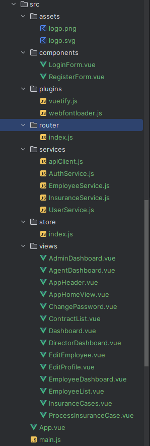

## Скрины полученных результатов

1. Страничка Авторизации (Логин):
   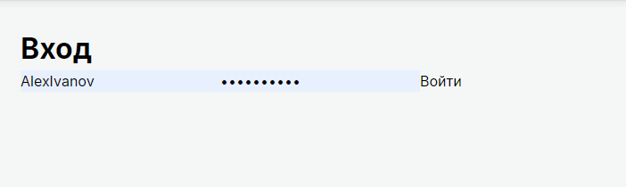
   Она реализована за счет обычного VUE-компонента, который обращается к API для авторизации пользователя, и проверяет в
   бд наличие пользователя с такими данными.
   Далее в случае успешной авторизации, пользователь перенаправляется на главную страницу, а его токен сохраняется при
   помощи скрипта в localStorage.
   В случае неудачной авторизации, пользователь получает сообщение об ошибке. вот так выглядит код авторизации:

```vue
async login(username, password) {
try {
const response = await axios.post(`${LOGIN_URL}token/`, {
username,
password,
});
this.setTokens(response.data);  // Сохраняем токены
return response.data;
} catch (error) {
throw error;
}
},
```

Получаем токен и сохраняем его в хранилище и дальше при каждом запросе от пользователя, мы будем использовать этот токен
для авторизации. При помощи следующего скрипта:

```vue
apiClient.interceptors.request.use(
async (config) => {
let token = localStorage.getItem('token');
const refreshToken = localStorage.getItem('refreshToken');

if (!token && refreshToken) {
try {
const response = await AuthService.refreshToken();
token = response.access;
} catch (error) {
}
}

if (token) {
config.headers.Authorization = `Bearer ${token}`;
}
return config;
},
(error) => Promise.reject(error)
);

```

Если объяснять, то простыми словами это выглядит так:

* Создание клиента: axios.create создает экземпляр axios с базовым URL и заголовками.
* Перехватчик запросов: Перед каждым запросом добавляется токен из localStorage. Если токен отсутствует, но есть
  refreshToken, он обновляется.
* Перехватчик ответов: Если ответ имеет статус 401 (неавторизован), токен обновляется и запрос повторяется.

2. Страничка Авторизации (Регистрация):
   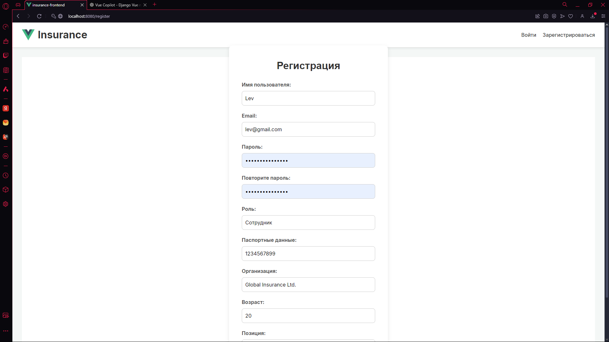

3. Главная страничка с данными:
   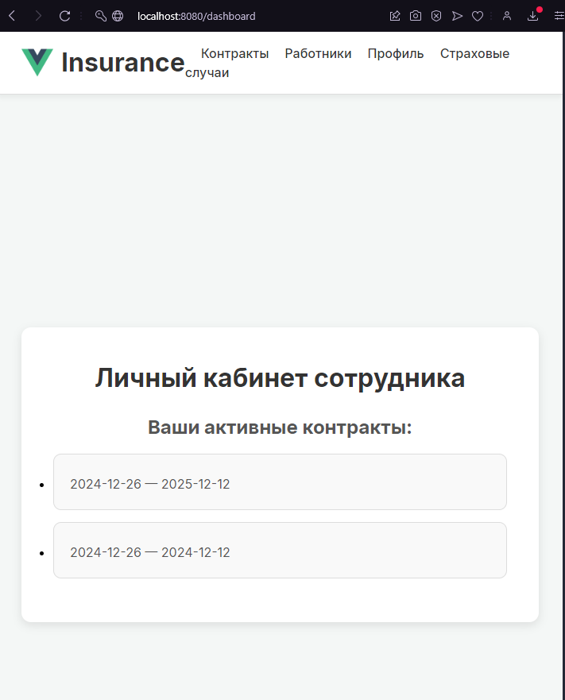

4. Страница всех сотрудников моей компании:
   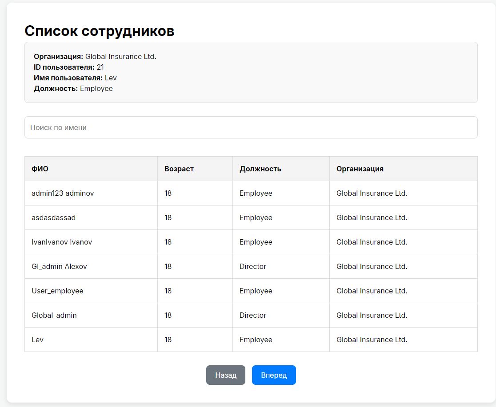
   Тут можно увидеть всех сотрудников компании, их должности, возраст и фио.
   также тут настроен поиск и пагинация, чтобы удобнее было искать нужного сотрудника:
   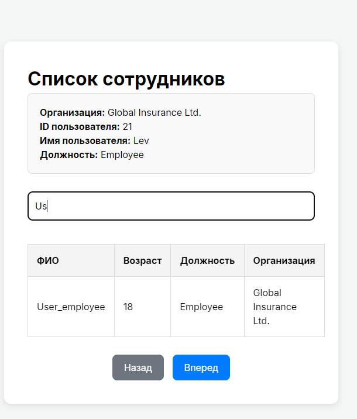

5. Страница контрактов (договоров) страхования:
   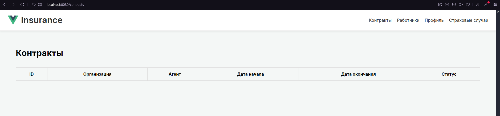
   В силу того, что данный пользователь пока что не был зарегистрирован ни в одном договоре страхования табличка пустая.

6. Страница личного профиля сотрудника:
   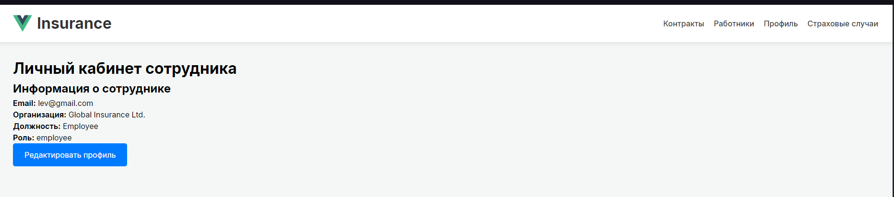
   Тут также доступно редактирование данных: можно изменить имя пользователя, почту, пароль, паспортные данные и
   контактную информацию.
   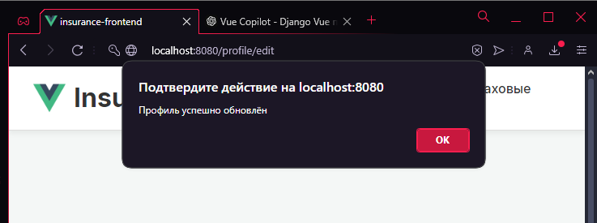 - если все успешно, то получаем сообщение об успешном изменении данных.

7. Авторизовавшись под Директором компании, мы можем увидеть все договора страхования, которые были заключены в нашей
   компании, а также их удалить либо создать новый договор, но изменение не предполагается:
   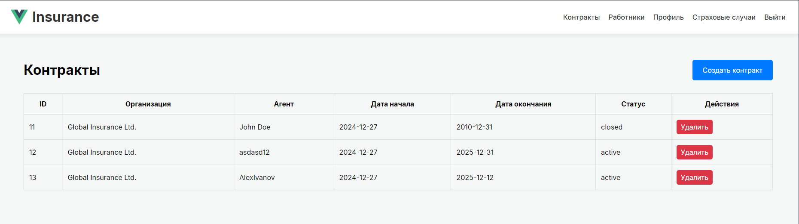

8. Также директор имеет возможность редактировать всех сотрудников компании, а также их удалять:
   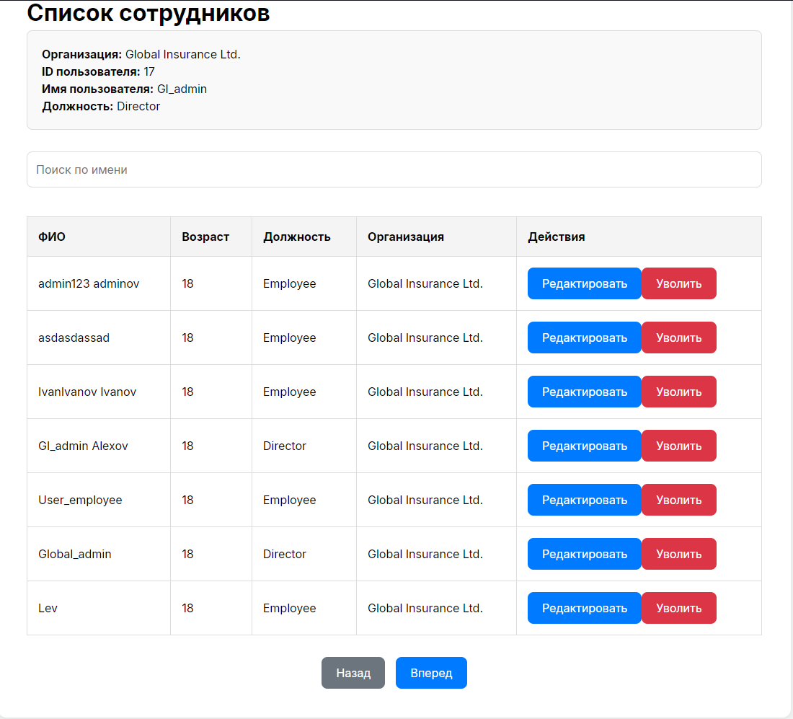

9. Страница страховых случаев:
   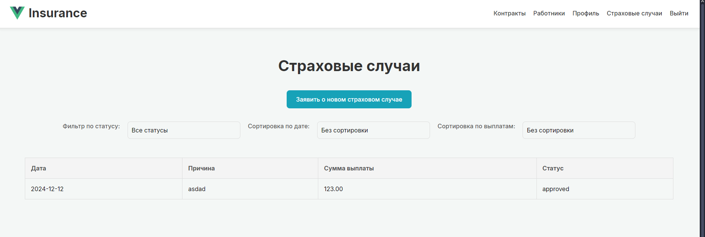
   Тут можно увидеть все страховые случаи, которые произошли в компании, их дату, описание и статус, также настроена
   фильтрация: по статусу, дате и сортировка по выплатам.
   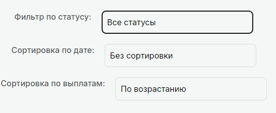

10. Войдем под сотрудником:
    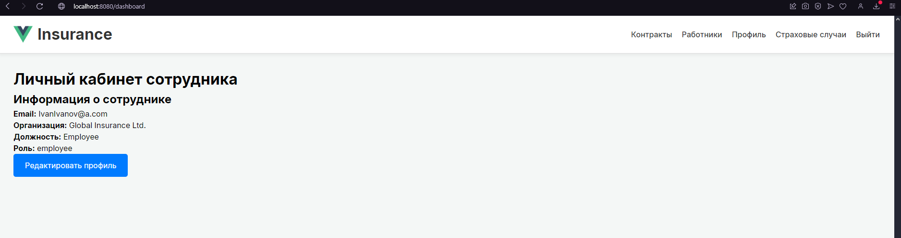 - ЛК Сотрудника
11. А теперь зайдем под агентом:
    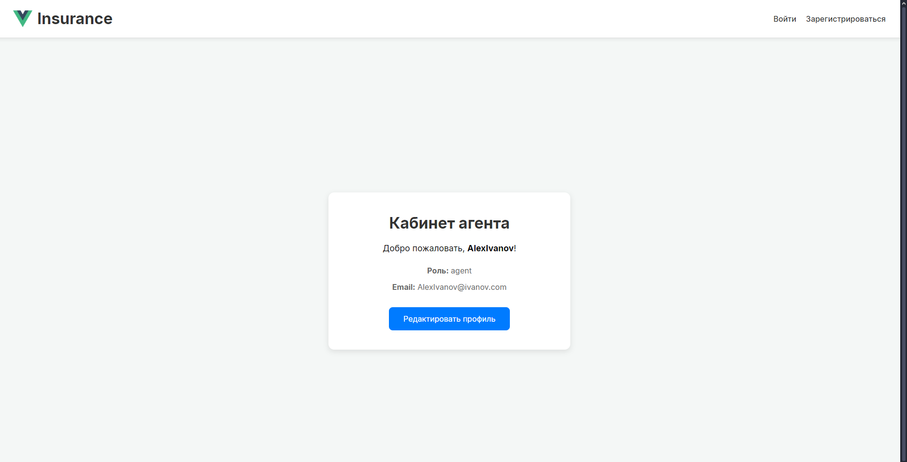 - ЛК Агента
Меню для агента и сотрудника отличается, также их возможности.
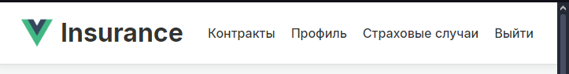 - меню агента
```vue
<template>
  <div class="agent-dashboard">
    <div class="profile-card">
      <h1>Кабинет агента</h1>
      <p class="welcome">Добро пожаловать, <strong>{{ user.username }}</strong>!</p>

      <div class="profile-info">
        <p><strong>Роль:</strong> {{ user.role || 'Агент' }}</p>
        <p><strong>Email:</strong> {{ user.email || 'Не указан' }}</p>
      </div>

      <button @click="$router.push('/profile/edit')" class="primary-btn">
        Редактировать профиль
      </button>
    </div>
  </div>
</template>
```
Распределение по типу пользователя происходит в файле Dashboard.vue, где в зависимости от роли пользователя, подгружается его личный кабинет, обработка происходит через:
```vue
if (this.role === 'agent') {
this.dashboardComponent = AgentDashboard;
}
else if (this.role === 'employee') {
if (this.isStaff) {
this.dashboardComponent = DirectorDashboard;  // Director как is_staff
} else {
this.dashboardComponent = EmployeeDashboard;
}
}
else if (this.role === 'admin') {
this.dashboardComponent = AdminDashboard;
}
```

