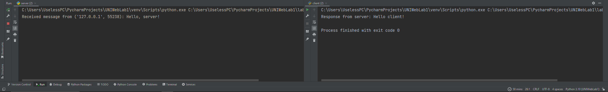

# Задание 1

Реализовать клиентскую и серверную часть приложения. Клиент
отсылает серверу сообщение «Hello, server». Сообщение должно
отразиться на стороне сервера. Сервер в ответ отсылает клиенту
сообщение «Hello, client». Сообщение должно отобразиться у клиента.
Обязательно использовать библиотеку socket. Реализовать с помощью
протокола UDP.

## Выполнение

### Реализация сервера

    import socket
    # HEADERSIZE = 4
    # AF_INET - IPv4
    # SOCK_STREAM - TCP
    #  SOCK_DGRAM - UDP
    def main():
        server_socket = socket.socket(socket.AF_INET, socket.SOCK_DGRAM)
        server_socket.bind(('localhost', 2003))

        while True:
            data, client_address = server_socket.recvfrom(1234)
            if data:
                message = data.decode('utf-8')
                print(f"Received message from {client_address}: {message}")
                server_msg = "Hello client!"
                server_socket.sendto(server_msg.encode("utf-8"), client_address)

    if __name__ == "__main__":
        main()

### Реализация клиента

    import socket

    def send_and_receive_message():
        client_s = socket.socket(socket.AF_INET, socket.SOCK_DGRAM)
        server_address = ('localhost', 2003)
        msg_to_server = "Hello, server!"

        try:
            client_s.sendto(msg_to_server.encode('utf-8'), server_address)
            response_from_server, _ = client_s.recvfrom(1234)
            print("Response from server:", response_from_server.decode("utf-8"))
        except Exception as e:
            print("Error:", str(e))
        finally:
            client_s.close()

    if __name__ == "__main__":
        send_and_receive_message()

## Пример работы

