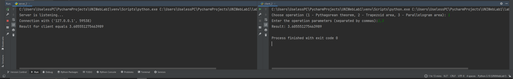

# Задание 2

Реализовать клиентскую и серверную часть приложения. Клиент
запрашивает у сервера выполнение математической операции, параметры,
которые вводятся с клавиатуры. Сервер обрабатывает полученные данные
и возвращает результат клиенту. Вариант “поиск площади трапеции”.

## Выполнение

### Реализация сервера

    import socket
    
    
    def calculate_pythagoras(a, b):
        return (a ** 2 + b ** 2) ** 0.5
    
    
    def calculate_trapezoid_area(a, b, h):
        return ((a + b) * h) / 2
    
    
    def calculate_parallelogram_area(base, height):
        return base * height

    def main():
        server_socket = socket.socket(socket.AF_INET, socket.SOCK_STREAM)
        server_socket.bind(("localhost", 2003))
        server_socket.listen(1)

        print("Server is listening...")

        while True:
            client_socket, addr = server_socket.accept()
            print(f"Connection with {addr}", )
    
            data = client_socket.recv(1024).decode('utf-8')
    
            if data:
                try:
                    operation, *params = data.split(',')
                    if operation == "1":
                        result = calculate_pythagoras(float(params[0]), float(params[1]))
                    elif operation == "2":
                        result = calculate_trapezoid_area(float(params[0]), float(params[1]), float(params[2]))
                    elif operation == "3":
                        result = calculate_parallelogram_area(float(params[0]), float(params[1]))
                    else:
                        result = "Wrong operation code"
                except Exception as e:
                    result = "Error: " + str(e)
    
                client_socket.send(str(result).encode('utf-8'))
                print(f"Result for client equals {result}")
            client_socket.close()

    if __name__ == "__main__":
        main()

### Реализация клиента

    import socket

    def main():
        client_socket = socket.socket(socket.AF_INET, socket.SOCK_STREAM)
        client_socket.connect(("localhost", 2003))

        try:
            operation = input(
                "Choose operation (1 - Pythagorean theorem, 2 - Trapezoid area, 3 - Parallelogram area): ")
    
            if operation not in ["1", "2", "3"]:
                print("Wrong operation code")
                return
    
            params = input("Enter the operation parameters (separated by commas):")
    
            client_socket.send(f"{operation},{params}".encode('utf-8'))
    
            result = client_socket.recv(1024).decode('utf-8')
    
            print("Result:", result)
    
        except Exception as e:
            print("Error:", str(e))
        finally:
            client_socket.close()

    if __name__ == "__main__":
        main()

## Пример работы

