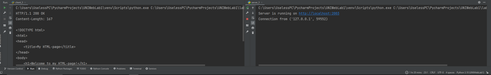

# Задание 3

Реализовать серверную часть приложения. Клиент подключается к
серверу. В ответ клиент получает http-сообщение, содержащее
html-страницу, которую сервер подгружает из файла index.html.

## Выполнение

### Реализация сервера

    import socket
    
    
    def get_response_html():
        try:
            with open("index.html", "r") as file:
                html_content = file.read()
        except FileNotFoundError:
            html_content = "<html><body><h1>File index.html isn't found</h1></body></html>"

    response = f"HTTP/1.1 200 OK\r\nContent-Length: {len(html_content)}\r\n\r\n{html_content}"
    return response

    def main():
        server_socket = socket.socket(socket.AF_INET, socket.SOCK_STREAM)
        server_socket.bind(("localhost", 2003))
        server_socket.listen(1)

        print(f"Server is running on http://localhost:2003")
    
        while True:
            client_socket, addr = server_socket.accept()
            print(f"Connection from {addr}")
    
            request = client_socket.recv(1024).decode('utf-8')
    
            if request:
                response = get_response_html()
                client_socket.send(response.encode('utf-8'))
    
            client_socket.close()

    if __name__ == "__main__":
        main()

### Реализация клиента
    import socket
    
    
    def main():
        client_socket = socket.socket(socket.AF_INET, socket.SOCK_STREAM)

        try:
            client_socket.connect(("localhost", 2003))
    
            request = "GET / HTTP/1.1\r\nHost: localhost\r\n\r\n"
            client_socket.send(request.encode('utf-8'))
    
            response = client_socket.recv(1024).decode('utf-8')
            print(response)
    
        except Exception as e:
            print("Error:", str(e))
        finally:
            client_socket.close()

    if __name__ == "__main__":
        main()

## Пример работы

