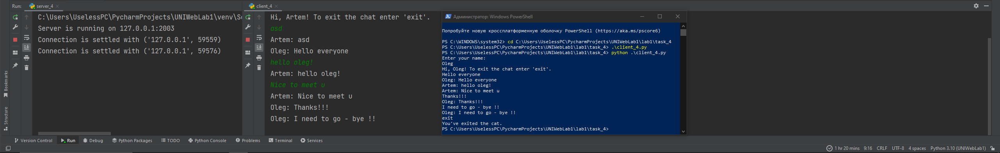

# Задание 4

Реализовать многопользовательский чат. Для применения с TCP
необходимо запускать клиентские подключения И прием и отправку
сообщений всем юзерам на сервере в потоках. Не забудьте сохранять
юзеров, чтобы потом отправлять им сообщения.

## Выполнение

### Реализация сервера

    import socket
    import threading
    
    clients = {}
    HOST = '127.0.0.1'
    PORT = 2003
    
    
    def handle_client(client_socket, client_address):
        try:
            client_socket.send("Enter your name: ".encode('utf-8'))
            client_name = client_socket.recv(1024).decode('utf-8')
            welcome_message = f"Hi, {client_name}! To exit the chat enter 'exit'."
            client_socket.send(welcome_message.encode('utf-8'))
            clients[client_name] = client_socket

        while True:
            message = client_socket.recv(1024).decode('utf-8')
            if message == 'exit':
                client_socket.send('exit'.encode('utf-8'))
                del clients[client_name]
                client_socket.close()
                break
            broadcast_message = f"{client_name}: {message}"
            # Рассылка сообщения всем клиентам
            for client in clients.values():
                client.send(broadcast_message.encode('utf-8'))

        except Exception as e:
            print(f"Error: {str(e)}")
            client_socket.close()

    def main():
        server_socket = socket.socket(socket.AF_INET, socket.SOCK_STREAM)
        server_socket.bind((HOST, PORT))
        server_socket.listen(5)

        print(f"Server is running on {HOST}:{PORT}")
    
        while True:
            client_socket, client_address = server_socket.accept()
            print(f"Connection is settled with {client_address}")
            client_thread = threading.Thread(target=handle_client, args=(client_socket, client_address))
            client_thread.start()

    if __name__ == "__main__":
        main()

### Реализация клиента

    import socket
    import threading
    
    HOST = '127.0.0.1'
    PORT = 2003
    
    
    def receive_messages(client_socket):
        while True:
            message = client_socket.recv(1024).decode('utf-8')
            if message == 'exit':
                print("You've exited the cat.")
                break
            print(message)
    
    
    def main():
        client_socket = socket.socket(socket.AF_INET, socket.SOCK_STREAM)
        client_socket.connect((HOST, PORT))
    
        receive_thread = threading.Thread(target=receive_messages, args=(client_socket,))
        receive_thread.start()
    
        while True:
            message = input()
            client_socket.send(message.encode('utf-8'))
            if message == 'exit':
                break
    
    
    if __name__ == "__main__":
        main()

## Пример работы

