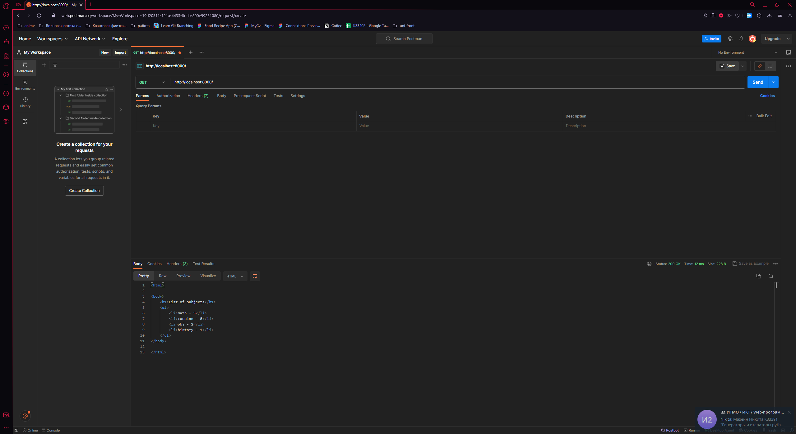

# Задание 5

Необходимо написать простой web-сервер для обработки GET и
POST http запросов средствами Python и библиотеки socket. Сделать
сервер, который может:

- Принять и записать информацию о дисциплине и оценке по
  дисциплине.
- Выдать информацию обо всех оценках по дисциплине в виде
  html-страницы.

## Выполнение

### Реализация сервера

    import socket
    import sys
    
    
    class MyHTTPServer:
        def __init__(self, host, port, server_name):
            self._host = host
            self._port = port
            self._server_name = server_name
            self.grades = []
            self.subjects = []
    
        def serve_forever(self):
            serv_sock = socket.socket(
                socket.AF_INET,  # IPv4
                socket.SOCK_STREAM,
                proto=0
            )
    
            try:
                serv_sock.bind((self._host, self._port))
                serv_sock.listen()
    
                while True:
                    conn, _ = serv_sock.accept()
                    try:
                        self.serve_client(conn)
                    except Exception as e:
                        print('Client serving failed', e)
            finally:
                serv_sock.close()
    
        def serve_client(self, conn):
            try:
                req = self.parse_request(conn)
                if req.method == 'GET':
                    resp = self.handle_get_request(req)
                elif req.method == 'POST':
                    resp = self.handle_post_request(req)
                else:
                    resp = self.create_response(405, 'Method Not Allowed', 'Only GET and POST methods are supported.')
    
                self.send_response(conn, resp)
            except ConnectionResetError:
                conn = None
            except Exception as e:
                self.send_error(conn, e)
    
            if conn:
                conn.close()
    
        def parse_request(self, conn):
            request_data = b''
            while b'\r\n\r\n' not in request_data:
                data = conn.recv(1024)
                if not data:
                    break
                request_data += data
    
            if not request_data:
                raise ValueError('Invalid request')
    
            request_lines = request_data.decode('utf-8').split('\r\n')  # Разделение запроса на строки
            method, path, _ = request_lines[0].split(' ')  # Извлечение метода и пути из первой строки запроса
            headers = {}
            for line in request_lines[1:]:
                if ':' in line:
                    key, value = line.split(':', 1)
                    headers[key.strip()] = value.strip()
    
            params = (
                {p.split("=")[0]: p.split("=")[1] for p in path.split("?")[1].split("&")}
                if "?" in path
                else None
            )
            print(params)
    
            return HTTPRequest(method, path.split("?")[0], headers, params)
    
        def handle_get_request(self, req):
            if req.path == '/':
                response_body = '<html><body><h1>List of subjects</h1><ul>{}</ul></body></html>'
                items = ''.join(
                    '<li>{} - {}</li>'.format(subject, grade) for subject, grade in zip(self.subjects, self.grades))
                print(self.subjects)
                response_body = response_body.format(items)
                return self.create_response(200, 'OK', response_body)
            else:
                return self.create_response(404, 'Not Found', 'Page not found')
    
        def handle_post_request(self, req):
            if req.path == '/record':
                self.grades.append(req.params.get("grade"))  # Добавление оценки в список
                self.subjects.append(req.params.get("subject"))  # Добавление предмета в список
                print(self.subjects)
                return self.create_response(200, 'OK', 'Record saved')
            else:
                return self.create_response(404, 'Not Found', 'Page not found')
    
        def create_response(self, status_code, status_text, body):
            response = f"HTTP/1.1 {status_code} {status_text}\r\n"
            response += f"Server: {self._server_name}\r\n"
            response += "Content-Type: text/html\r\n"
    
            response += f"Content-Length: {len(body)}\r\n"
            response += "\r\n"
            response += body
    
            return response.encode('utf-8')
    
        def send_response(self, conn, resp):
            conn.sendall(resp)
    
        def send_error(self, conn, err):
            error_message = f"HTTP/1.1 500 Internal Server Error\r\n\r\nError: {err}"
            conn.sendall(error_message.encode('utf-8'))
    
    
    class HTTPRequest:
        def __init__(self, method, path, headers, params):
            self.method = method
            self.path = path
            self.headers = headers
            self.params = params
    
        def read_body(self, length):
            body = b''
            while len(body) < length:
                data = self.conn.recv(length - len(body))
                if not data:
                    break
                body += data
    
            return body.decode('utf-8')
    
    
    if __name__ == '__main__':
        host = 'localhost'
        port = 8000
        name = 'UselessStudentServer'
    
        serv = MyHTTPServer(host, port, name)
        print("Server listening on port", port)
        try:
            serv.serve_forever()
        except KeyboardInterrupt:
            pass

## Пример работы

## Результат
