# Лабораторная работа 4. Реализация клиентской части средствами Vue.js.

Вход
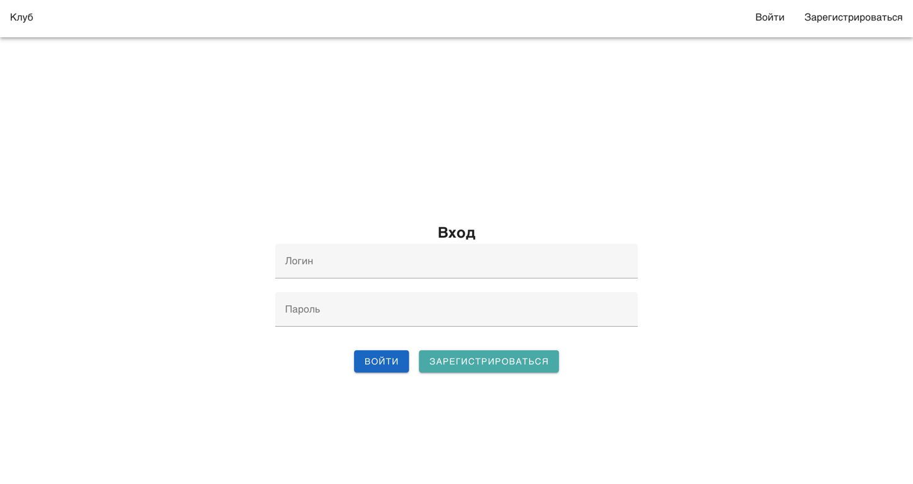

Регистрация

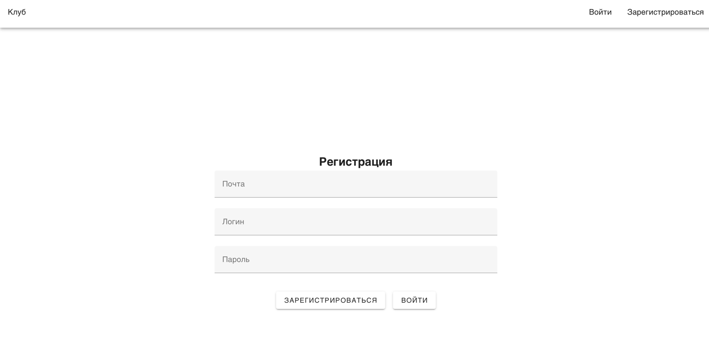

Список альпинистов

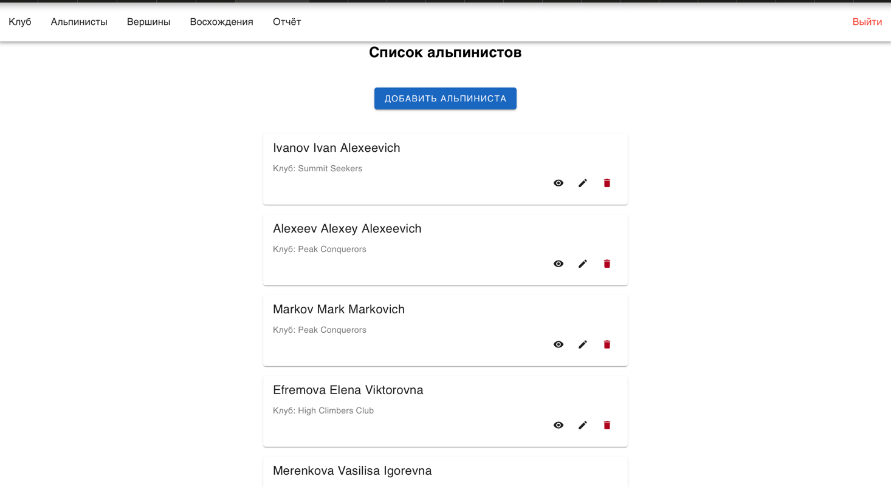

Окно для изменения альпиниста
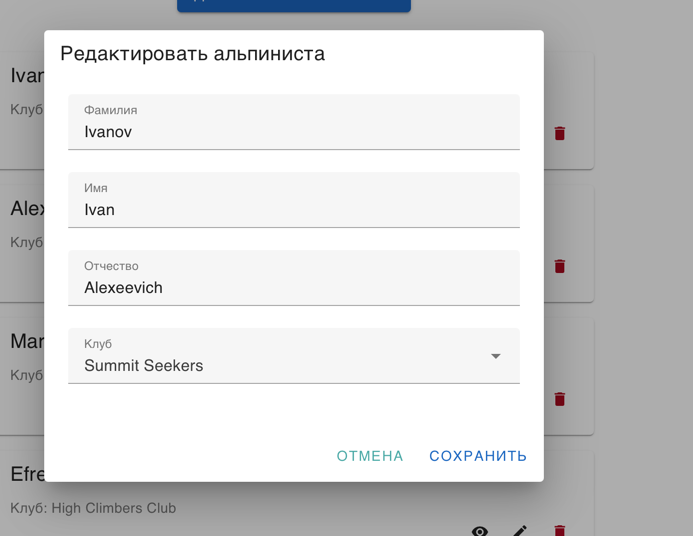

Окно для добавления альпиниста
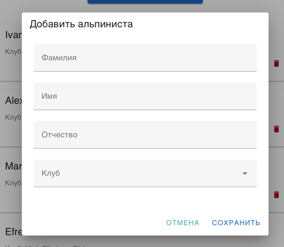

Подробная информация об альпинисте
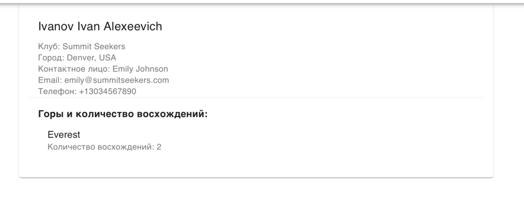

Список вершин
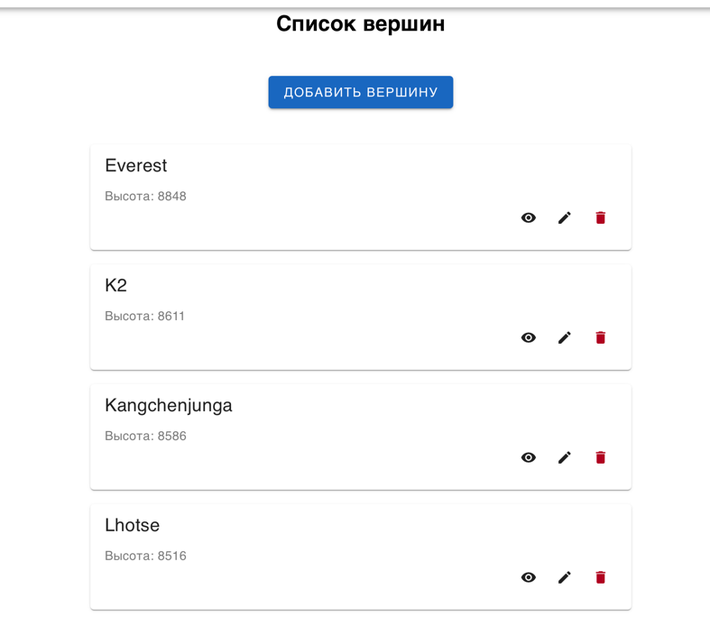

Окно для добавления вершины
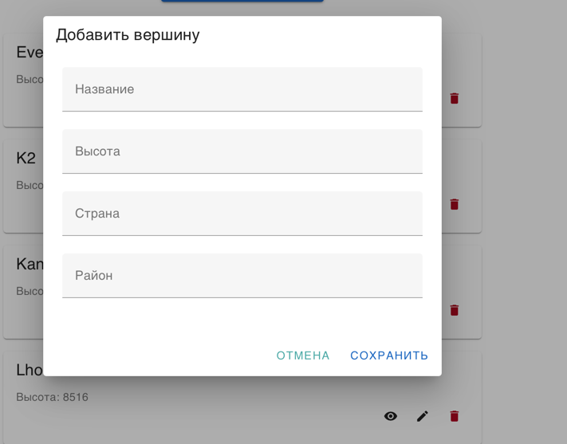

Окно для изменения вершины
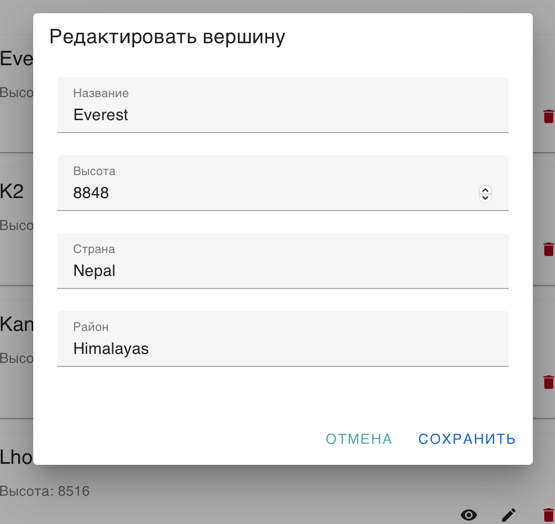

Подробная информация о вершине
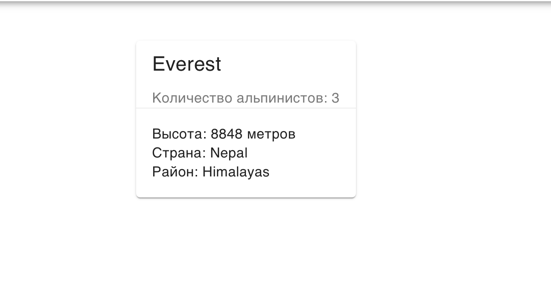

Список восхождений
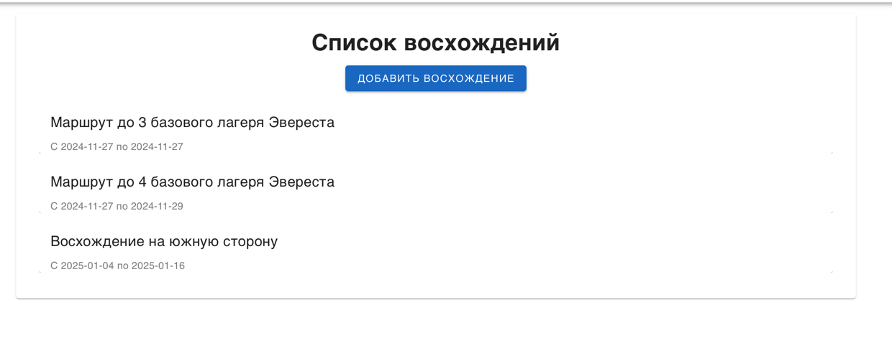

Окно для добавления восхождения
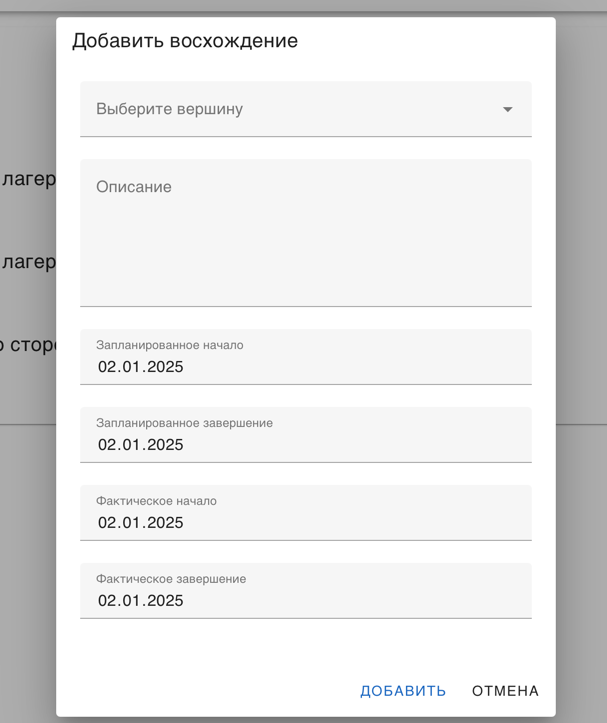

Подробная информация о восхождении
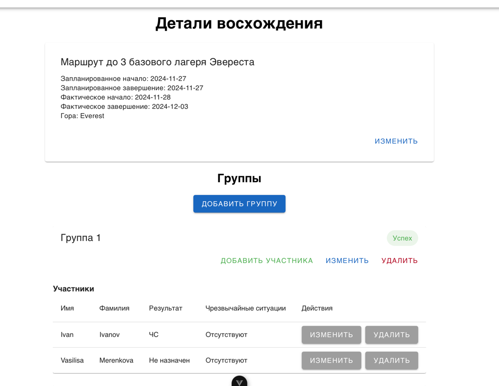

Изменить даты восхождения
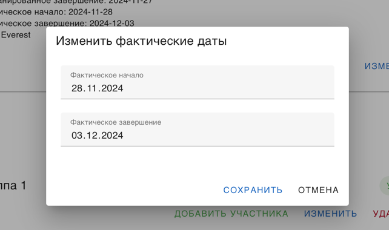

Окно добавления группы
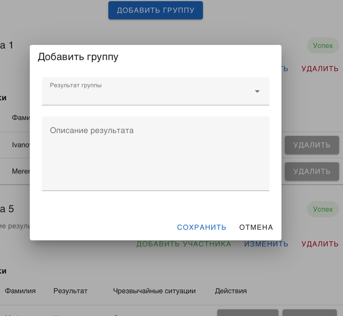

Окно добавления участника в группу
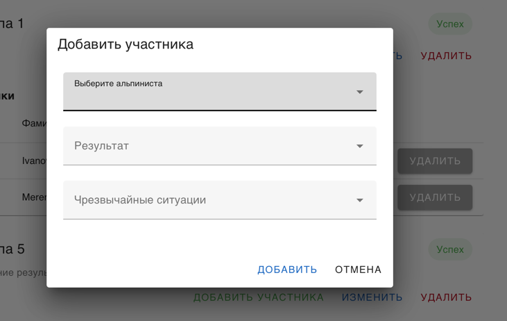

Окно редактирования результатов группы
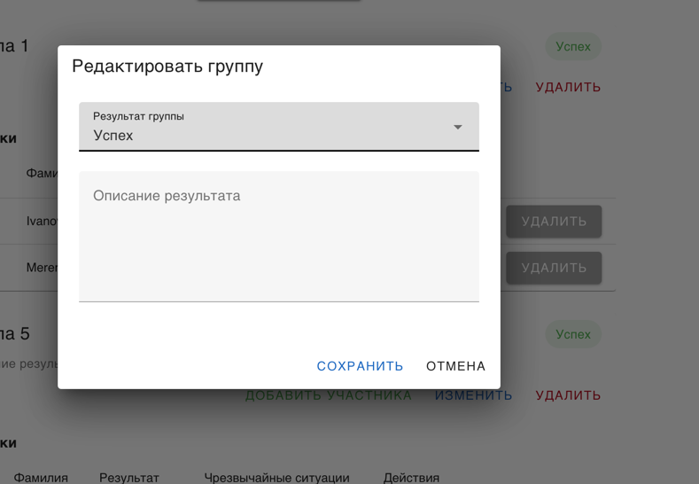

Окно редактирования результатов участникоч
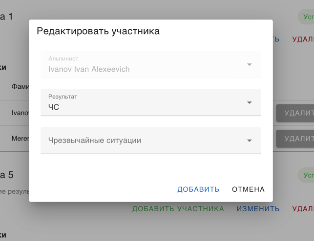

Отчёт о восхождениях за период
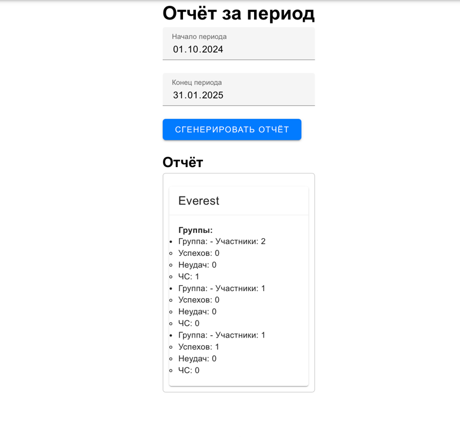