# Лабораторная работа №2

## Вариант: Конференции

### Описание

Интерфейс описывает названия конференций, список тематик, место проведения,
период проведения, описание конференций, описание место проведения, условия участия.
Необходимо реализовать следующий функционал:

- Регистрация новых пользователей.
- Просмотр конференций и регистрацию авторов для выступлений.
- Пользователь должен иметь возможность редактирования и удаления своих
регистраций.
- Написание отзывов к конференциям. При добавлении комментариев,
должны сохраняться даты конференции, текст комментария, рейтинг (1-10),
информация о комментаторе.
- Администратор должен иметь возможность указания результатов
выступления (рекомендован к публикации или нет) средствами Django-
admin.
- В клиентской части должна формироваться таблица, отображающая всех
участников по конференциям.

  ## Реализация:

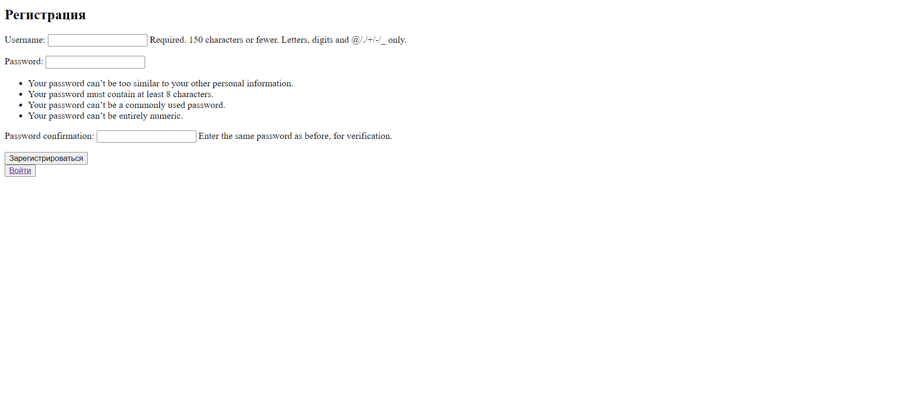
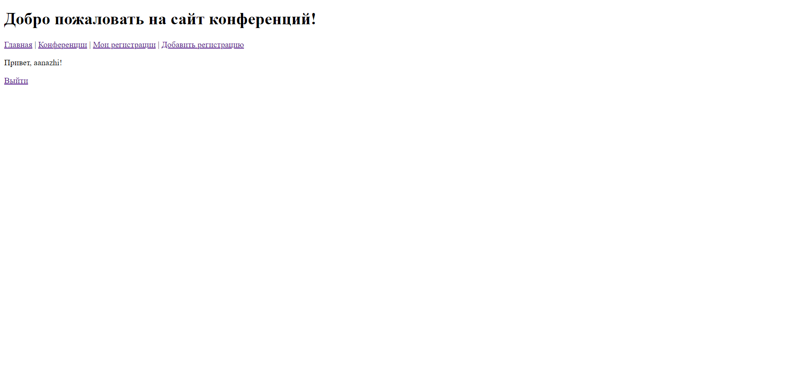
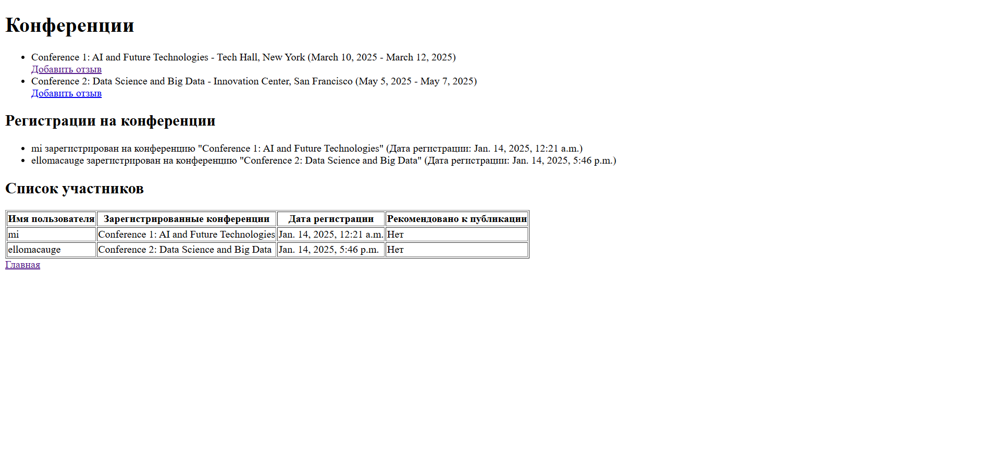
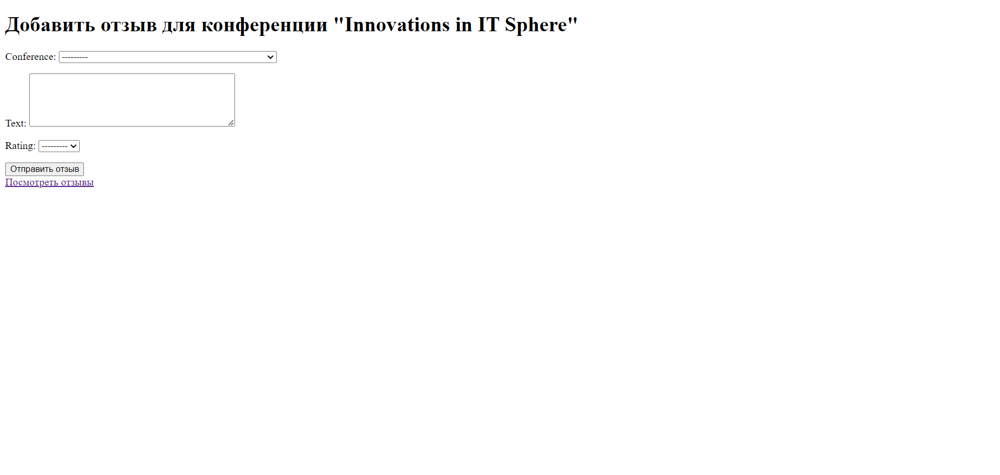
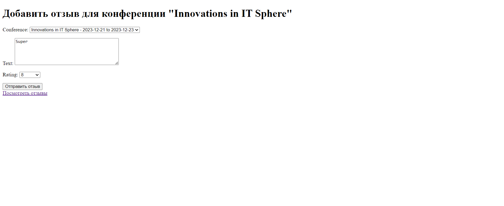
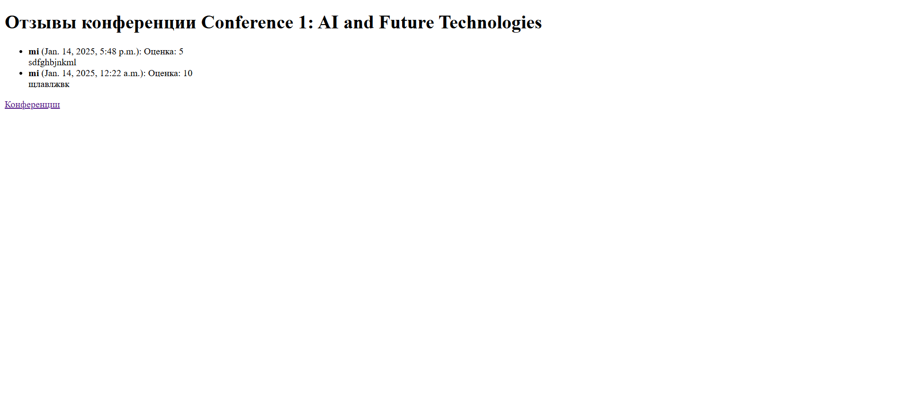
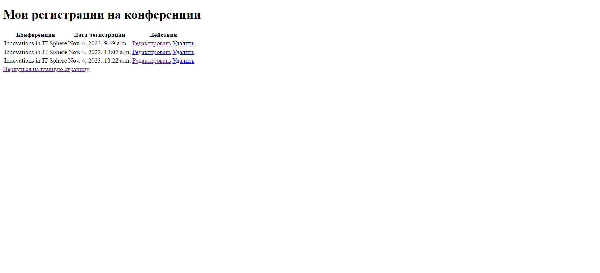
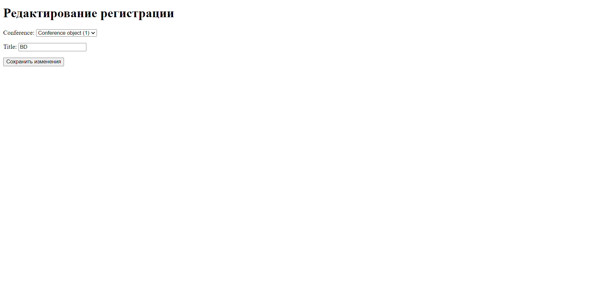
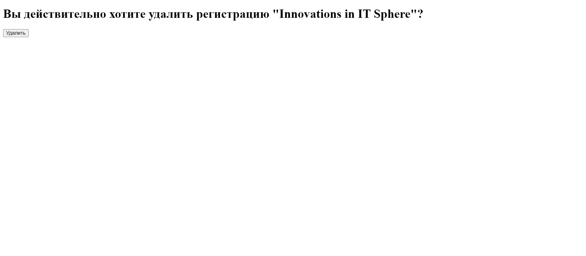 
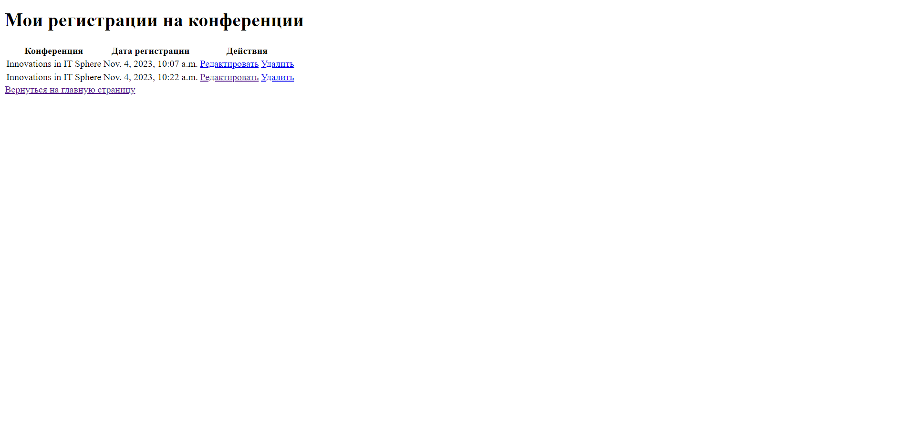
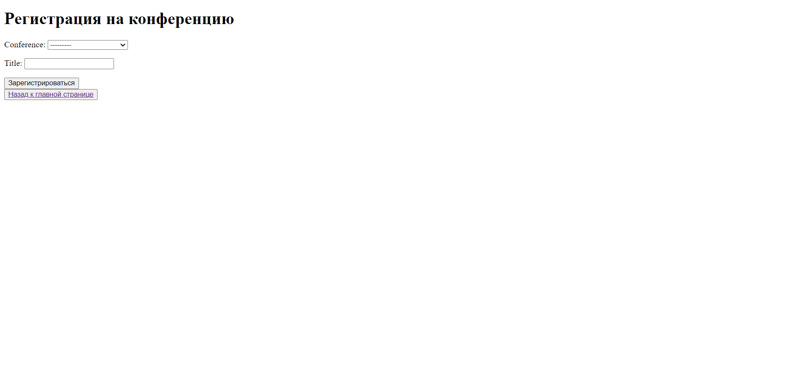

# Realization html

### add_review.html

```html
<!DOCTYPE html>
<html>
<head>
    <title>Добавить отзыв</title>
</head>
<body>
    <h1>Добавить отзыв для конференции "{{ conference.title }}"</h1>
    <form method="post">
        
        {{ form.as_p }}
        <button type="submit">Отправить отзыв</button>
    </form>
    <a href="">Посмотреть отзывы</a>
</body>
</html>

```

### create_registration.html

```html
<!DOCTYPE html>
<html lang="en">
<head>
    <meta charset="UTF-8">
    <title>Регистрация на конференцию</title>
</head>
<body>
    <h1>Регистрация на конференцию</h1>
    <form method="post">
        
        {{ form.as_p }}
        <button type="submit">Зарегистрироваться</button>
    </form>
    <button type="submit"> <a href="">Назад к главной странице</a></button>
</body>
</html>
```

### delete_registration.html

```html
<!DOCTYPE html>
<html lang="en">
<head>
    <meta charset="UTF-8">
    <title>Удаление регистрации</title>
</head>
<body>
    <h1>Вы действительно хотите удалить регистрацию "{{ registration.conference.title }}"?</h1>
    <form method="post">
        
        <button type="submit">Удалить</button>
    </form>
</body>
</html>
```

### edit_registration.html

```html
<!DOCTYPE html>
<html lang="en">
<head>
    <meta charset="UTF-8">
    <title>Редактирование регистрации</title>
</head>
<body>
    <h1>Редактирование регистрации</h1>
    <form method="post">
        
        {{ form.as_p }}
        <button type="submit">Сохранить изменения</button>
    </form>
</body>
</html>
```

### index.html

```html
<!DOCTYPE html>
<html lang="en">
<head>
    <meta charset="UTF-8">
    <title>Главная страница конференции</title>
</head>
<body>
    <h1>Добро пожаловать на сайт конференций!</h1>
    <nav>
        <a href="">Главная</a> |
        <a href="">Конференции</a> |
        <a href="">Мои регистрации</a> |
        <a href="">Добавить регистрацию</a>
    </nav>
    
        <p>Привет, {{ user.username }}!</p>
        <a href="">Выйти</a>
    
        <a href="">Регистрация</a> |
        <a href="">Вход</a>
    
</body>
</html>
```

### list.html

```html
<!DOCTYPE html>
<html>
<head>
    <title>Список конференций</title>
</head>
<body>
    <h1>Конференции</h1>
    <ul>
        
            <li>{{ conference.title }} - {{ conference.venue }} ({{ conference.start_date }} - {{ conference.end_date }})</li>
            <a href="">Добавить отзыв</a>
        
    </ul>

    <h2>Регистрации на конференции</h2>
    <ul>
        
            <li>{{ registration.user.username }} зарегистрирован на конференцию "{{ registration.conference.title }}" (Дата регистрации: {{ registration.date_registered }})</li>
        
    </ul>

    <h2>Список участников</h2>
    <table border="1">
        <tr>
            <th>Имя пользователя</th>
            <th>Зарегистрированные конференции</th>
            <th>Дата регистрации</th>
            <th>Рекомендовано к публикации</th>
        </tr>
        
            <tr>
                <td>{{ registration.user.username }}</td>
                <td>{{ registration.conference.title }}</td>
                <td>{{ registration.date_registered }}</td>
                <td>{{ registration.recommended_for_publication|yesno:"Да,Нет" }}</td>
            </tr>
        
    </table>
    
    <a href="">Главная</a>
</body>
</html>
```

### my_registrations.html

```html
<!DOCTYPE html>
<html lang="en">
<head>
    <meta charset="UTF-8">
    <title>Мои регистрации</title>
</head>
<body>
    <h1>Мои регистрации на конференции</h1>
    <table>
        <tr>
            <th>Конференция</th>
            <th>Дата регистрации</th>
            <th>Действия</th>
        </tr>
        
        <tr>
            <td>{{ registration.conference.title }}</td>
            <td>{{ registration.date_registered }}</td>
            <td>
                <a href="">Редактировать</a>
                <a href="" onclick="return confirm('Вы уверены, что хотите удалить регистрацию?');">Удалить</a>
            </td>
        </tr>
        
        <tr>
            <td colspan="3">Регистрации отсутствуют.</td>
        </tr>
        
    </table>
    <a href="">Вернуться на главную страницу</a>
</body>
</html>
```

### register.html

```html
<!DOCTYPE html>
<html>
<head>
  <title>Регистрация</title>
</head>
<body>
  <h2>Регистрация</h2>
  <form method="post">
    
    {{ form.as_p }}
    <button type="submit">Зарегистрироваться</button>
  </form>
  <button type="submit"><a href="">Войти</a></button>
</body>
```

### reviews_list.html

```html
<!DOCTYPE html>
<html>
<head>
    <title>Отзывы конференции {{ conference.title }}</title>
</head>
<body>
    <h1>Отзывы конференции {{ conference.title }}</h1>
    <ul>
        
        <li>
            <strong>{{ review.author.username }}</strong> ({{ review.comment_date }}): 
            Оценка: {{ review.rating }}<br>
            {{ review.text }}
        </li>
        
        <li>Отзывов пока нет.</li>
        
    </ul>
    <a href="">Конференции</a>
</body>
</html>
```

# Realization python

### models.py

```python
from django.db import models
from django.contrib.auth.models import User

class Conference(models.Model):
    title = models.CharField(max_length=200)
    topics = models.TextField()
    location_description = models.TextField()
    venue = models.CharField(max_length=200)
    start_date = models.DateField()
    end_date = models.DateField()
    participation_conditions = models.TextField()

class Author(models.Model):
    user = models.ForeignKey(User, on_delete=models.CASCADE)
    biography = models.TextField()

class Registration(models.Model):
    user = models.ForeignKey(User, on_delete=models.CASCADE)
    conference = models.ForeignKey(Conference, on_delete=models.CASCADE)
    date_registered = models.DateTimeField(auto_now_add=True)
    title = models.CharField(max_length=200, default='') 
    recommended_for_publication = models.BooleanField(default=False) 

class Presentation(models.Model):
    conference = models.ForeignKey(Conference, on_delete=models.CASCADE)
    author = models.ForeignKey(Author, on_delete=models.CASCADE)
    title = models.CharField(max_length=200)
    abstract = models.TextField()
    recommended_for_publication = models.BooleanField(default=False)

class Review(models.Model):
    conference = models.ForeignKey(Conference, on_delete=models.CASCADE)
    author = models.ForeignKey(User, on_delete=models.CASCADE)
    comment_date = models.DateTimeField(auto_now_add=True)
    text = models.TextField()
    rating = models.IntegerField(choices=[(i, i) for i in range(1, 11)])

```


### admin.py

```python
from django.contrib import admin
from .models import Conference, Author, Presentation, Review, Registration

@admin.register(Conference)
class ConferenceAdmin(admin.ModelAdmin):
    list_display = ('title', 'venue', 'start_date', 'end_date')
    search_fields = ('title', 'venue')
    list_filter = ('start_date', 'end_date')
    ordering = ('start_date',)

@admin.register(Author)
class AuthorAdmin(admin.ModelAdmin):
    list_display = ('user', 'biography')
    search_fields = ('user__username', 'user__email')

@admin.register(Registration)
class RegistrationAdmin(admin.ModelAdmin):
    list_display = ('user', 'conference', 'date_registered', 'title')
    list_filter = ('conference',)
    search_fields = ('user__username', 'conference__title')
    raw_id_fields = ('user', 'conference')

@admin.register(Presentation)
class PresentationAdmin(admin.ModelAdmin):
    list_display = ('title', 'conference', 'author', 'recommended_for_publication')
    search_fields = ('title', 'conference__title', 'author__user__username')
    list_filter = ('recommended_for_publication', 'conference')
    ordering = ('conference', 'author')

@admin.register(Review)
class ReviewAdmin(admin.ModelAdmin):
    list_display = ('conference', 'author', 'rating', 'comment_date')
    search_fields = ('conference__title', 'author__username', 'text')
    list_filter = ('rating', 'comment_date')
    ordering = ('comment_date', 'rating')
```


### forms.py

```python
from django import forms
from .models import Presentation, Registration, Review, Conference

class PresentationForm(forms.ModelForm):
    class Meta:
        model = Presentation
        fields = ['title', 'abstract']  

    def __init__(self, *args, **kwargs):
        super(PresentationForm, self).__init__(*args, **kwargs)
        self.fields['title'].widget.attrs.update({'class': 'form-control'})
        self.fields['abstract'].widget.attrs.update({'class': 'form-control'})

class RegistrationForm(forms.ModelForm):
    class Meta:
        model = Registration
        fields = ['conference', 'title'] 

    def __init__(self, *args, **kwargs):
        super().__init__(*args, **kwargs)

class ReviewForm(forms.ModelForm):
    class Meta:
        model = Review
        fields = ['conference', 'text', 'rating']
        widgets = {
            'text': forms.Textarea(attrs={'cols': 40, 'rows': 5}),
            'rating': forms.Select(choices=Review._meta.get_field('rating').choices),
        }

    def __init__(self, *args, **kwargs):
        super().__init__(*args, **kwargs)
        self.fields['conference'].queryset = Conference.objects.all()
        self.fields['conference'].label_from_instance = lambda obj: f"{obj.title} - {obj.start_date} to {obj.end_date}"
```


### urls.py

```python
from django.urls import path
from .views import register
from . import views
from django.contrib.auth import views as auth_views

urlpatterns = [
    path('', views.index, name='index'),
    path('registrations/edit/<int:registration_id>/', views.edit_registration, name='edit_registration'),
    path('registrations/delete/<int:registration_id>/', views.delete_registration, name='delete_registration'),
    path('conferences/<int:conference_id>/add_review/', views.add_review, name='add_review'),
    path('register/', views.register, name='register'),
    path('logout/', auth_views.LogoutView.as_view(next_page='index'), name='logout'),
    path('login/', auth_views.LoginView.as_view(next_page='index'), name='login'),
    path('my_registrations/', views.my_registrations_view, name='my_registrations'),
    path('edit_registration/<int:registration_id>/', views.edit_registration, name='edit_registration'),
    path('delete_registration/<int:registration_id>/', views.delete_registration, name='delete_registration'),
    path('conferences/register/', views.create_registration, name='create_registration'),
    path('reviews/', views.review_list, name='review_list'),
    path('conferences/', views.list_conferences),
    path('conferences/', views.list_conferences, name='list_conferences'),
    path('register/<int:conference_id>/', views.register_presentation),
    path('presentations/edit/<int:presentation_id>/', views.edit_presentation),
    path('presentations/delete/<int:presentation_id>/', views.delete_presentation),
    path('conferences/<int:conference_id>/add_review/', views.add_review, name='add_review'),
    path('conferences/<int:conference_id>/reviews/', views.review_list, name='review_list'),
]
```

### view.py

```python
from django.shortcuts import render, redirect, get_object_or_404
from django.contrib.auth import login
from django.contrib.auth.decorators import login_required
from django.contrib.auth.forms import UserCreationForm
from .models import Conference, Presentation, Registration, Review
from .forms import PresentationForm, RegistrationForm
from .forms import ReviewForm

@login_required
def edit_registration(request, registration_id):
    registration = get_object_or_404(Registration, id=registration_id, user=request.user)
    if request.method == 'POST':
        form = RegistrationForm(request.POST, instance=registration)
        if form.is_valid():
            form.save()
            return redirect('my_registrations') 
    else:
        form = RegistrationForm(instance=registration)
    
    return render(request, 'edit_registration.html', {'form': form})

@login_required
def delete_registration(request, registration_id):
    registration = get_object_or_404(Registration, id=registration_id, user=request.user)
    if request.method == 'POST':
        registration.delete()
        return redirect('my_registrations') 
    return render(request, 'delete_registration.html', {'registration': registration})


@login_required
def my_registrations_view(request):
    registrations = Registration.objects.filter(user=request.user)
    return render(request, 'my_registrations.html', {'registrations': registrations})

@login_required
def add_review(request, conference_id):
    conference = get_object_or_404(Conference, pk=conference_id)
    if request.method == 'POST':
        form = ReviewForm(request.POST)
        if form.is_valid():
            review = form.save(commit=False)
            review.author = request.user
            review.conference = conference
            review.save()
            return redirect('review_list', conference_id=conference_id)
    else:
        form = ReviewForm()
    return render(request, 'add_review.html', {'form': form, 'conference': conference})

def register(request):
    if request.method == 'POST':
        form = UserCreationForm(request.POST)
        if form.is_valid():
            user = form.save()
            login(request, user)
            return render(request, 'index.html')
    else:
        form = UserCreationForm()
    return render(request, 'register.html', {'form': form})

def index(request):
    return render(request, 'index.html')


def list_conferences(request):
    conferences = Conference.objects.all()
    registrations = Registration.objects.select_related('conference', 'user').all()
    return render(request, 'list.html', {
        'conferences': conferences,
        'registrations': registrations
    })

@login_required
def register_presentation(request, conference_id):
    conference = get_object_or_404(Conference, id=conference_id)
    if request.method == 'POST':
        form = PresentationForm(request.POST)
        if form.is_valid():
            presentation = form.save(commit=False)
            presentation.author = request.user.author
            presentation.conference = conference
            presentation.save()
            return redirect('list_conferences')
    else:
        form = PresentationForm()
    return render(request, 'register_presentation.html', {'form': form, 'conference': conference})

@login_required
def edit_presentation(request, presentation_id):
    presentation = get_object_or_404(Presentation, id=presentation_id, author__user=request.user)
    if request.method == 'POST':
        form = PresentationForm(request.POST, instance=presentation)
        if form.is_valid():
            form.save()
            return redirect('list_conferences')
    else:
        form = PresentationForm(instance=presentation)
    return render(request, 'edit_presentation.html', {'form': form, 'presentation': presentation})

@login_required
def delete_presentation(request, presentation_id):
    presentation = get_object_or_404(Presentation, id=presentation_id, author__user=request.user)
    if request.method == 'POST':
        presentation.delete()
        return redirect('list_conferences')
    return render(request, 'delete_presentation.html', {'presentation': presentation})


def review_list(request, conference_id):
    reviews = Review.objects.filter(conference_id=conference_id).order_by('-comment_date')
    conference = Conference.objects.get(pk=conference_id)
    return render(request, 'reviews_list.html', {'reviews': reviews, 'conference': conference})


@login_required
def create_registration(request):
    if request.method == 'POST':
        form = RegistrationForm(request.POST)
        if form.is_valid():
            registration = form.save(commit=False)
            registration.user = request.user
            registration.save()
            return redirect('my_registrations')
    else:
        form = RegistrationForm()
    return render(request, 'create_registration.html', {'form': form})
```
