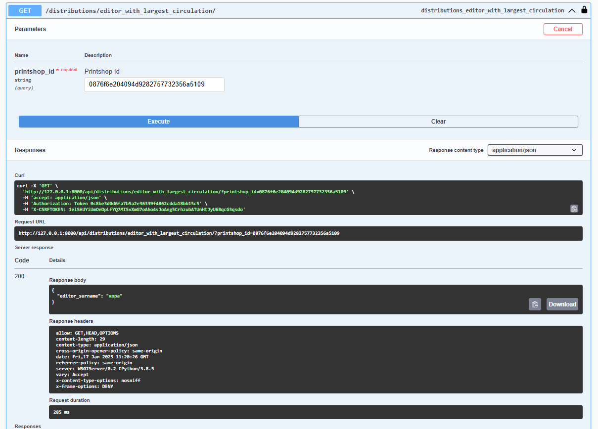
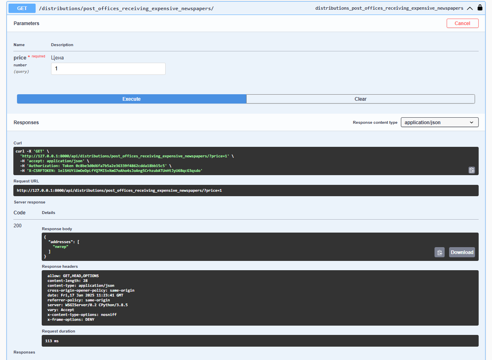

# Лабораторная работа №3

# Система, позволяющая отслеживать распределение по почтовым отделениям газет, печатающихся в типографиях 

## Модели

- **Editor** (Редактор газеты)
- **Newspaper** (Газета с ценой и индексом итд)
- **PrintShop** (Типография)
- **PostOffice** (Почтовое отделение)
- **Distribution** (Отслеживает распространение газет из типографии в почтовые отделения)
---

## Endpoints

### Editors
- **URL**: `/editors/`
- **Methods**: GET, POST, PUT, DELETE
- **Description**: Manage editor information.

---

### Newspapers
- **URL**: `/newspapers/`
- **Methods**: GET, POST, PUT, DELETE
- **Description**: Manage newspaper information.

#### Additional Action:
- **`GET /newspapers/{id}/index_and_price/`**  
    Retrieves the index, price, and last price update timestamp for a specific newspaper.

---

### Print Shops
- **URL**: `/printshops/`
- **Methods**: GET, POST, PUT, DELETE
- **Description**: Manage print shop information.

#### Additional Action:
- **`GET /printshops/{id}/report/`**  
    Retrieves a detailed report of the newspapers printed and distributed by a specific print shop.

---

### Post Offices
- **URL**: `/postoffices/`
- **Methods**: GET, POST, PUT, DELETE
- **Description**: Manage post office information.

---

### Distributions
- **URL**: `/distributions/`
- **Methods**: GET, POST, PUT, DELETE
- **Description**: Manage distribution records.

#### Additional Actions:
1. **`GET /distributions/newspapers_printed_at_address/`**  
    Retrieves addresses of print shops where a specific newspaper was printed.
    - **Query Parameters**:
        - `newspaper_name` (required): Name of the newspaper.

2. **`GET /distributions/editor_with_largest_circulation/`**  
    Retrieves the surname of the editor whose newspaper had the largest circulation at a specific print shop.
    - **Query Parameters**:
        - `printshop_id` (required): ID of the print shop.

3. **`GET /distributions/post_offices_receiving_expensive_newspapers/`**  
    Retrieves addresses of post offices receiving newspapers priced higher than a specified value.
    - **Query Parameters**:
        - `price` (required): Price threshold.

4. **`GET /distributions/newspapers_with_low_circulation/`**  
    Retrieves newspapers with circulation lower than a specified quantity.
    - **Query Parameters**:
        - `quantity` (required): Circulation threshold.

5. **`GET /distributions/newspaper_distribution_at_address/`**  
    Retrieves post offices receiving a specific newspaper from a specific print shop.
    - **Query Parameters**:
        - `newspaper_name` (required): Name of the newspaper.
        - `printshop_address` (required): Address of the print shop.

## Запросы к БД

- Фамилия редактора газеты, которая печатается в указанной типографии самым
большим тиражом?

- На какие почтовые отделения (адреса) поступает газета, имеющая цену, больше
указанной?


etc.

---

## Authentication
- The API requires authentication for all endpoints.
- Authentication is managed through `djoser` and `TokenAuthentication`.

## URL Routing
- **Base URL**: `/`
- **Auth Endpoints**: `/auth/`

## Installation
1. Include the app URLs in your Django project's `urls.py`:
    ```python
    from django.urls import path, include
    urlpatterns = [
        path('', include('your_app.urls')),
    ]
    ```
2. Ensure you have the necessary models and serializers defined in your project.


