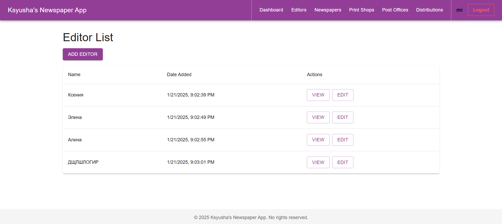

# Лабораторная работа №4

## Overview
This documentation describes the frontend part of the **Ksyusha's Newspaper App** project. The application is built using **React**, **TypeScript**, and **Material-UI** for the user interface with a Django backend. It includes authentication, CRUD operations, a dynamic dashboard with graphs, and various management features.
 
Entities: editors, newspapers, printshops, post offices, distributions.

## Technologies Used
- **React** (v18+)
- **TypeScript**
- **Material-UI**
- **Recharts** (for charts and graphs)
- **React Router v6**
- **Axios** (for API calls)


## Key Interfaces
### AuthContext
The `AuthContext` interface defines the structure for authentication logic in the application.
```ts
interface AuthContextType {
    token: string | null;
    login: (username: string, password: string) => Promise<void>;
    register: (username: string, password: string) => Promise<void>;
    logout: () => void;
}
```
- **token:** Stores the authentication token.
- **login:** Authenticates the user and stores the token.
- **register:** Registers a new user and logs them in.
- **logout:** Clears authentication data and redirects the user to the login page.

### Distribution
The `Distribution` interface represents the data structure for a distribution entity.
```ts
interface Distribution {
    id: string;
    newspaper: {
        id: string;
        name: string;
    };
    printshop: {
        id: string;
        name: string;
        address: string;
    };
    postoffice: {
        id: string;
        office_number: number;
        address: string;
    };
    copies_printed: number;
    copies_sent: number;
    created_at: string;
    updated_at: string;
}
```
- **id:** Unique identifier for the distribution.
- **newspaper:** Information about the associated newspaper.
- **printshop:** Details about the printshop where the newspaper was printed.
- **postoffice:** Information about the post office where copies were sent.
- **copies_printed:** Total number of copies printed.
- **copies_sent:** Number of copies sent to the post office.
- **created_at:** Timestamp of record creation.
- **updated_at:** Timestamp of the last update.

## Authentication
### AuthContext
Located at `src/context/AuthContext.tsx`

The authentication context provides centralized state management for user authentication.
- **login:** Sends credentials to the backend and stores the authentication token.
- **register:** Registers a new user, logs them in, and stores the token.
- **logout:** Clears authentication data from localStorage and resets the state.

### Login Page
Located at `src/components/Auth/Login.tsx`
```tsx
const handleLogin = async (values: { username: string; password: string }) => {
    await authContext.login(values.username, values.password);
    navigate('/dashboard');
};
```
The login page validates user credentials and redirects to the dashboard upon successful authentication.

## Header Component
Located at `src/components/layout/Header.tsx`
- Provides navigation links to key sections.
- Displays the username of the authenticated user.
- Includes a logout button to clear authentication data.
- Uses `Divider` for visual separation between sections.

### Example Snippet:
```tsx
<Button onClick={handleLogout} variant="outlined" color="error">
    Выйти
</Button>
```
The logout button is styled to stand out from regular navigation buttons.

## Dashboard
Located at `src/pages/Dashboard.tsx`
The dashboard aggregates statistical data and visualizes it using Recharts.
- **Bar Charts:** Show data trends.
- **Pie Charts:** Represent categorical data.
- **Search Filters:** Allow dynamic querying of statistical data.
- **Interactive Widgets:** Provide insights at a glance.

### Example Graph Integration:
```tsx
<ResponsiveContainer width="100%" height={300}>
    <BarChart data={lowCirculationData}>
        <XAxis dataKey="newspaper" />
        <YAxis />
        <Bar dataKey="copies" fill="#8884d8" />
    </BarChart>
</ResponsiveContainer>
```

## CRUD for Distribution
Located at `src/pages/distributions`
- **List:** Fetch and display all distribution records.
- **Detail:** Show specific distribution details.
- **Form:** Allow creating and updating distribution records.


## Running the Project
1. Run the django project from the previos lab work at `http://localhost:8000`.
2. Install dependencies:
```bash
npm install
```
3. Start the development server:
```bash
npm start
```
4. Access the app at `http://localhost:3000`.

## Interface

