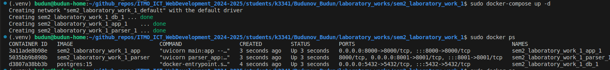
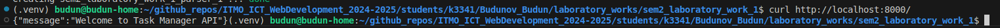
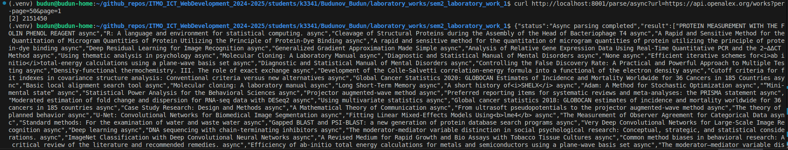
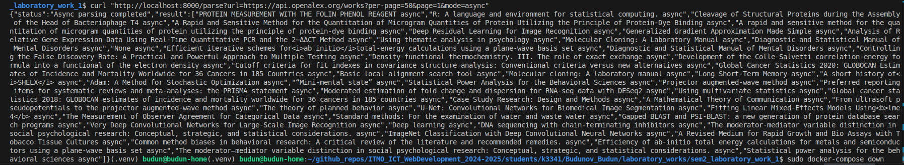
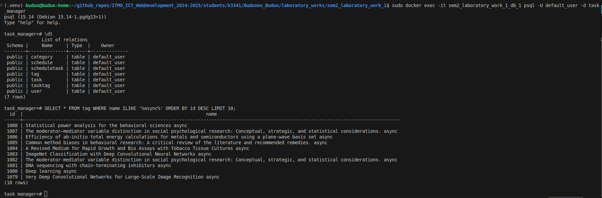

# Отчет по лабораторной работе №3: Упаковка и интеграция FastAPI приложения с парсером данных в Docker

## Введение

В рамках лабораторной работы были выполнены две подзадачи: упаковка FastAPI приложения, базы данных PostgreSQL и парсера данных в Docker (подзадача 1) и добавление endpoint в FastAPI для вызова парсера из отдельного контейнера (подзадача 2).

### Основные файлы проекта:
- `main.py`: Основное FastAPI приложение для управления задачами.
- `parser_app.py`: FastAPI приложение для парсера.
- `task_async.py`, `task_threading.py`, `task_multiprocessing.py`: Модули для парсинга в асинхронном, многопоточном и мультипроцессном режимах.
- `parse_functions.py`: Функции для парсинга и сохранения данных в базу.
- `database.py`, `models.py`, `schemas.py`, `security.py`, `functions.py`: Вспомогательные модули для работы с базой данных и авторизацией.
- `Dockerfile`: Конфигурация для сборки Docker-образа.
- `docker-compose.yml`: Конфигурация для оркестрации сервисов.
- `requirements.txt`: Зависимости проекта.


---

## Подзадача 1: Упаковка FastAPI приложения, базы данных и парсера данных в Docker

### 1.1. Конфигурация Dockerfile

`Dockerfile` определяет базовый образ, устанавливает зависимости и копирует файлы приложения.

```dockerfile
FROM python:3.10-slim

RUN apt-get update && apt-get install -y \
    build-essential \
    && rm -rf /var/lib/apt/lists/*

WORKDIR /app

RUN pip install --upgrade pip

COPY requirements.txt .
RUN pip install --no-cache-dir -r requirements.txt

COPY main.py .
COPY database.py .
COPY models.py .
COPY schemas.py .
COPY security.py .
COPY functions.py .
COPY parse_functions.py .
COPY parser_app.py .
COPY task_async.py .
COPY task_threading.py .
COPY task_multiprocessing.py .

EXPOSE 8000

CMD ["uvicorn", "main:app", "--host", "0.0.0.0", "--port", "8000"]
```

### 1.2. Конфигурация docker-compose.yml

`docker-compose.yml` определяет три сервиса: `db` (PostgreSQL), `app` (основное FastAPI приложение), и `parser` (FastAPI приложение для парсинга).

```yaml
version: '3.8'

services:
  db:
    image: postgres:15
    restart: always
    environment:
      POSTGRES_DB: task_manager
      POSTGRES_USER: default_user
      POSTGRES_PASSWORD: default
    ports:
      - "5432:5432"
    volumes:
      - db_data:/var/lib/postgresql/data

  app:
    build: .
    restart: always
    command: ["uvicorn", "main:app", "--host", "0.0.0.0", "--port", "8000"]
    ports:
      - "8000:8000"
    depends_on:
      - db
    environment:
      DATABASE_URL: postgresql://default_user:default@db:5432/task_manager

  parser:
    build: .
    restart: always
    command: ["uvicorn", "parser_app:app", "--host", "0.0.0.0", "--port", "8001"]
    ports:
      - "8001:8001"
    depends_on:
      - db
    environment:
      DATABASE_URL: postgresql://default_user:default@db:5432/task_manager

volumes:
  db_data:
```

### 1.3. Ключевые команды

- **Сборка и запуск контейнеров**:
  ```bash
  sudo docker-compose build --no-cache
  sudo docker-compose up -d
  ```

- **Проверка статуса контейнеров**:
  ```bash
  sudo docker ps
  ```
  

- **Проверка работы `app` сервиса**:
  ```bash
  curl http://localhost:8000/
  ```
  

- **Проверка работы `parser` сервиса**:
  ```bash
  curl http://localhost:8001/parse/async?url=https://api.openalex.org/works?per-page=50&page=1
  ```
  

### 1.4. Результаты

После выполнения вышеуказанных шагов:
- Все контейнеры успешно запущены.
- Основное приложение (`app`) доступно на `http://localhost:8000`.
- Парсер (`parser`) доступен на `http://localhost:8001`.
- База данных PostgreSQL сохраняет данные (теги), добавленные парсером.

---

## Подзадача 2: Вызов парсера из FastAPI

### 2.1. Код `parser_app.py`

```python
from fastapi import FastAPI
from task_async import task_2 as async_parse
from task_threading import task_2 as threading_parse
from task_multiprocessing import task_2 as multiprocessing_parse

app = FastAPI()

@app.get("/parse/{mode}")
async def run_parser(mode: str, url: str):
    if mode == "async":
        result = await async_parse(url)
        return {"status": "Async parsing completed", "result": result}
    elif mode == "threading":
        result = threading_parse(url)
        return {"status": "Threading parsing completed", "result": result}
    elif mode == "multiprocessing":
        result = multiprocessing_parse(url)
        return {"status": "Multiprocessing parsing completed", "result": result}
    else:
        return {"error": "Invalid mode. Use 'async', 'threading' or 'multiprocessing'"}
```

### 2.2. Обновление `main.py`

Добавлен endpoint `/parse` для вызова парсера:

```python
from fastapi import FastAPI, HTTPException
import requests

app = FastAPI()

@app.get("/")
async def root():
    return {"message": "Welcome to Task Manager API"}

@app.get("/parse")
async def parse_url(url: str, mode: str = "async"):
    if mode not in ["async", "threading", "multiprocessing"]:
        raise HTTPException(status_code=400, detail="Invalid mode. Use 'async', 'threading', or 'multiprocessing'")
    
    try:
        parser_url = f"http://parser:8001/parse/{mode}?url={url}"
        response = requests.get(parser_url)
        response.raise_for_status()
        return response.json()
    except requests.RequestException as e:
        raise HTTPException(status_code=500, detail=f"Error calling parser service: {str(e)}")
```

- **Тестирование endpoint**:
  ```bash
  curl "http://localhost:8000/parse?url=https://api.openalex.org/works?per-page=50&page=1&mode=async"
  ```
  

### 2.3. Результаты

- Endpoint `/parse` в `main.py` успешно вызывает `parser` сервис, передавая URL и режим парсинга.
- Парсер обрабатывает URL, извлекает заголовки из JSON-ответа OpenAlex API, сохраняет их в базу данных с добавлением тега (e.g., `async`, `threading`, `multiprocessing`), и возвращает результаты клиенту.

  

---

## Заключение

В результате выполнения лабораторной работы:
- Все сервисы (`app`, `parser`, `db`) успешно упакованы в Docker и работают стабильно.
- Реализован endpoint `/parse` в `main.py`, который позволяет клиенту отправлять URL для парсинга и получать результаты от `parser` сервиса.
