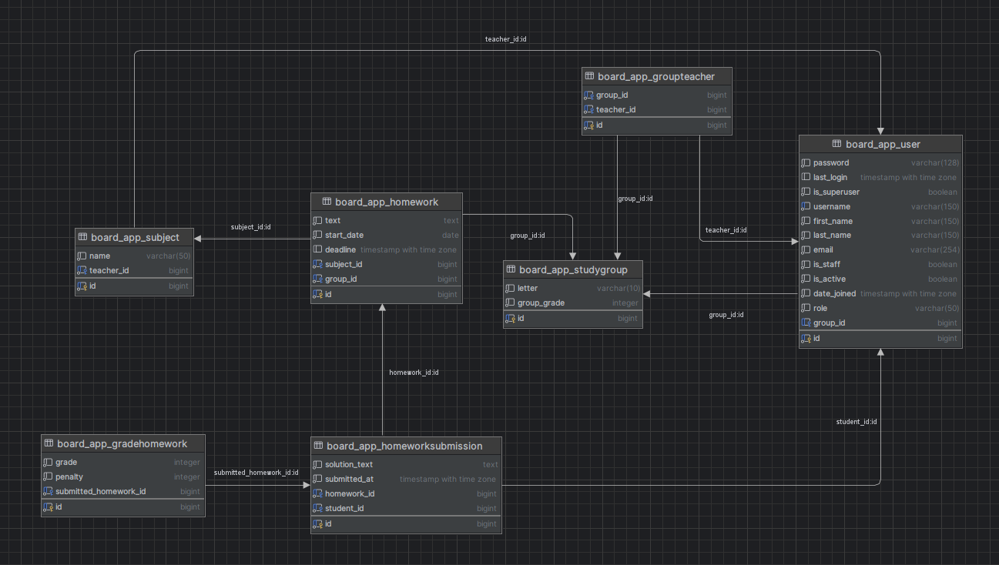

# Модели



```python
class StudyGroup(models.Model):
    LETTER_CHOICES = [
        ('A', 'A'),
        ('B', 'B'),
        ('C', 'C'),
    ]

    GROUP_GRADE_CHOICES = [
        (1, 1),
        (2, 2),
        (3, 3),
        (4, 4),
        (5, 5),
        (6, 6),
        (7, 7),
        (8, 8),
        (9, 9),
        (10, 10),
        (11, 11),
    ]
    letter = models.CharField(max_length=10, choices=LETTER_CHOICES)
    group_grade = models.IntegerField(choices=GROUP_GRADE_CHOICES)

    def __str__(self):
        return f"{self.group_grade}{self.letter}"


class User(AbstractUser):
    ROLE_CHOICES = [
        ('teacher', 'Teacher'),
        ('student', 'Student'),
    ]

    role = models.CharField(max_length=50, choices=ROLE_CHOICES, default='student')
    group = models.ForeignKey(StudyGroup, on_delete=models.CASCADE, null=True, blank=True)

    def clean(self):
        if self.role == 'student' and not self.group:
            raise ValidationError('You must select a group')

    def save(self, *args, **kwargs):
        if not self.is_superuser:
            self.clean()

        if self.role == 'teacher':
            self.is_superuser = True

        super(User, self).save(*args, **kwargs)

    def __str__(self):
        return f"{self.first_name} {self.last_name}"


class Subject(models.Model):
    name = models.CharField(max_length=50)
    teacher = models.ForeignKey(settings.AUTH_USER_MODEL, on_delete=models.CASCADE)

    def clean(self):
        if self.teacher.role == 'student':
            raise ValidationError('The user must be a teacher')

    def __str__(self):
        return self.name


class Homework(models.Model):
    subject = models.ForeignKey(Subject, on_delete=models.CASCADE)
    group = models.ForeignKey(StudyGroup, on_delete=models.CASCADE)
    text = models.TextField(max_length=500)
    start_date = models.DateField()
    deadline = models.DateTimeField(null=True, blank=True)

    def __str__(self):
        return f"{self.subject} - {self.text} ({self.group})"


class GroupTeacher(models.Model):
    teacher = models.ForeignKey(User, on_delete=models.CASCADE)
    group = models.ForeignKey(StudyGroup, on_delete=models.CASCADE)

    def clean(self):
        if self.teacher.role == 'student':
            raise ValidationError('The user must be a teacher')

    def __str__(self):
        return f"{self.teacher} - {self.group}"


class HomeworkSubmission(models.Model):
    homework = models.ForeignKey(Homework, on_delete=models.CASCADE)
    student = models.ForeignKey(User, on_delete=models.CASCADE)
    solution_text = models.TextField(max_length=1000, default='')
    submitted_at = models.DateTimeField(auto_now_add=True)

    def __str__(self):
        return f"Submission by {self.student.username} for {self.homework} at {self.submitted_at}"


class GradeHomework(models.Model):
    submitted_homework = models.ForeignKey(HomeworkSubmission, on_delete=models.CASCADE)
    grade = models.IntegerField(null=False)
    penalty = models.IntegerField(null=False)

    def __str__(self):
        return f"{self.submitted_homework} - {self.grade} - {self.penalty}"
```