# Лабораторная работа 4. Реализация клиентской части средствами Vue.js

Вариант 1 (Система для администрирования гостиницы)

### Описание интерфейсов

- Регистрация, авторизация, выход из аккаунта
- Комнаты
    - Просмотр всех свободных комнат
    - Поиск комнаты, подходящей для заданного количества человек
- Сотрудники
    - Просмотр и редактирование всех сотрудников и их расписаний
    - Добавление нового сотрудника с расписанием
- Клиенты
    - Просмотр и редактирование всех клиентов
    - Добавление нового клиента
- Оформление заселений
    - Просмотр и редактирование всех регистраций
    - Оформление регистрации для определенного клиента
- Отчетность
    - Просмотр отчета о работе гостиницы за определенный квартал текущего года

### Экраны

#### 1. Регистрация
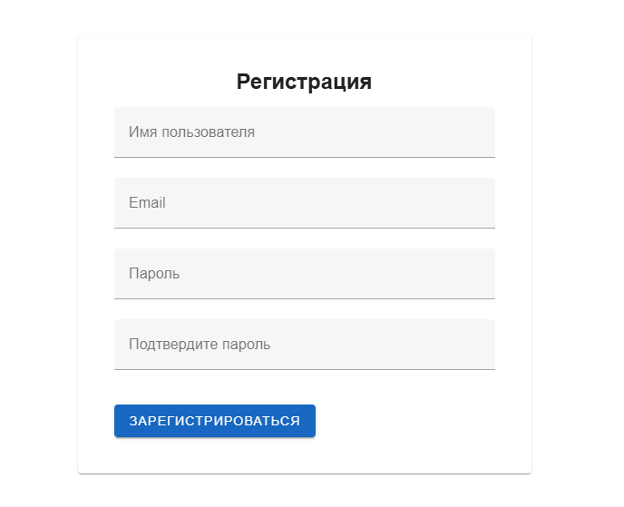

#### 2. Авторизация
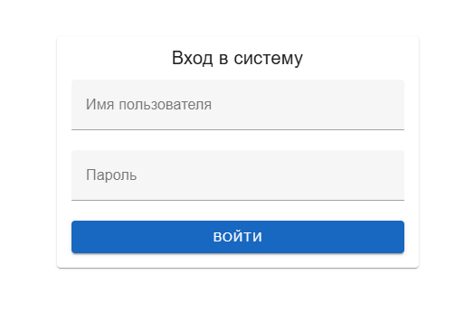

#### 3. Комнаты
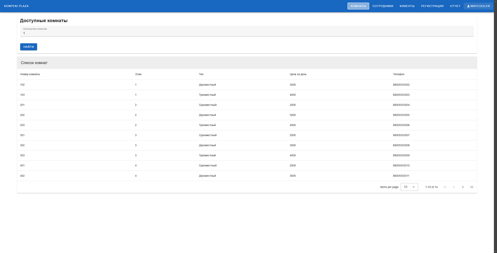

#### 4. Сотрудники
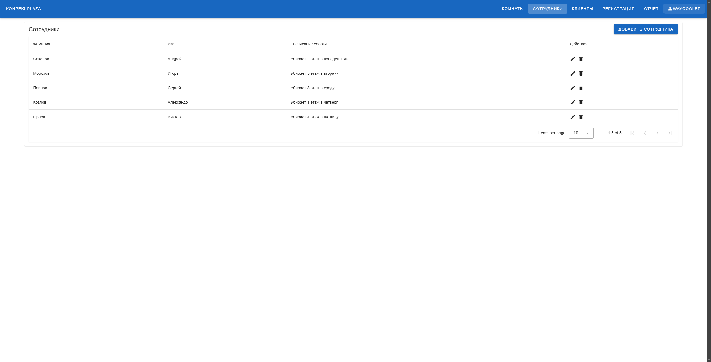
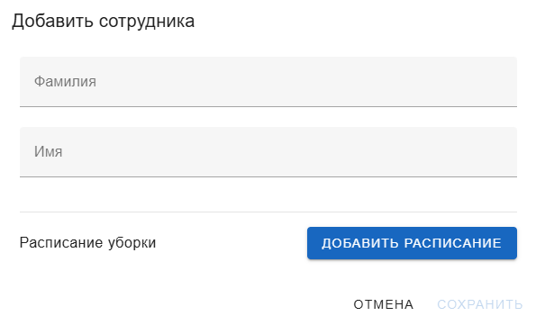
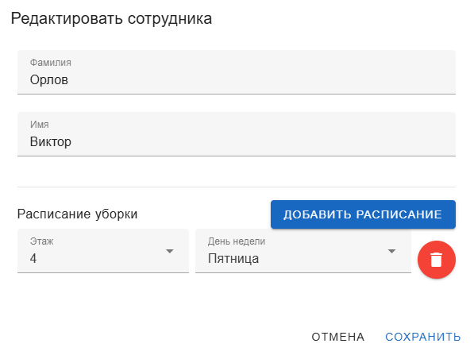

#### 5. Клиенты
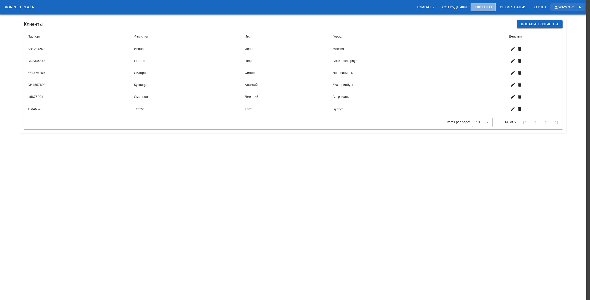
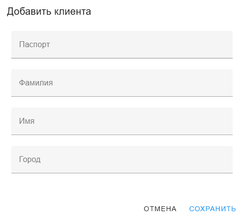
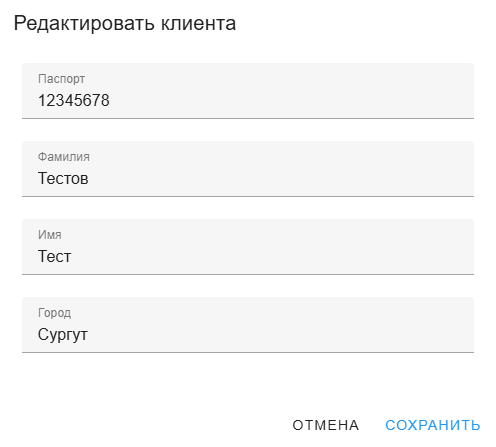

#### 6. Оформление заселений
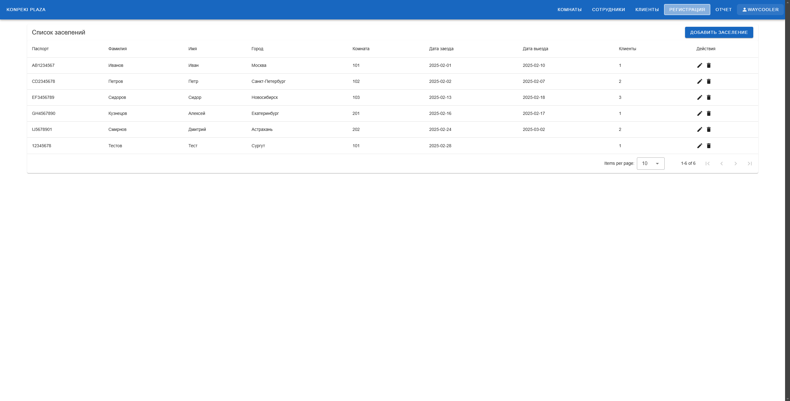
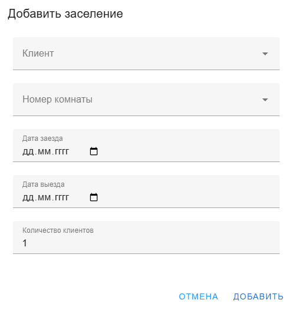
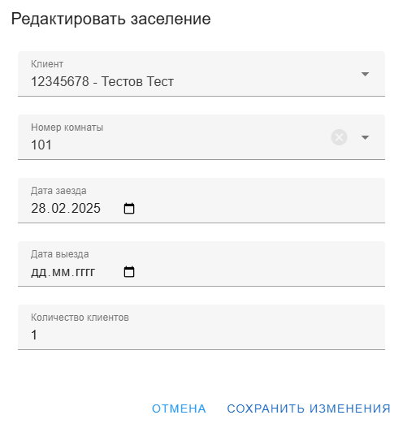

#### 7. Отчет
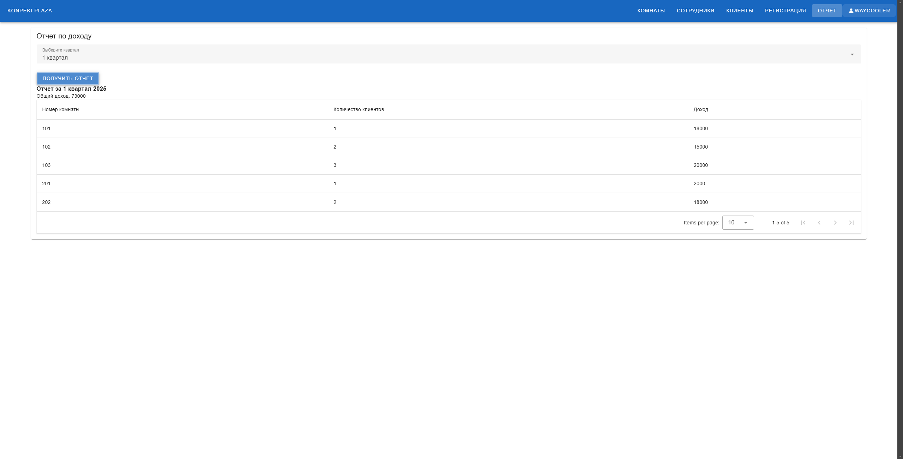