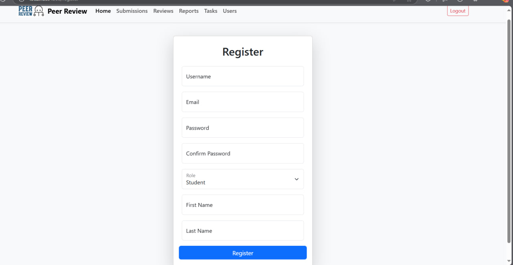

# Authentication

Страница **Authentication** и связанные сервисы обеспечивают авторизацию и аутентификацию пользователей в системе. Это фундаментальная часть проекта, которая включает процессы входа, выхода и проверки текущего пользователя.

---

## Основные возможности

- **Авторизация пользователя**:
  - Пользователь вводит свои учетные данные (email и пароль) и получает токен для взаимодействия с API.

- **Проверка текущего пользователя**:
  - После авторизации клиент может запрашивать информацию о текущем пользователе, включая его роль и статус суперпользователя.

- **Выход пользователя**:
  - Удаление токена из локального хранилища и перенаправление на страницу входа.

---

## Особенности интерфейса

### Страница входа:
- Поля для ввода email и пароля.
- Кнопка "Login" для выполнения авторизации.

### Перенаправление:
- После успешного входа пользователь перенаправляется на главную страницу (`/home`).
- Если пользователь не авторизован, он не может получить доступ к защищённым страницам.

---
## `login.component.ts`:
```typescript
import { Component } from '@angular/core';
import { Router } from '@angular/router';
import { FormsModule } from '@angular/forms';
import { CommonModule } from '@angular/common';
import { AuthService } from '../../services/auth.service';

@Component({
  selector: 'app-login',
  templateUrl: './login.component.html',
  standalone: true,
  imports: [FormsModule, CommonModule],
  styleUrls: ['./login.component.css'],
})
export class LoginComponent {
  username: string = '';
  password: string = '';
  currentUser: any = null;
  errorMessage: string | null = null;

  constructor(private authService: AuthService, private router: Router) {}

  login(): void {
    this.authService.login(this.username, this.password).subscribe({
      next: (response) => {
        localStorage.setItem('auth_token', response.auth_token);
        this.authService.getCurrentUserDetails().subscribe({
          next: (user) => {
            this.currentUser = user;
            localStorage.setItem('current_user', JSON.stringify(user));
            this.router.navigate(['/home']);
          },
          error: () => {
            this.errorMessage = 'Failed to fetch user details.';
          },
        });
      },
      error: () => {
        this.errorMessage = 'Invalid username or password.';
      },
    });
  }

  navigateToHome(): void {
    this.router.navigate(['/home']);
  }
}
```
## API эндпоинты

- **Авторизация**:
  - `POST /auth/token/login/`
  - Возвращает токен доступа.

- **Проверка текущего пользователя**:
  - `GET /auth/users/me/`
  - Возвращает данные текущего пользователя.

- **Выход**:
  - `POST /auth/token/logout/`
  - Удаляет токен доступа.

---

## Работа с компонентом

### Основные переменные

- **credentials**:
  - Объект, содержащий email и пароль, вводимые пользователем.

- **currentUser**:
  - Данные текущего пользователя, загружаемые после успешной авторизации.

- **isAuthenticated**:
  - Логическое значение, указывающее, авторизован ли текущий пользователь.

---

## Алгоритм авторизации

1. Пользователь вводит email и пароль на странице входа.
2. Нажимает кнопку "Login".
3. Данные отправляются на сервер через API `/auth/token/login/`.
4. Если авторизация успешна, токен сохраняется в локальном хранилище, а пользователь перенаправляется на `/home`.

---

## Алгоритм выхода

1. Пользователь нажимает кнопку "Logout".
2. Токен удаляется из локального хранилища.
3. Пользователь перенаправляется на страницу `/login`.

---

## Особенности работы

1. **Проверка токена**:
   - На каждой защищённой странице вызывается метод проверки токена, чтобы убедиться, что пользователь авторизован.

2. **Хранение токена**:
   - Токен сохраняется в `localStorage` для использования в заголовках запросов.

3. **Суперпользователь**:
   - Через API `/auth/users/me/` возвращается флаг `is_superuser`, который используется для отображения дополнительных возможностей.

---

## Пример данных API

### **POST /auth/token/login/**
**Тело запроса:**
```json
{
  "email": "user@example.com",
  "password": "password123"
}
```