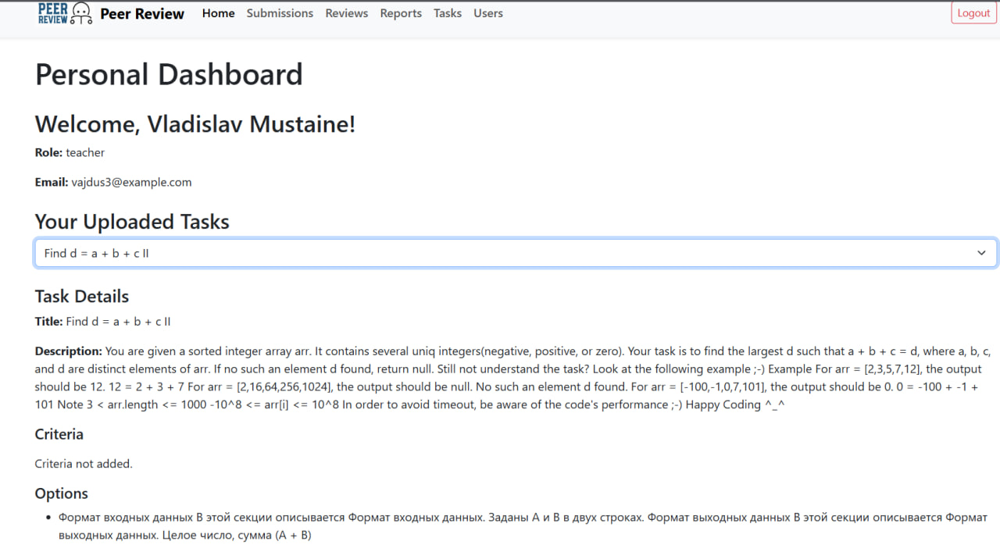
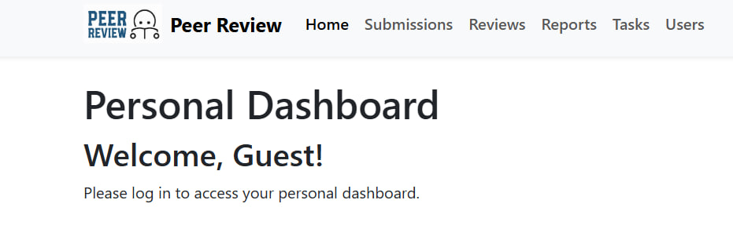

# Home

Страница **Home** является основной панелью для студентов и преподавателей. Она отображает персонализированную информацию в зависимости от роли авторизованного пользователя.



---

## Основные возможности

### Для преподавателей:
- Просмотр списка загруженных задач.
- Возможность перейти к подробной информации о каждой задаче.

### Для студентов:
- Просмотр отправленных решений (submissions).
- Просмотр рецензий (reviews), созданных студентом или полученных от других студентов.

---

## Компоненты

### **1. home.component.ts**
Логика работы компонента. 

#### Основные переменные:
- `currentUser`: Объект текущего авторизованного пользователя.
- `uploadedTasks`: Список задач, созданных преподавателем.
- `uploadedSubmissions`: Список отправленных студентом решений.
- `reviews`: Список рецензий, относящихся к студенту.
- `selectedDetails`: Объект с подробной информацией о выбранной задаче, решении или рецензии.

#### Основные методы:
- `loadUploadedTasks()`: Загружает задачи, созданные преподавателем.
- `loadUploadedSubmissions()`: Загружает решения, отправленные студентом.
- `loadReviews()`: Загружает рецензии, связанные с текущим студентом.
- `loadTaskDetails(taskId: number)`: Загружает подробную информацию о задаче.
- `loadSubmissionDetails(submissionId: number)`: Загружает подробную информацию о решении.
- `loadReviewDetails(reviewId: number)`: Загружает подробную информацию о рецензии.

Пример кода:
```typescript
import { Component, OnInit } from '@angular/core';
import { HomeService } from '../../services/home.service';
import { AuthService } from '../../services/auth.service';

@Component({
  selector: 'app-home',
  templateUrl: './home.component.html',
  styleUrls: ['./home.component.css']
})
export class HomeComponent implements OnInit {
  currentUser: any;
  uploadedTasks: any[] = [];
  uploadedSubmissions: any[] = [];
  reviews: any[] = [];
  selectedDetails: any = null;

  constructor(private authService: AuthService, private homeService: HomeService) {}

  ngOnInit(): void {
    this.currentUser = this.authService.getCurrentUser();
    if (this.currentUser?.role === 'teacher') {
      this.loadUploadedTasks();
    } else if (this.currentUser?.role === 'student') {
      this.loadUploadedSubmissions();
      this.loadReviews();
    }
  }

  loadUploadedTasks(): void {
    this.homeService.getUploadedTasks(this.currentUser.id).subscribe((tasks) => {
      this.uploadedTasks = tasks;
    });
  }

  loadUploadedSubmissions(): void {
    this.homeService.getUploadedSubmissions(this.currentUser.id).subscribe((submissions) => {
      this.uploadedSubmissions = submissions;
    });
  }

  loadReviews(): void {
    this.homeService.getReviews(this.currentUser.id).subscribe((reviews) => {
      this.reviews = reviews;
    });
  }

  loadTaskDetails(taskId: number): void {
    this.homeService.getTaskDetails(taskId).subscribe((details) => {
      this.selectedDetails = details;
    });
  }

  loadSubmissionDetails(submissionId: number): void {
    this.homeService.getSubmissionDetails(submissionId).subscribe((details) => {
      this.selectedDetails = details;
    });
  }

  loadReviewDetails(reviewId: number): void {
    this.homeService.getReviewDetails(reviewId).subscribe((details) => {
      this.selectedDetails = details;
    });
  }
}
```

### **2. home.component.html**
Шаблон. 

#### Основные элементы:
- Приветствие пользователя.
- Список задач для преподавателя.
- Список отправленных решений и рецензий для студента.
- Динамическое отображение деталей выбранного элемента.

Код:
```html
<div class="container mt-4">
  <h1>Welcome, {{ currentUser.first_name }} {{ currentUser.last_name }}!</h1>
  <p><strong>Role:</strong> {{ currentUser.role }}</p>

  <div *ngIf="currentUser.role === 'teacher'" class="mt-4">
    <h3>Your Uploaded Tasks</h3>
    <ul class="list-group">
      <li *ngFor="let task of uploadedTasks" class="list-group-item">
        <span (click)="loadTaskDetails(task.id)" class="text-primary" style="cursor: pointer;">
          {{ task.title }}
        </span>
      </li>
    </ul>
  </div>

  <div *ngIf="currentUser.role === 'student'" class="mt-4">
    <h3>Your Submissions</h3>
    <ul class="list-group">
      <li *ngFor="let submission of uploadedSubmissions" class="list-group-item">
        <span (click)="loadSubmissionDetails(submission.id)" class="text-primary" style="cursor: pointer;">
          {{ submission.title }}
        </span>
      </li>
    </ul>

    <h3>Your Reviews</h3>
    <ul class="list-group">
      <li *ngFor="let review of reviews" class="list-group-item">
        <span (click)="loadReviewDetails(review.id)" class="text-primary" style="cursor: pointer;">
          Criterion: {{ review.criterion_detail.name }}, Score: {{ review.score }}
        </span>
      </li>
    </ul>
  </div>

  <div *ngIf="selectedDetails" class="mt-4">
    <h4>Details</h4>
    <pre>{{ selectedDetails | json }}</pre>
  </div>
</div>
```