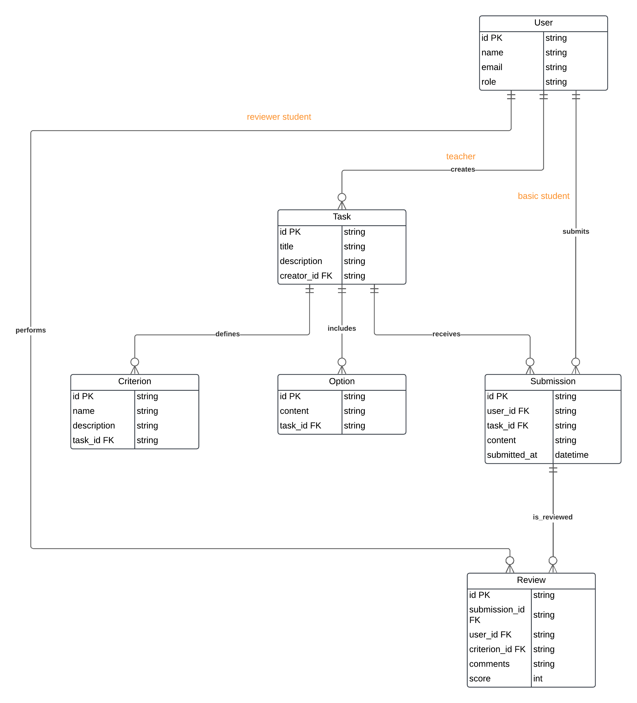

# Peer Review System

Добро пожаловать в систему Peer Review System! Этот проект позволяет преподавателям и студентам взаимодействовать через задачи, отправленные решения и взаимные рецензии.

## Основные возможности
- Преподаватели могут:

    Создавать, редактировать и удалять задачи.

    Просматривать отправленные студентами работы.
  
- Студенты могут:

    Отправлять решения задач.

    Оценивать работы других студентов.

- Суперпользователи:

    Управляют всеми пользователями.

    Имеют доступ ко всем функциям системы.

## Страницы:
- **Home**: Главная страница, где отображается информация о текущем пользователе.
- **Tasks**: Управление задачами (создание, просмотр, редактирование).
- **Submissions**: Отправка решений задач.
- **Reviews**: Оценка отправленных решений.
- **Reports**: Просмотр статистики.
- **Users**: Управление пользователями, их список.
