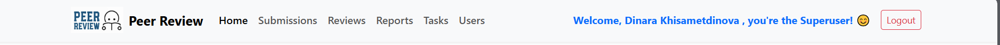

# Navbar Component

Компонент **Navbar** — это навигационная панель, отображаемая на всех страницах приложения. Она предоставляет пользователям быстрый доступ к основным разделам системы.

---

## Основные функции

- **Навигация**:
  - Переключение между страницами приложения: `Home`, `Submissions`, `Reviews`, `Reports`, `Tasks`, `Users`.
- **Приветствие пользователя**:
  - Отображает имя текущего пользователя (`Welcome, John Doe!`).
  - Если пользователь является суперпользователем, добавляется текст: `"you're the Superuser! 😊"`.
- **Кнопка выхода**:
  - Завершает сессию пользователя и перенаправляет его на страницу входа.

---

## Структура компонента

### **1. navbar.component.ts**
Логика работы компонента.

#### Основные переменные:
- `currentUser`: Данные текущего пользователя, полученные из `AuthService`.
- `isTeacher`: Флаг, определяющий, является ли пользователь преподавателем.
- `isSuperUser`: Флаг, определяющий, является ли пользователь суперпользователем.

#### Основные методы:
- `ngOnInit`: Загружает данные текущего пользователя через `AuthService`.
- `logout`: Завершает сессию пользователя.
- `navigateTo(route)`: Перенаправляет пользователя на выбранную страницу.

Пример кода:
```typescript
import { Component, OnInit } from '@angular/core';
import { Router } from '@angular/router';
import { CommonModule } from '@angular/common';
import { AuthService } from '../../services/auth.service';

@Component({
  selector: 'app-navbar',
  templateUrl: './navbar.component.html',
  standalone: true,
  imports: [CommonModule],
  styleUrls: ['./navbar.component.css']
})
export class NavbarComponent implements OnInit {
  currentUser: any = null;
  isTeacher = false;
  isSuperUser = false;

  constructor(private router: Router, private authService: AuthService) {}

  ngOnInit() {
    this.authService.getCurrentUserDetails().subscribe({
      next: (user) => {
        this.currentUser = user;
        this.isTeacher = this.currentUser?.role === 'teacher';
        this.isSuperUser = this.currentUser?.is_superuser;
      },
      error: (error) => {
        console.error('Failed to fetch user details:', error);
      },
    });
  }

  logout(): void {
    this.authService.logout();
    this.router.navigate(['/login']);
  }

  navigateTo(route: string): void {
    this.router.navigate([route]);
  }
}
```

### **2. navbar.component.html**
Шаблон.

#### Основные элементы:
- Логотип и название приложения.
- Ссылки для навигации по основным страницам.
- Приветствие пользователя:
    - Для обычного пользователя: Welcome, John Doe!.
    - Для суперпользователя: Welcome, John Doe, you're the Superuser! 😊.
- Кнопка выхода (Logout).

Код:
```html
<nav class="navbar navbar-expand-lg navbar-light bg-light shadow-sm">
  <div class="container">
    <a class="navbar-brand fw-bold d-flex align-items-center" routerLink="/dashboard">
      
      Peer Review
    </a>
    <button
      class="navbar-toggler"
      type="button"
      data-bs-toggle="collapse"
      data-bs-target="#navbarNav"
      aria-controls="navbarNav"
      aria-expanded="false"
      aria-label="Toggle navigation"
    >
      <span class="navbar-toggler-icon"></span>
    </button>
    <div class="collapse navbar-collapse" id="navbarNav">
      <ul class="navbar-nav me-auto">
        <li class="nav-item">
          <a class="nav-link active fw-semibold" routerLink="/home">Home</a>
        </li>
        <li class="nav-item">
          <a class="nav-link fw-semibold" routerLink="/submissions">Submissions</a>
        </li>
        <li class="nav-item">
          <a class="nav-link fw-semibold" routerLink="/reviews">Reviews</a>
        </li>
        <li class="nav-item">
          <a class="nav-link fw-semibold" routerLink="/reports">Reports</a>
        </li>
        <li class="nav-item">
          <a class="nav-link fw-semibold" routerLink="/tasks">Tasks</a>
        </li>
        <li class="nav-item">
          <a class="nav-link fw-semibold" routerLink="/users">Users</a>
        </li>
      </ul>
      <div class="d-flex align-items-center">
        <span *ngIf="currentUser" class="me-3 text-primary fw-bold">
          Welcome, {{ currentUser.first_name }} {{ currentUser.last_name }}
          <span *ngIf="isSuperUser">, you're the Superuser! 😊</span>
        </span>
        <button class="btn btn-outline-danger btn-sm" (click)="logout()">Logout</button>
      </div>
    </div>
  </div>
</nav>
```