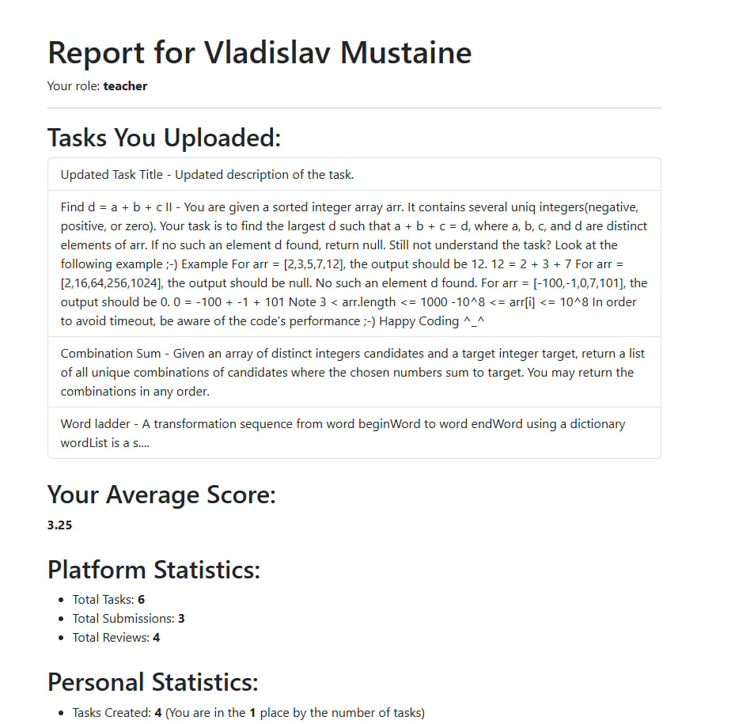

# Reports

Страница **Reports** предназначена для просмотра статистики системы. Она предоставляет преподавателям информацию о количестве задач, решений и рецензий, а также отображает средние оценки.

---

## Основные возможности

- Просмотр общей статистики системы:
  - Количество задач.
  - Количество решений.
  - Количество рецензий.

---

## Компоненты

### **1. reports.component.ts**

#### Основные переменные:
- `stats`: Объект, содержащий данные о статистике (количество задач, решений и рецензий, средние оценки).

#### Основные методы:
- `loadStatistics()`: Загружает данные о статистике через `ReportsService`.

#### Пример:
```typescript
import { Component, OnInit } from '@angular/core';
import { ReportsService } from '../../services/reports.service';

@Component({
  selector: 'app-reports',
  templateUrl: './reports.component.html',
  styleUrls: ['./reports.component.css']
})
export class ReportsComponent implements OnInit {
  stats: any = {
    tasks: 0,
    submissions: 0,
    reviews: 0,
    average_score: 'N/A',
  };

  constructor(private reportsService: ReportsService) {}

  ngOnInit(): void {
    this.loadStatistics();
  }

  loadStatistics(): void {
    this.reportsService.getStatistics().subscribe({
      next: (data) => {
        this.stats = data;
      },
      error: (err) => {
        console.error('Error loading statistics:', err);
      },
    });
  }
}
```
### **2. reports.component.html**

#### Основные 'элементы':
- Основные ревью
- Общая статистика по сайту
- Личная статистика пользователя
- Место авторизованного в общем зачёте

Код:
```html
<div class="container mt-5">
    <h1>Report for {{ currentUser.first_name }} {{ currentUser.last_name }}</h1>
    <p>Your role: <strong>{{ currentUser.role }}</strong></p>
    <hr />
  
    <div *ngIf="tasksUploaded.length && currentUser.role === 'teacher'">
      <h2>Tasks You Uploaded:</h2>
      <ul class="list-group">
        <li class="list-group-item" *ngFor="let task of tasksUploaded">
          {{ task.title }} - {{ task.description }}
        </li>
      </ul>
    </div>
  
    <div *ngIf="tasksReviewed.length && currentUser.role === 'student'">
      <h2>Tasks You Reviewed:</h2>
      <ul class="list-group">
        <li class="list-group-item" *ngFor="let task of tasksReviewed">
          {{ task.title }} - {{ task.description }}
        </li>
      </ul>
    </div>
  
    <div *ngIf="averageScoreForUser !== null" class="mt-4">
      <h2>Your Average Score:</h2>
      <p><strong>{{ averageScoreForUser }}</strong></p>
    </div>
  
    <div *ngIf="taskStatistics" class="mt-4">
      <h2>Platform Statistics:</h2>
      <ul>
        <li>Total Tasks: <strong>{{ taskStatistics.tasks }}</strong></li>
        <li>Total Submissions: <strong>{{ taskStatistics.submissions }}</strong></li>
        <li>Total Reviews: <strong>{{ taskStatistics.reviews }}</strong></li>
      </ul>
    </div>
    <div *ngIf="personalStatistics" class="mt-4">
        <h2>Personal Statistics:</h2>
        <ul>
          <li *ngIf="personalStatistics.tasks_created !== undefined">
            Tasks Created: <strong>{{ personalStatistics.tasks_created }}</strong>
            <span *ngIf="personalStatistics.task_rank">
              (You are in the <strong>{{ personalStatistics.task_rank }}</strong> place by the number of tasks)
            </span>
          </li>
          <li *ngIf="personalStatistics.submissions_made !== undefined">
            Submissions Made: <strong>{{ personalStatistics.submissions_made }}</strong>
            <span *ngIf="personalStatistics.submission_rank">
              (You are in the <strong>{{ personalStatistics.submission_rank }}</strong> place by the number of submissions)
            </span>
          </li>
          <li *ngIf="personalStatistics.reviews_given !== undefined">
            Reviews Given: <strong>{{ personalStatistics.reviews_given }}</strong>
            <span *ngIf="personalStatistics.review_rank">
              (You are in the <strong>{{ personalStatistics.review_rank }}</strong> place by the number of reviews)
            </span>
          </li>
        </ul>
    </div>
  </div>
```

### **3. reports.service.ts**

#### Основные 'функции':
- Обеспечивает связь с API для получения статистики.
- `getStatistics()`: Выполняет запрос к серверу для получения данных.
- `getPersonalStatistics()`: Запрос для статистики данного пользователя.
- `getUploadedTasks()`: Получение загруженных задач.

#### Файл:
```typescript
import { Injectable } from '@angular/core';
import { HttpClient } from '@angular/common/http';
import { Observable } from 'rxjs';

@Injectable({
  providedIn: 'root',
})
export class ReportService {
  private baseUrl = 'http://127.0.0.1:8000/peer';

  constructor(private http: HttpClient) {}

  getUploadedTasks(userId: number): Observable<any[]> {
    return this.http.get<any[]>(`${this.baseUrl}/tasks/?creator=${userId}`);
  }

  getReviewedTasks(userId: number): Observable<any[]> {
    return this.http.get<any[]>(`${this.baseUrl}/reviews/?user=${userId}`);
  }

  getAverageScoreByUsername(username: string): Observable<any> {
    return this.http.get<any>(`${this.baseUrl}/tasks/average-score/${username}/`);
  }

  getTaskStatistics(): Observable<any> {
    return this.http.get<any>(`${this.baseUrl}/statistics/`);
  }  

  getPersonalStatistics(): Observable<any> {
    return this.http.get<any>(`${this.baseUrl}/personal-statistics/`);
  }  
}
```