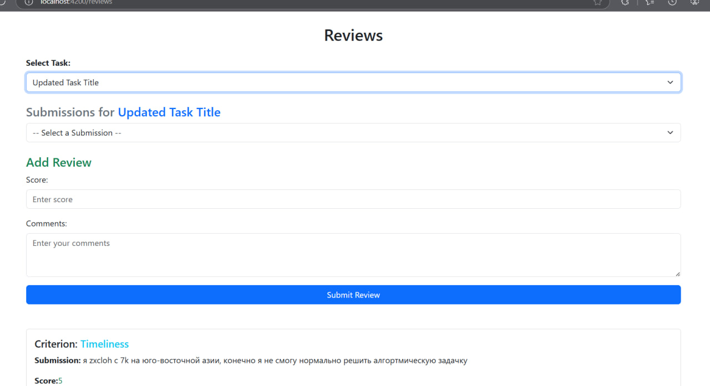

# Reviews

Страница **Reviews** предназначена для работы студентов с рецензиями, предоставляя возможность оценивать решения других студентов, а также просматривать свои рецензии и оценки.

---

## Основные возможности

- **Добавление новых рецензий**:
  
    Студенты могут выбрать задачу и решение для написания рецензии.

    Указание критерия оценки, выставление баллов и добавление комментариев.

- **Просмотр рецензий**:
  
    Студенты могут видеть рецензии, которые они написали, а также рецензии на их решения.

- **Редактирование рецензий**:
  
    Студенты могут редактировать свои рецензии, если была допущена ошибка.

- **Динамическая фильтрация**:
- 
    Выбор задач и связанных решений для более удобной работы с рецензиями.

---

## Особенности интерфейса

- **Списки задач и решений**:
  - Доступен выпадающий список задач, созданных преподавателями.
  - При выборе задачи отображаются связанные решения, на которые можно оставить рецензию.

- **Добавление рецензии**:
  - Поля для указания комментария и выставления баллов.
  - Кнопка для сохранения новой рецензии.

- **Список существующих рецензий**:
  - Отображает краткую информацию: критерий, комментарий, балл, автор рецензии.
  - Возможность редактирования рецензии, если она была создана текущим пользователем.

```html
<div class="container mt-5">
  <h2 class="text-center mb-4">Reviews</h2>
  
  <div class="mb-4">
    <label for="taskSelect" class="form-label fw-bold">Select Task:</label>
    <select
      id="taskSelect"
      class="form-select"
      (change)="onTaskSelect($event)"
      [(ngModel)]="selectedTaskId"
    >
      <option [value]="null">-- Select a Task --</option>
      <option *ngFor="let task of tasks" [value]="task.id">
        {{ task.title }}
      </option>
    </select>
  </div>

  <div *ngIf="selectedTask" class="mb-4">
    <h4 class="text-secondary">Submissions for <span class="text-primary">{{ selectedTask.title }}</span></h4>
    <select class="form-select" (change)="onSubmissionSelect($event)">
      <option [value]="null">-- Select a Submission --</option>
      <option *ngFor="let submission of submissions" [value]="submission.id">
        {{ submission.content }}
      </option>
    </select>
  </div>

  <div *ngIf="submissions.length > 0; else noSubmissions" class="mb-5">
    <h4 class="text-success">Add Review</h4>
    <div class="mb-3">
      <label for="score" class="form-label">Score:</label>
      <input
        type="number"
        id="score"
        class="form-control"
        [(ngModel)]="newReview.score"
        placeholder="Enter score"
      />
    </div>
    <div class="mb-3">
      <label for="comments" class="form-label">Comments:</label>
      <textarea
        id="comments"
        class="form-control"
        [(ngModel)]="newReview.comments"
        placeholder="Enter your comments"
        rows="3"
      ></textarea>
    </div>
    <button class="btn btn-primary w-100" (click)="addReview()">Submit Review</button>
  </div>

  <ng-template #noSubmissions>
    <div class="alert alert-warning" role="alert">
      <strong>No submissions available for this task.</strong>
    </div>
  </ng-template>

  <div *ngFor="let review of reviews" class="card mb-3">
    <div class="card-body">
      <h5 class="card-title">
        Criterion: 
        <span class="text-info">{{ review.criterion_detail?.name || 'Not specified' }}</span>
      </h5>
      <p class="card-text"><strong>Submission:</strong> {{ review.submission_detail?.content || 'Not specified' }}</p>
      <p class="card-text"><strong>Score:</strong> <span class="text-success">{{ review.score }}</span></p>
      <p class="card-text"><strong>Comments:</strong> {{ review.comments }}</p>
      <p class="card-text">
        <strong>Reviewer:</strong> {{ review.user?.first_name }} {{ review.user?.last_name }}
      </p>
      <button
        *ngIf="review.user?.id === currentUser?.id"
        class="btn btn-outline-primary btn-sm"
        (click)="editReview(review)"
      >
        Edit
      </button>
    </div>
  </div>
</div>
```
---

## API эндпоинты

- **Получение списка рецензий**:
  - `GET /peer/reviews/`
  - Возвращает список всех рецензий с деталями критерия, решения и автора.

- **Добавление рецензии**:
  - `POST /peer/reviews/`
  - Поля: `criterion`, `submission`, `comments`, `score`.

- **Редактирование рецензии**:
  - `PUT /peer/reviews/<id>/`
  - Поля: `comments`, `score`.

- **Удаление рецензии**:
  - `DELETE /peer/reviews/<id>/`

---

## Работа с компонентом

### Основные переменные:

- **tasks**:
  - Список доступных задач.
  - Используется для выбора задачи из выпадающего списка.

- **submissions**:
  - Список решений, связанных с выбранной задачей.
  - Отображается после выбора задачи.

- **reviews**:
  - Список рецензий, относящихся к текущему студенту (или написанных им).

- **newReview**:
  - Объект, содержащий данные для новой рецензии (критерий, комментарии, балл).

- **editingReview**:
  - Объект для редактирования существующей рецензии.

```typescript
import { Component } from '@angular/core';
import { ReviewService } from '../../services/review.service';
import { SubmissionService } from '../../services/submission.service';
import { TaskService } from '../../services/task.service';
import { CommonModule } from '@angular/common';
import { FormsModule } from '@angular/forms';

@Component({
  selector: 'app-review-list',
  standalone: true,
  imports: [CommonModule, FormsModule],
  templateUrl: './review-list.component.html',
  styleUrls: ['./review-list.component.css'],
})
export class ReviewListComponent {
  reviews: any[] = [];
  tasks: any[] = [];
  submissions: any[] = [];
  selectedTaskId: number | null = null;
  selectedTask: any = null;
  selectedSubmission: any = null;
  currentUser: any = null;

  editingReview: any = null;
  newReview = {
    score: '',
    comments: '',
    submission: null,
    criterion: null,
  };

  constructor(
    private reviewService: ReviewService,
    private submissionService: SubmissionService,
    private taskService: TaskService
  ) {
    this.loadReviews();
    this.loadTasks();
  }

  loadReviews() {
    this.reviewService.getReviews().subscribe((data) => {
      this.reviews = data;
    });
  }

  loadTasks() {
    this.reviewService.getAllTasks().subscribe((data) => {
      this.tasks = data;
    });
  }

  onTaskSelect(event: Event) {
    const target = event.target as HTMLSelectElement;
    const id = parseInt(target.value, 10);
    this.selectedTaskId = id;
    this.selectedTask = this.tasks.find((task) => task.id === id);
    this.reviewService.getSubmissionsByTask(id).subscribe((data: any[]) => {
      this.submissions = data;
    });
  }

  onSubmissionSelect(event: Event) {
    const target = event.target as HTMLSelectElement;
    const id = parseInt(target.value, 10);
    this.selectedSubmission = this.submissions.find((submission) => submission.id === id);
  }

  addReview() {
    if (!this.newReview.submission || !this.newReview.criterion || !this.newReview.score || !this.newReview.comments) {
      alert('Please fill in all fields.');
      return;
    }
    this.reviewService.createReview(this.newReview).subscribe({
      next: () => {
        alert('Review added successfully.');
        this.newReview = { score: '', comments: '', submission: null, criterion: null };
        this.loadReviews();
      },
      error: (err) => console.error('Error adding review:', err),
    });
  }

  editReview(review: any) {
    this.editingReview = { ...review };
  }

  saveReview() {
    if (!this.editingReview.score || !this.editingReview.comments) {
      alert('Please fill in all fields.');
      return;
    }
    this.reviewService.updateReview(this.editingReview.id, this.editingReview).subscribe({
      next: () => {
        alert('Review updated successfully.');
        this.editingReview = null;
        this.loadReviews();
      },
      error: (err) => console.error('Error updating review:', err),
    });
  }

  cancelEdit() {
    this.editingReview = null;
  }
}
```
---

## Динамическая фильтрация

- При выборе задачи из выпадающего списка автоматически загружаются связанные решения.
- Рецензии фильтруются в зависимости от текущего пользователя:
  - **Написанные рецензии**: рецензии, созданные текущим студентом.
  - **Полученные рецензии**: рецензии, которые были оставлены другими студентами на решения текущего пользователя.

---

## Особенности работы

1. **Проверка доступа**:
   - Убедитесь, что пользователь имеет доступ к задачам и решениям, связанным с текущим курсом.

2. **Редактирование рецензий**:
   - Только автор рецензии может её редактировать.
   - Ошибки редактирования отображаются в виде уведомлений.

3. **Удобство интерфейса**:
   - Выпадающие списки задач и решений упрощают навигацию.
   - Простой интерфейс для добавления комментариев и выставления баллов.

---

## Пример данных API

**GET /peer/reviews/**:
```json
[
  {
    "id": 1,
    "submission": {
      "id": 10,
      "content": "Solution content...",
      "task": {
        "id": 5,
        "title": "Task Title"
      }
    },
    "criterion": {
      "id": 2,
      "name": "Creativity"
    },
    "comments": "Great solution!",
    "score": 5,
    "user": {
      "id": 3,
      "first_name": "John",
      "last_name": "Doe"
    }
  }
]
```