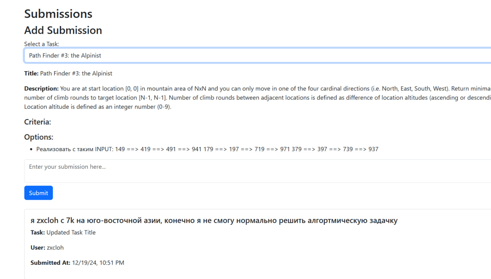

# Submissions

Страница **Submissions** позволяет студентам отправлять решения задач, созданных преподавателями, а также просматривать список своих отправленных решений.

---

## Основные возможности

- **Отправка нового решения**:
  - Студенты могут выбрать задачу из списка доступных и отправить текст решения.

- **Просмотр списка отправленных решений**:
  - Отображаются отправленные решения текущего студента с указанием связанной задачи, времени отправки и содержимого.

- **Фильтрация**:
  - Возможность фильтровать задачи по названию, а отправленные решения — по их содержимому.

Вот submission-list.component.ts:
```typescript
import { Component, OnInit } from '@angular/core';
import { SubmissionService } from '../../services/submission.service';
import { CommonModule } from '@angular/common';
import { FormsModule } from '@angular/forms';

@Component({
  selector: 'app-submission-list',
  standalone: true,
  imports: [CommonModule, FormsModule],
  templateUrl: './submission-list.component.html',
  styleUrls: ['./submission-list.component.css'],
})
export class SubmissionListComponent implements OnInit {
  submissions: any[] = [];
  filteredSubmissions: any[] = [];
  tasks: any[] = [];
  selectedTaskId: number | null = null; 
  selectedTaskDetails: any = null; 
  newSubmissionContent: string = '';
  searchQuery: string = '';

  constructor(private submissionService: SubmissionService) {}

  ngOnInit(): void {
    this.loadSubmissions();
    this.loadTasks();
  }

  loadSubmissions(): void {
    this.submissionService.getSubmissions().subscribe((data) => {
      this.submissions = data;
      this.filteredSubmissions = data; 
    });
  }

  loadTasks(): void {
    this.submissionService.getAllTasks().subscribe((tasks) => {
      this.tasks = tasks;
    });
  }

  onTaskSelect(taskId: number | null): void {
    if (taskId !== null) {
      this.selectedTaskId = taskId;
      this.loadTaskDetails(taskId);
    }
  }

  loadTaskDetails(taskId: number): void {
    this.submissionService.getTaskDetails(taskId).subscribe((details) => {
      this.selectedTaskDetails = details;
    });
  }

  addSubmission(): void {
    if (!this.newSubmissionContent.trim()) {
      alert('Submission content cannot be empty!');
      return;
    }

    const newSubmission = {
      task: this.selectedTaskId,
      content: this.newSubmissionContent,
    };

    this.submissionService.createSubmission(newSubmission).subscribe({
      next: () => {
        this.newSubmissionContent = '';
        this.loadSubmissions();
      },
      error: (err) => console.error('Error creating submission:', err),
    });
  }
}
```
---

## Особенности интерфейса

- **Список доступных задач**:
  - Выпадающий список всех задач, созданных преподавателями, доступных для текущего студента.

- **Добавление решения**:
  - Поле для ввода текста решения.
  - Кнопка отправки для сохранения решения.

- **Список отправленных решений**:
  - Показывает список решений с информацией о задаче, пользователе и времени отправки.

---

## API эндпоинты

- **Получение списка задач**:
  - `GET /peer/tasks/for-students/`
  - Возвращает задачи, доступные для студентов.

- **Получение списка решений**:
  - `GET /peer/submissions/`
  - Возвращает решения, отправленные студентом.

- **Создание нового решения**:
  - `POST /peer/submissions/`
  - Поля: `task`, `content`.

- **Обновление решения**:
  - `PUT /peer/submissions/<id>/`
  - Поля: `content`.

- **Удаление решения**:
  - `DELETE /peer/submissions/<id>/`

Вот `submission.service.ts:`
```typescript
import { Injectable } from '@angular/core';
import { HttpClient } from '@angular/common/http';
import { Observable } from 'rxjs';

@Injectable({
  providedIn: 'root',
})
export class SubmissionService {
  private baseUrl = 'http://127.0.0.1:8000/peer';

  constructor(private http: HttpClient) {}

  getSubmissions(): Observable<any[]> {
    return this.http.get<any[]>(`${this.baseUrl}/submissions/`);
  }

  createSubmission(submission: any): Observable<any> {
    return this.http.post(`${this.baseUrl}/submissions/`, submission);
  }

  updateSubmission(id: number, submission: any): Observable<any> {
    return this.http.put(`${this.baseUrl}/submissions/${id}/`, submission);
  }

  deleteSubmission(id: number): Observable<any> {
    return this.http.delete(`${this.baseUrl}/submissions/${id}/`);
  }

  getTaskDetails(taskId: number): Observable<any> {
    return this.http.get<any>(`${this.baseUrl}/tasks/${taskId}/details`);
  }
  getAllTasks(): Observable<any[]> {
    return this.http.get<any[]>(`${this.baseUrl}/tasks/for-students/`);
  }
  getSubmissionsByTask(taskId: number): Observable<any[]> {
    return this.http.get<any[]>(`${this.baseUrl}/submissions/?task=${taskId}`);
  }  
}
```
---

## Работа с компонентом

### Основные переменные

- **tasks**:
  - Список задач, доступных для отправки решений.
  - Загружается через API `/peer/tasks/for-students/`.

- **submissions**:
  - Список отправленных решений текущего студента.
  - Загружается через API `/peer/submissions/`.

- **newSubmissionContent**:
  - Содержит текст нового решения, вводимый студентом.

- **selectedTaskId**:
  - ID выбранной задачи для отправки решения.

---

## Алгоритм отправки решения

1. Студент выбирает задачу из выпадающего списка.
2. Вводит текст решения в текстовое поле.
3. Нажимает кнопку "Submit", после чего решение отправляется на сервер через API.

---

## Особенности работы

1. **Проверка доступа**:
   - Студенты могут отправлять решения только на задачи, доступные им через API `/peer/tasks/for-students/`.

2. **Редактирование решения**:
   - Решение можно изменить, если оно было отправлено текущим пользователем.

3. **Удаление решения**:
   - Решения можно удалять, если они были отправлены текущим пользователем.

4. **Проверка валидности**:
   - Текст решения не может быть пустым.
   - Выбор задачи обязателен для отправки решения.

---

## Пример данных API

### **GET /peer/tasks/for-students/**
```json
[
  {
    "id": 1,
    "title": "Task 1",
    "description": "Solve this problem...",
    "creator": {
      "id": 10,
      "first_name": "John",
      "last_name": "Doe"
    }
  },
  {
    "id": 2,
    "title": "Task 2",
    "description": "Another task...",
    "creator": {
      "id": 11,
      "first_name": "Jane",
      "last_name": "Smith"
    }
  }
]
```