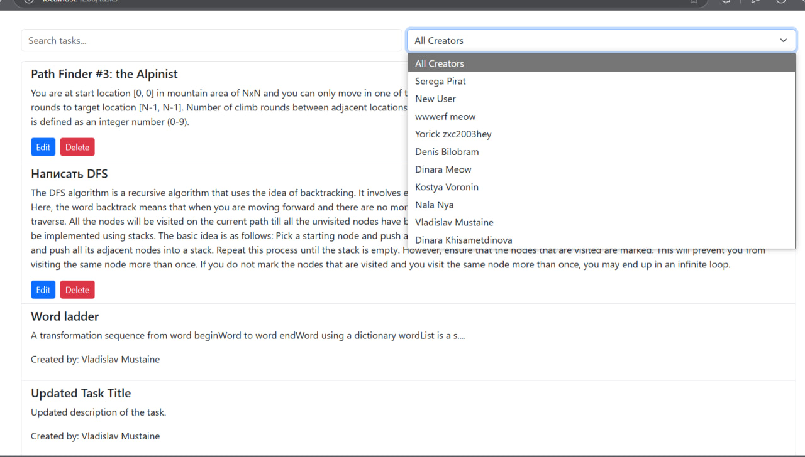

# Tasks

Страница **Tasks** предназначена для управления задачами в системе. Её функционал различается для преподавателей и студентов.

---

## Основные возможности

### Для преподавателей:
- Создание новых задач.
- Просмотр списка созданных задач.
- Редактирование задач.
- Удаление задач.
- Управление критериями и опциями для каждой задачи.

### Для студентов:
- Просмотр списка доступных задач.
- Возможность увидеть, кто создал задачу.

---

## Особенности интерфейса

### Преподаватели:
- **Добавление задачи**:
  - Форма с полями для названия, описания, критериев и опций.
  - Кнопка "Add Task" для создания новой задачи.

- **Редактирование задачи**:
  - Возможность изменить название, описание, критерии и опции.
  - Кнопка "Save Task" для сохранения изменений.

- **Удаление задачи**:
  - Кнопка "Delete" доступна только для задач, созданных текущим преподавателем.

### Студенты:
- **Просмотр задач**:
  - Список всех доступных задач.
  - Отображается название задачи, описание и информация о её создателе.

```html
<div class="container">
  <h1 class="mb-4">Task List</h1>

    <div class="d-flex mb-3">
      <input
        type="text"
        class="form-control me-2"
        [(ngModel)]="filter"
        placeholder="Search tasks..."
      />
      <select
        class="form-select"
        [(ngModel)]="selectedCreatorId"
        (change)="filterTasksByCreator(selectedCreatorId)"
      >
        <option [value]="null">All Creators</option>
        <option *ngFor="let creator of creators" [value]="creator.id">
          {{ creator.first_name }} {{ creator.last_name }}
        </option>
      </select>
    </div>

  <ul class="list-group">
    <li class="list-group-item" *ngFor="let task of filteredTasks">
      <div *ngIf="editingTask?.id !== task.id">
        <h5>{{ task.title }}</h5>
        <p>{{ task.description }}</p>
        <div *ngIf="currentUser && task.creator.id === currentUser.id; else showCreator">
          <button class="btn btn-sm btn-primary me-2" (click)="editTask(task)">
            Edit
          </button>
          <button class="btn btn-sm btn-danger" (click)="deleteTask(task.id)">
            Delete
          </button>
        </div>
        <ng-template #showCreator>
          <p>Created by: {{ task.creator.first_name }} {{ task.creator.last_name }}</p>
        </ng-template>
      </div>

      <div *ngIf="editingTask?.id === task.id">
        <h5>Editing Task</h5>
        <input
          type="text"
          class="form-control mb-2"
          [(ngModel)]="editingTask.title"
          placeholder="Task title"
        />
        <textarea
          class="form-control mb-3"
          [(ngModel)]="editingTask.description"
          placeholder="Task description"
        ></textarea>

        <h4 class="mb-2">Criteria</h4>
        <div class="mb-2" *ngFor="let criterion of editingCriteria; let i = index">
          <input
            type="text"
            class="form-control mb-2"
            [(ngModel)]="criterion.name"
            placeholder="Criterion name"
          />
          <textarea
            class="form-control mb-2"
            [(ngModel)]="criterion.description"
            placeholder="Criterion description"
          ></textarea>
          <button
            class="btn btn-danger btn-sm"
            (click)="removeCriterion(i)"
            title="Remove this criterion"
          >
            Remove Criterion
          </button>
        </div>
        <button class="btn btn-primary btn-sm mb-3" (click)="addCriterion()">
          Add New Criterion
        </button>

        <h4 class="mb-2">Options</h4>
        <div class="mb-2" *ngFor="let option of editingOptions; let i = index">
          <input
            type="text"
            class="form-control mb-2"
            [(ngModel)]="option.content"
            placeholder="Option content"
          />
          <button
            class="btn btn-danger btn-sm"
            (click)="removeOption(i)"
            title="Remove this option"
          >
            Remove Option
          </button>
        </div>
        <button class="btn btn-primary btn-sm mb-4" (click)="addOption()">
          Add New Option
        </button>

        <div class="mt-1">
          <button class="btn btn-success btn-sm me-2" (click)="saveTask()">
            Save Task
          </button>
          <button class="btn btn-secondary btn-sm" (click)="cancelEdit()">
            Cancel
          </button>
        </div>
      </div>
    </li>
  </ul>

  <div *ngIf="isTeacher" class="mt-4">
    <h3 class="mb-3">Add New Task</h3>
    <input
      type="text"
      class="form-control mb-2"
      [(ngModel)]="newTask.title"
      placeholder="Task title"
    />
    <textarea
      class="form-control mb-3"
      [(ngModel)]="newTask.description"
      placeholder="Task description"
    ></textarea>

    <h4 class="mb-2">Criteria</h4>
    <div class="mb-2" *ngFor="let criterion of editingCriteria; let i = index">
      <input
        type="text"
        class="form-control mb-2"
        [(ngModel)]="criterion.name"
        placeholder="Criterion name"
      />
      <textarea
        class="form-control mb-2"
        [(ngModel)]="criterion.description"
        placeholder="Criterion description"
      ></textarea>
      <button
        class="btn btn-danger btn-sm"
        (click)="removeCriterion(i)"
        title="Remove this criterion"
      >
        Remove Criterion
      </button>
    </div>
    <button class="btn btn-primary btn-sm mb-3" (click)="addCriterion()">
      Add New Criterion
    </button>

    <h4 class="mb-2">Options</h4>
    <div class="mb-2" *ngFor="let option of editingOptions; let i = index">
      <input
        type="text"
        class="form-control mb-2"
        [(ngModel)]="option.content"
        placeholder="Option content"
      />
      <button
        class="btn btn-danger btn-sm"
        (click)="removeOption(i)"
        title="Remove this option"
      >
        Remove Option
      </button>
    </div>
    <button class="btn btn-primary btn-sm mb-4" (click)="addOption()">
      Add New Option
    </button>

    <div class="mt-1">
      <button class="btn btn-primary btn-lg" (click)="createTask()">
        Add Task
      </button>
    </div>
  </div>
</div>
```
---

## API эндпоинты

- **Получение списка задач для преподавателей**:
  - `GET /peer/tasks/`
  - Возвращает список задач, созданных преподавателем.

- **Получение списка задач для студентов**:
  - `GET /peer/tasks/for-students/`
  - Возвращает список задач, доступных для студентов.

- **Создание задачи**:
  - `POST /peer/tasks/`
  - Поля: `title`, `description`, `criteria`, `options`.

- **Редактирование задачи**:
  - `PUT /peer/tasks/<id>/details/`
  - Поля: `title`, `description`, `criteria`, `options`.

- **Удаление задачи**:
  - `DELETE /peer/tasks/<id>/`

---

## Работа с компонентом

### Основные переменные

- **tasks**:
  - Список задач, загружаемых через API.
  - Для преподавателей: загружается через API `/peer/tasks/`.
  - Для студентов: загружается через API `/peer/tasks/for-students/`.

- **newTask**:
  - Объект для создания новой задачи (содержит название, описание, критерии и опции).

- **editingTask**:
  - Объект для редактирования существующей задачи.

- **editingCriteria**:
  - Список критериев, связанных с текущей задачей.

- **editingOptions**:
  - Список опций, связанных с текущей задачей.

---

## Алгоритм работы

### Для преподавателей:

1. **Создание задачи**:
   - Заполняется форма с названием, описанием, критериями и опциями.
   - Нажимается кнопка "Add Task".
   - Данные отправляются на сервер через API `/peer/tasks/`.

2. **Редактирование задачи**:
   - Преподаватель выбирает задачу для редактирования.
   - Вносит изменения и нажимает "Save Task".
   - Изменённые данные отправляются на сервер через API `/peer/tasks/<id>/details/`.

3. **Удаление задачи**:
   - Преподаватель нажимает кнопку "Delete".
   - Задача удаляется через API `/peer/tasks/<id>/`.

---

### Для студентов:

1. **Просмотр задач**:
   - Загружается список задач через API `/peer/tasks/for-students/`.
   - Отображается информация о названии, описании и создателе каждой задачи.
  
### Компонент
```typescript
import { Component } from '@angular/core';
import { CommonModule } from '@angular/common';
import { FormsModule } from '@angular/forms';
import { TaskService } from '../../services/task.service';
import { AuthService } from '../../services/auth.service';

@Component({
  selector: 'app-task-list',
  standalone: true,
  imports: [CommonModule, FormsModule],
  templateUrl: './task-list.component.html',
  styleUrls: ['./task-list.component.css'],
})
export class TaskListComponent {
  tasks: any[] = [];
  filter: string = '';
  isTeacher: boolean = false;
  currentUser: any = null;
  selectedCreatorId: number | null = null;
  creators: any[] = []; 

  newTask = {
    title: '',
    description: '',
  };

  editingTask: any = null;
  editingCriteria: any[] = [];
  editingOptions: any[] = [];

  constructor(private taskService: TaskService, private authService: AuthService) {
    this.currentUser = this.authService.getCurrentUser();
    this.isTeacher = this.currentUser?.role === 'teacher';

    if (this.isTeacher) {
      this.loadTasks();
      this.loadCreators();
    } else {
      this.loadTasksForStudents();
      this.loadCreators();
    }
  }

  loadTasks() {
    this.taskService.getTasks().subscribe({
      next: (data) => {
        this.tasks = data;
      },
      error: (err) => console.error('Error loading tasks:', err),
    });
  }

  loadTasksForStudents() {
    this.taskService.getTasksForStudents().subscribe({
      next: (data) => {
        this.tasks = data;
      },
      error: (err) => console.error('Error loading tasks for students:', err),
    });
  }

  loadCreators() {
    this.taskService.getCreators().subscribe({
      next: (data) => {
        this.creators = data;
      },
      error: (err) => console.error('Error loading creators:', err),
    });
  }

  filterTasksByCreator(creatorId: number | null) {
    if (creatorId === null) {
      this.isTeacher ? this.loadTasks() : this.loadTasksForStudents();
    } else {
      const filterMethod = this.isTeacher
        ? this.taskService.getTasksByCreator
        : this.taskService.getTasksByCreatorStudents;

      filterMethod.call(this.taskService, creatorId).subscribe({
        next: (data) => {
          this.tasks = data;
        },
        error: (err) => console.error('Error filtering tasks by creator:', err),
      });
    }
  }

  get filteredTasks() {
    return this.tasks.filter((task) =>
      task.title.toLowerCase().includes(this.filter.toLowerCase())
    );
  }

  createTask() {
    if (!this.newTask.title || !this.newTask.description) {
      alert('Please fill in all fields.');
      return;
    }
    const newTaskPayload = {
      ...this.newTask,
      criterion: this.editingCriteria,
      options: this.editingOptions,
    };
    this.taskService.createTask(newTaskPayload).subscribe({
      next: () => {
        this.loadTasks();
        this.newTask = { title: '', description: '' };
        this.editingCriteria = [];
        this.editingOptions = [];
      },
      error: (err) => console.error('Error creating task:', err),
    });
  }

  editTask(task: any) {
    if (task.creator.id !== this.currentUser.id) {
      alert("You don't have permission to edit this task.");
      return;
    }
    this.editingTask = { ...task };
    this.editingCriteria = task.criterion ? [...task.criterion] : [];
    this.editingOptions = task.options ? [...task.options] : [];
  }

  saveTask() {
    if (!this.editingTask.title || !this.editingTask.description) {
      alert('Please fill in all fields.');
      return;
    }
    const updatedTask = {
      ...this.editingTask,
      criterion: this.editingCriteria,
      options: this.editingOptions,
    };

    this.taskService.updateTask(this.editingTask.id, updatedTask).subscribe({
      next: () => {
        this.loadTasks();
        this.cancelEdit();
      },
      error: (err) => console.error('Error updating task:', err),
    });
  }

  deleteTask(taskId: number) {
    const taskToDelete = this.tasks.find((task) => task.id === taskId);
    if (taskToDelete?.creator.id !== this.currentUser.id) {
      alert("You don't have permission to delete this task.");
      return;
    }
    if (confirm('Are you sure you want to delete this task?')) {
      this.taskService.deleteTask(taskId).subscribe({
        next: () => this.loadTasks(),
        error: (err) => console.error('Error deleting task:', err),
      });
    }
  }

  cancelEdit() {
    this.editingTask = null;
  }

  addCriterion() {
    this.editingCriteria.push({ name: '', description: '', task: this.editingTask?.id || null });
  }

  removeCriterion(index: number) {
    this.editingCriteria.splice(index, 1);
  }

  addOption() {
    this.editingOptions.push({ content: '', task: this.editingTask?.id || null });
  }

  removeOption(index: number) {
    this.editingOptions.splice(index, 1);
  }
}
```
---

## Пример данных API

### **GET /peer/tasks/**
```json
[
  {
    "id": 1,
    "title": "Task 1",
    "description": "Solve this problem...",
    "creator": {
      "id": 10,
      "first_name": "John",
      "last_name": "Doe"
    },
    "criteria": [
      {
        "id": 1,
        "name": "Correctness",
        "description": "Is the solution correct?"
      },
      {
        "id": 2,
        "name": "Creativity",
        "description": "Is the solution creative?"
      }
    ],
    "options": [
      {
        "id": 1,
        "content": "Option 1"
      },
      {
        "id": 2,
        "content": "Option 2"
      }
    ]
  }
]
```