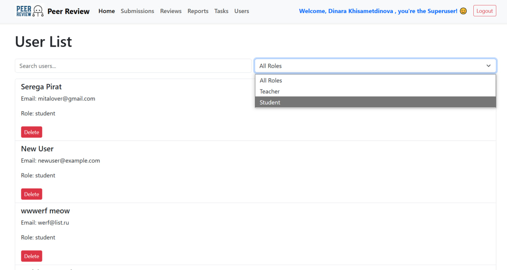

# Users

Страница **Users** предоставляет возможность управления пользователями системы. Её функционал различается для суперпользователей и обычных авторизованных пользователей.

---

## Основные возможности

### Для суперпользователей:
- Просмотр полного списка пользователей.
- Добавление новых пользователей.
- Удаление пользователей.

### Для обычных пользователей:
- Просмотр списка всех пользователей с их данными (имя, фамилия, роль).
- Фильтрация списка по ролям и поиску.

---

## Особенности интерфейса

### Для суперпользователей:
- **Добавление пользователя**:
  - Форма с полями для имени, фамилии, роли и электронной почты.
  - Кнопка "Add User" для добавления нового пользователя.

- **Удаление пользователя**:
  - Кнопка "Delete" доступна для всех пользователей в списке.

### Для обычных пользователей:
- **Просмотр пользователей**:
  - Отображается список всех пользователей с их именем, фамилией, электронной почтой и ролью.
  - Функционал добавления и удаления недоступен.

- **Фильтрация и поиск**:
  - Поле для поиска пользователей по имени или фамилии.
  - Выпадающий список для фильтрации пользователей по ролям (`student`, `teacher`).

---
## Сервис `user.service.ts:`
```typescript
import { Injectable } from '@angular/core';
import { HttpClient } from '@angular/common/http';
import { Observable } from 'rxjs';

@Injectable({
  providedIn: 'root',
})
export class UserService {
  private baseUrl = 'http://127.0.0.1:8000/peer/users';

  constructor(private http: HttpClient) {}

  getUsers(): Observable<any[]> {
    return this.http.get<any[]>(`${this.baseUrl}/`);
  }

  createUser(user: any): Observable<any> {
    return this.http.post<any>(`${this.baseUrl}/create/`, user);
  }

  deleteUser(userId: number): Observable<any> {
    return this.http.delete<any>(`${this.baseUrl}/${userId}/`);
  }
}
```
## API эндпоинты

- **Получение списка пользователей**:
  - `GET /peer/users/`
  - Возвращает список всех пользователей.

- **Создание пользователя**:
  - `POST /peer/users/create/`
  - Поля: `first_name`, `last_name`, `email`, `role`.

- **Удаление пользователя**:
  - `DELETE /peer/users/<id>/`

---

## Работа с компонентом

### Основные переменные

- **users**:
  - Список всех пользователей, загружаемый через API `/peer/users/`.

- **filteredUsers**:
  - Список пользователей, отфильтрованных по имени, фамилии или роли.

- **newUser**:
  - Объект для добавления нового пользователя, содержащий поля `first_name`, `last_name`, `email`, `role`.

- **filter**:
  - Строка для поиска пользователей по имени и фамилии.

- **selectedRole**:
  - Текущая выбранная роль для фильтрации.

---

## Алгоритм работы

### Для суперпользователей:

1. **Добавление пользователя**:
   - Заполняются поля имени, фамилии, электронной почты и роли.
   - Нажимается кнопка "Add User".
   - Новый пользователь создаётся через API `/peer/users/create/`.

2. **Удаление пользователя**:
   - Нажимается кнопка "Delete" для соответствующего пользователя.
   - Пользователь удаляется через API `/peer/users/<id>/`.

### Для обычных пользователей:

1. **Просмотр списка пользователей**:
   - Загружается список через API `/peer/users/`.
   - Отображается таблица с данными всех пользователей.

2. **Фильтрация пользователей**:
   - Пользователь вводит запрос в строку поиска, и список обновляется динамически.
   - Дополнительно можно выбрать роль для фильтрации пользователей.

---

## Пример данных API

### **GET /peer/users/**
```json
[
  {
    "id": 1,
    "first_name": "John",
    "last_name": "Doe",
    "email": "john.doe@example.com",
    "role": "teacher",
    "is_superuser": false
  },
  {
    "id": 2,
    "first_name": "Jane",
    "last_name": "Smith",
    "email": "jane.smith@example.com",
    "role": "student",
    "is_superuser": false
  },
  {
    "id": 3,
    "first_name": "Admin",
    "last_name": "User",
    "email": "admin@example.com",
    "role": "admin",
    "is_superuser": true
  }
]
```