# Лабораторная работа 4. Реализация клиентской части средствами Vue.js.

Вход
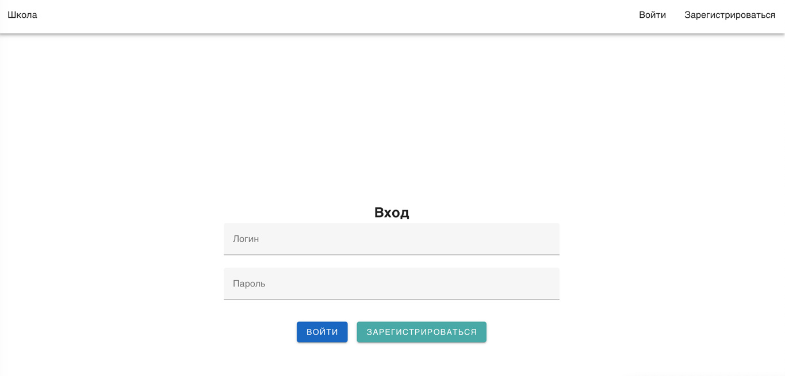

Регистрация

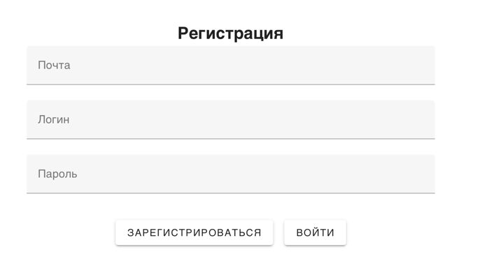

Список учителей

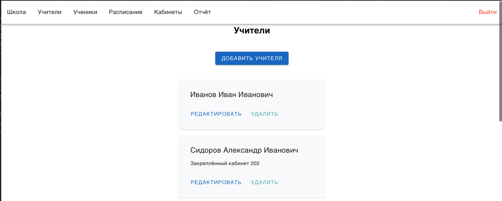

Окно для изменения учителя
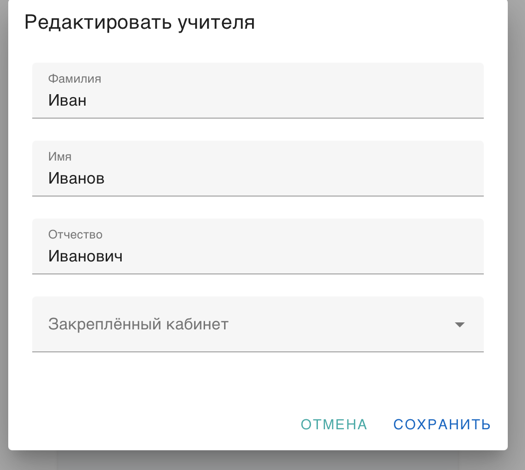

Окно для добавления учителя
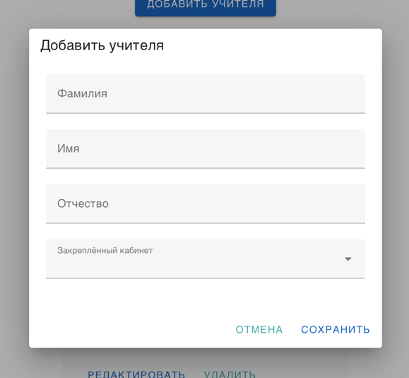

Расписание уроков
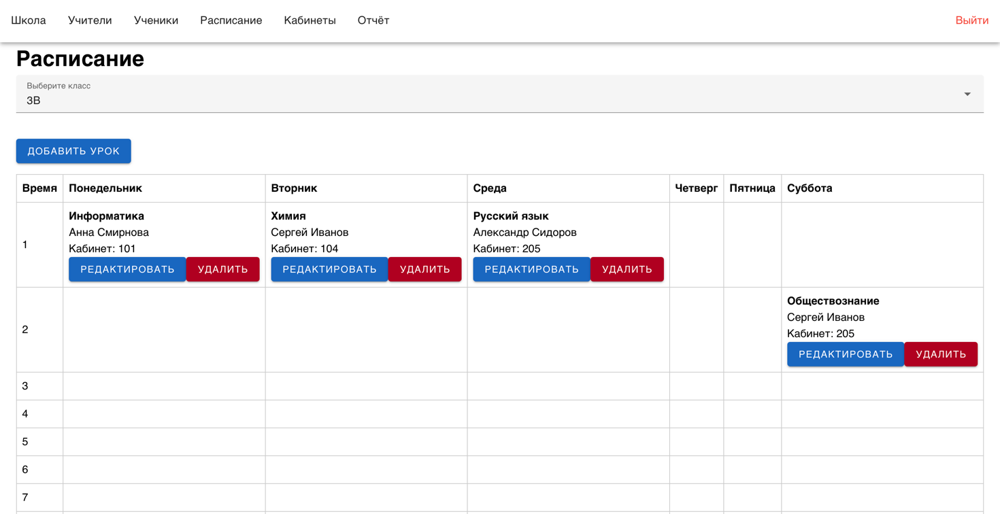

Окно для добавления расписания
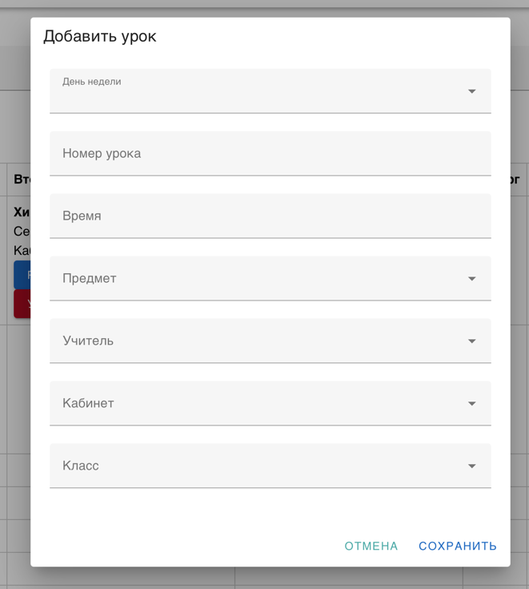

Окно для изменения расписания
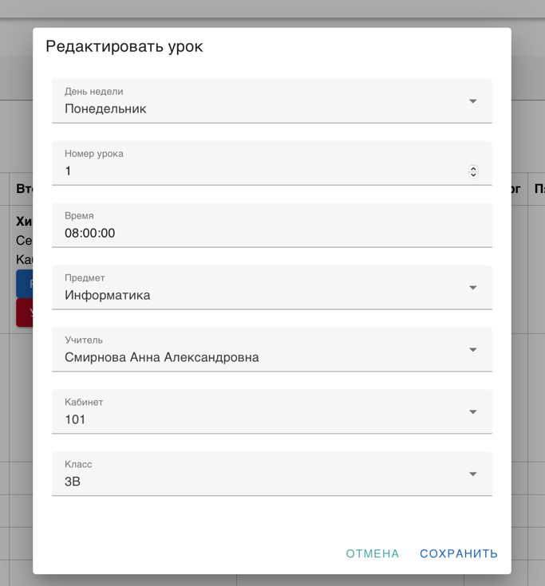

Список учеников
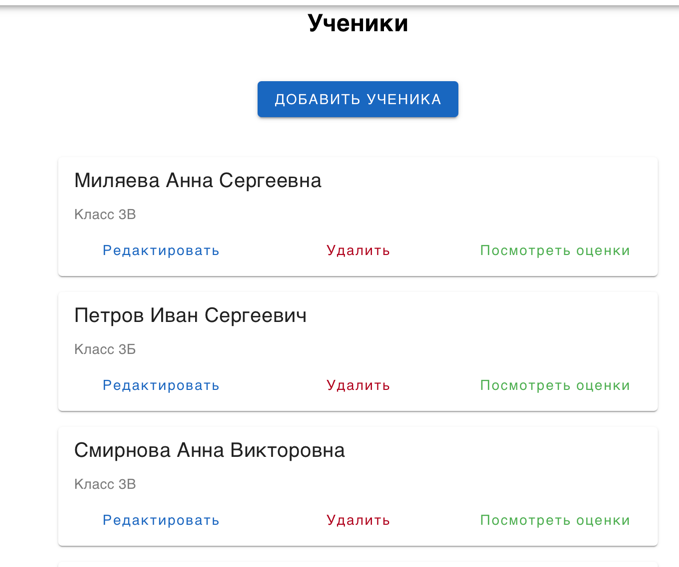

Окно для добавления ученика
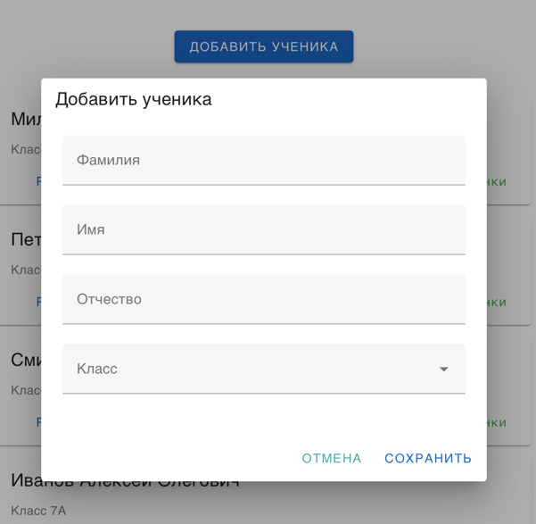

Окно для изменения ученика
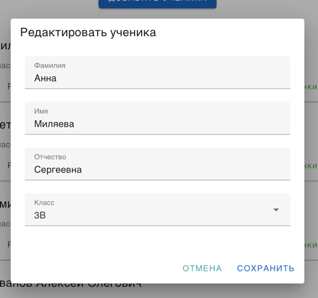

Просмотр оценок ученика
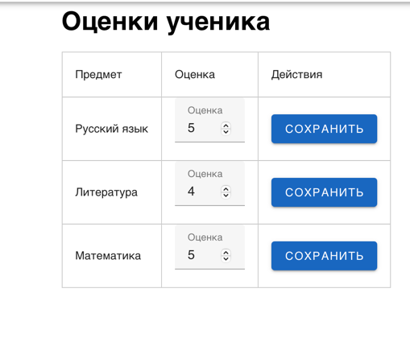

Список комнат
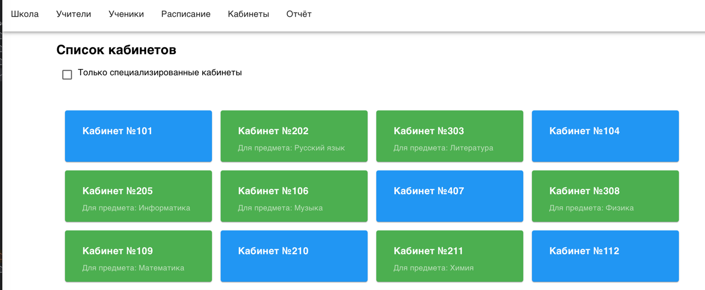

Отчёт об успеваемости
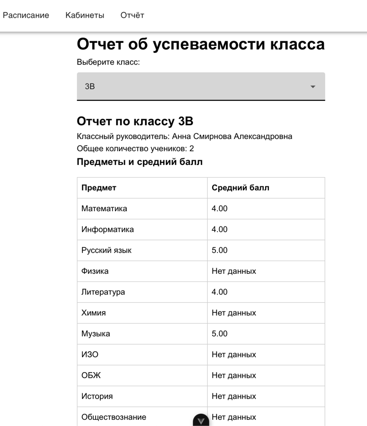