# Лабораторная работа 4. Реализация клиентской части средствами Vue.js

Вариант 15: Менеджер альпинистских клубов

## Описание интерфейсов

- Регистрация, авторизация, выход из аккаунта
- Профиль
    - Просмотр текущего пользователя (username, email, имя, фамилия, телефон, город, клуб)
    - Изменение этой информации
- Восхождения
    - таблица восхождений (даты, гора, маршрут, кол-во участников, успешность похода)
    - создание нового восхождения (админ)
- Детали восхождения
    - Просмотр более детальной информации о восхождении (запланированные и действительные даты, гора, маршрут, успешность, summary)
    - Изменение этой информации (админ)
    - Участвовать в походе. выписаться из списка участников
    - Список участников (пользователь, его клуб, успешно или нет окончил поход, тип происшествия (если есть), детали происшествия)
    - Изменение и удаление участия пользователя в походе (админ)
- Мои восхождения
    - таблица участий в восхождениях пользователя (даты, гора, маршрут, кол-во участников, успешность похода, успешность самого пользователя, тип происшествия)
- Клубы
    - Таблица клубов (название, страна, город, кол-во участников)
    - Создание клуба (админ)
- Детали клуба
    - Просмотр деталей клуба (название, страна, город, контактное лицо)
    - Изменение этих данных (админ)
    - Присоединиться к клубу/выход из клуба
    - Список учасников (пользователь, дата зачисления в клуб)
    - Удаление учасника клуба (админ)
- Отчет
    - Таблица, в которой для каждой горы отражается список восхождений, в хронологиском порядке (можно настроить). Для каждого восхождения выводится информация о количестве членов в группе и успешность.
    

## Экраны:
### 1. Авторизация
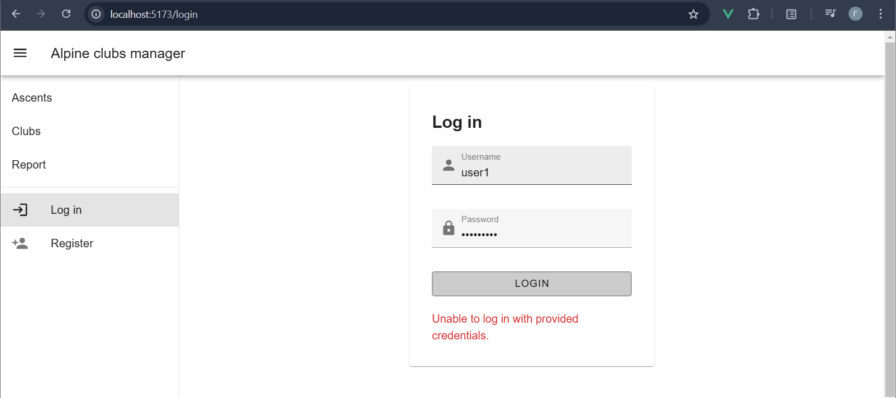
### 2. Регистрация
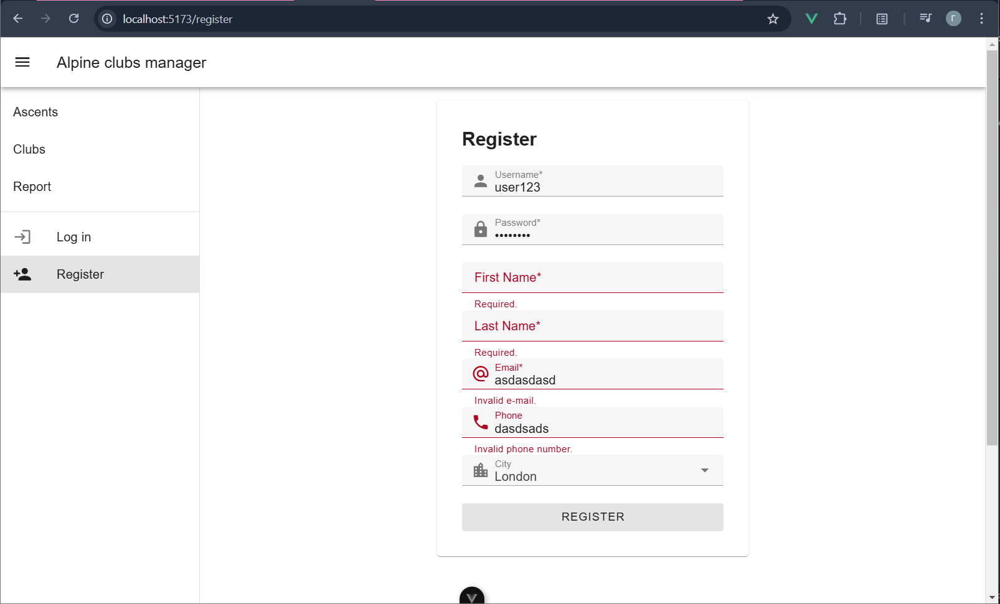
### 2. Профиль
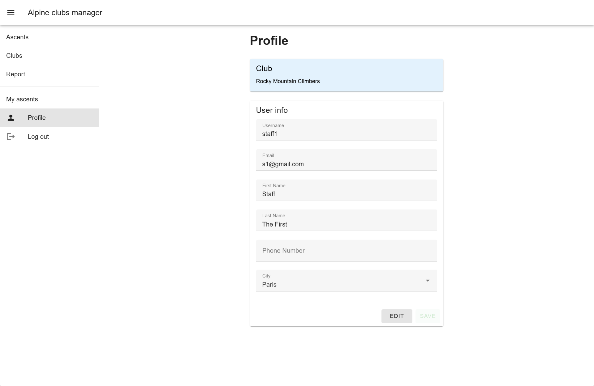
### 3. Восхождения (Ascents)
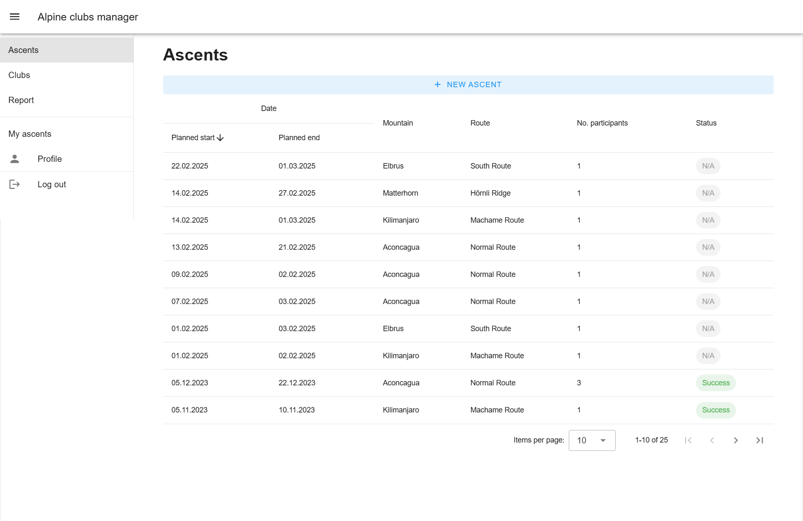
Создание восхождения:
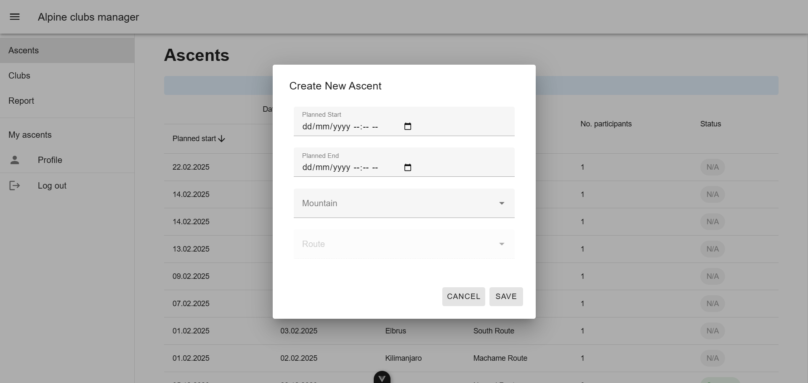
### 4. Детали восхождения
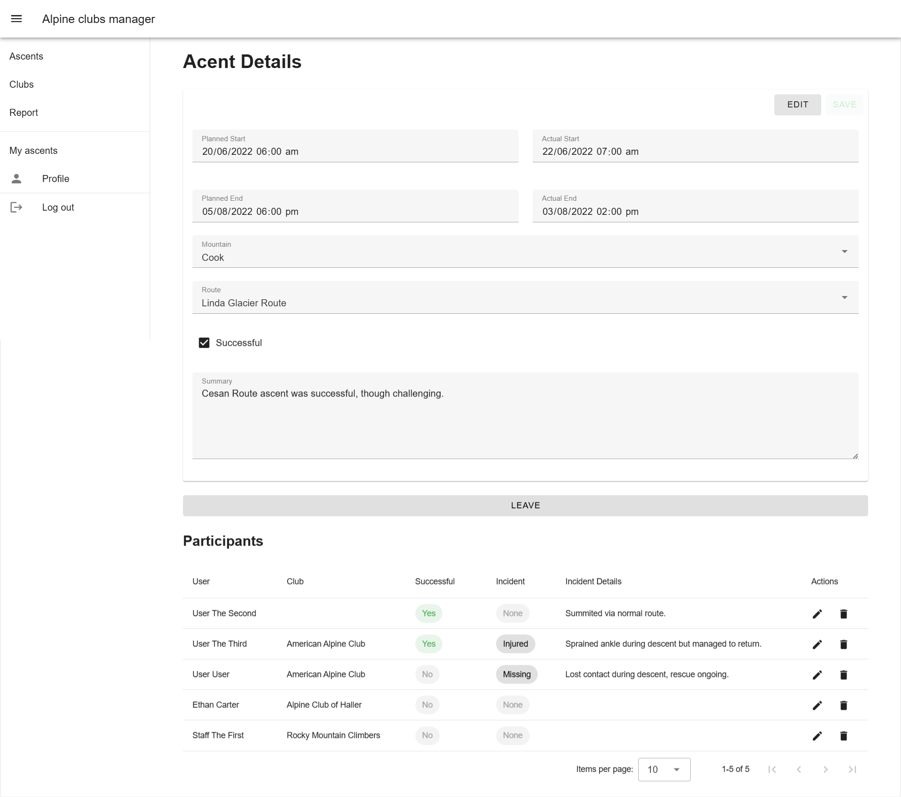
Редактирование участника восхождения:
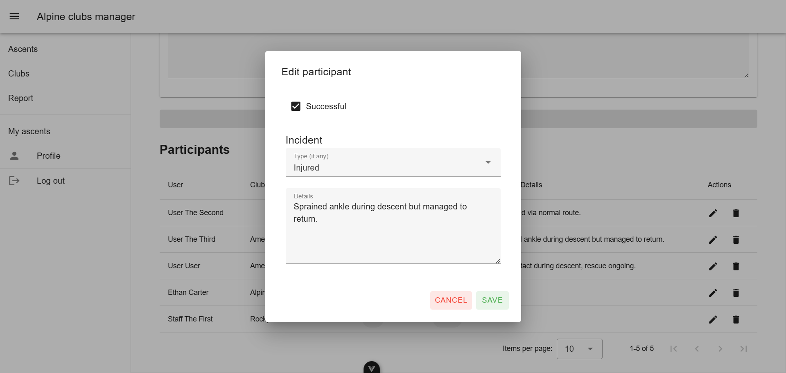
### 5. Мои восхождения
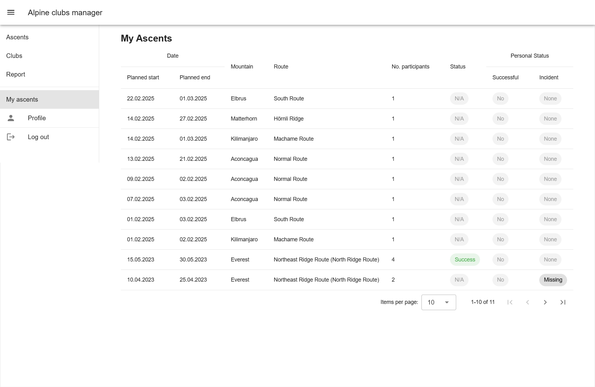
### 6. Клубы
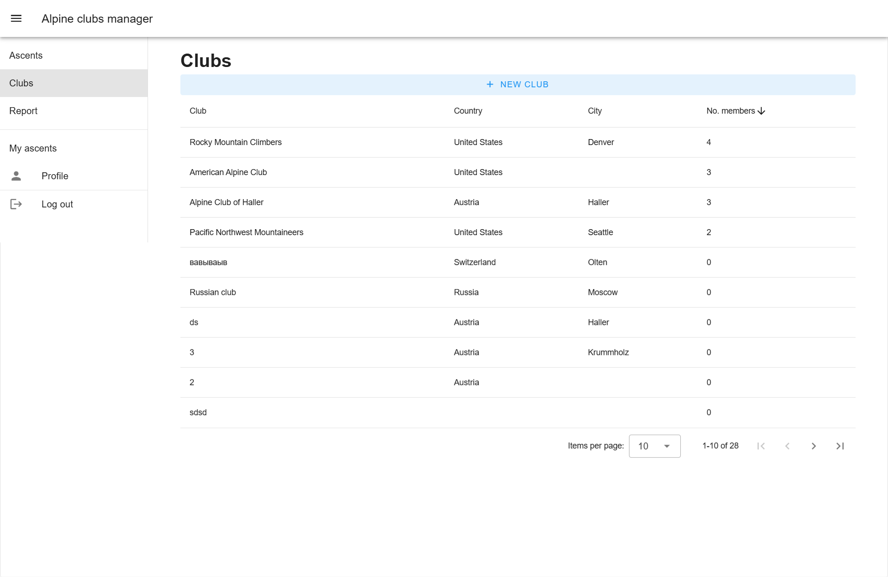
Создание клуба:
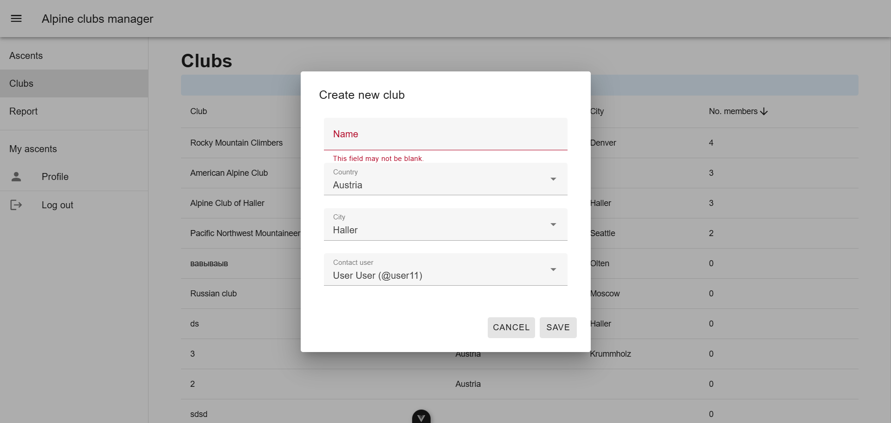
### 7. Детали клуба
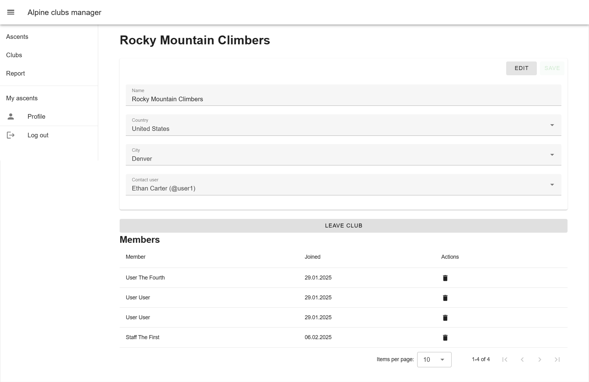
### 7. Отчет
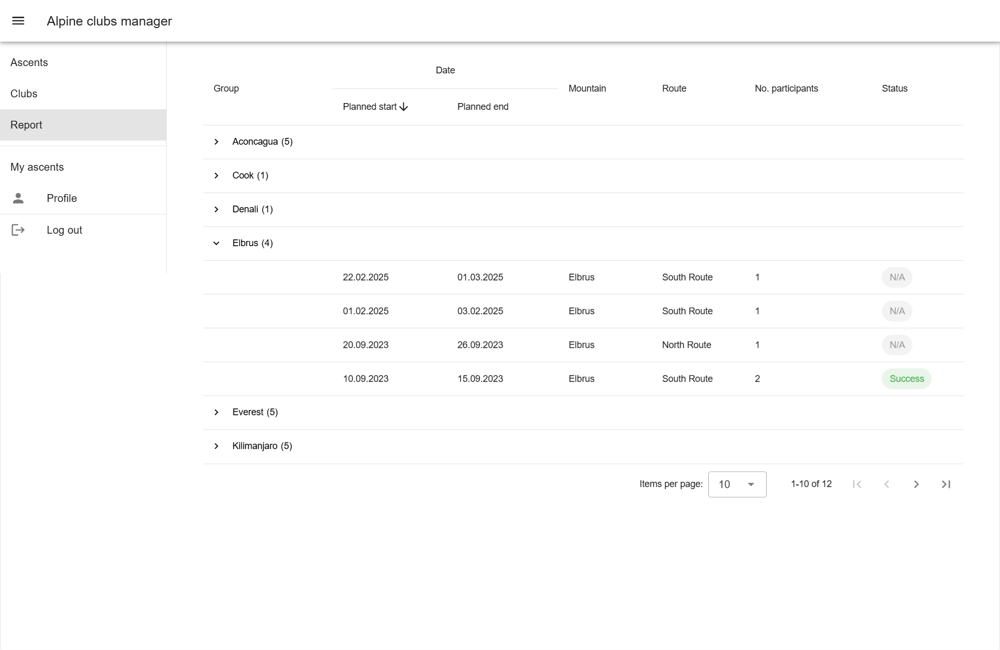

