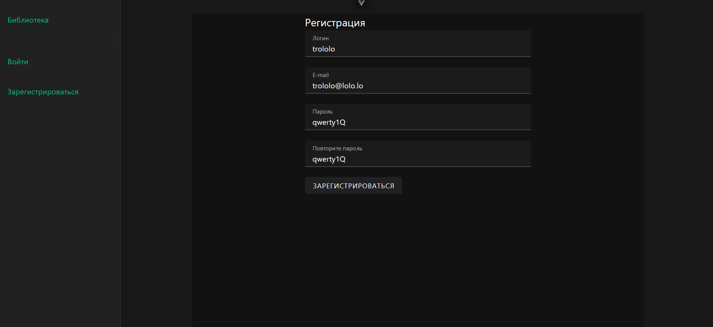
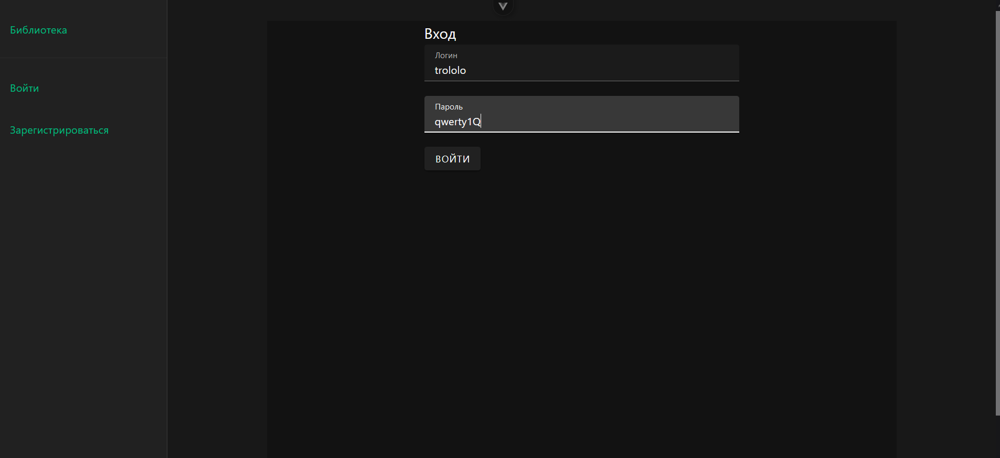
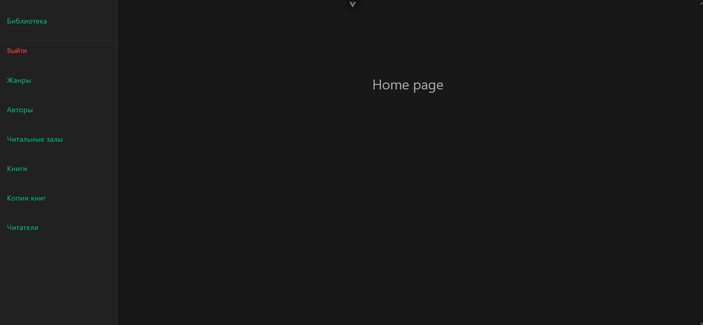

# Аутентификация

## Регистрация

В регистрации есть поля "Логин", "E-mail", "Пароль" и "Повторите пароль". Вводим креды и нажимаем "Зарегистрироваться" (джанго может ругаться на *слишком простой* пароль)

## Логин

Заходим на страницу логина. Вводим креды, с которыми мы регистрировались и нажимаем "Войти".

Нас перебросит в корень и появятся разделы и возможность выйти.

Токен сессии хранится на сервере в Pinia и сохраняется в рамках одной сессии, а значит нас выкинет из системы после перезахода.
