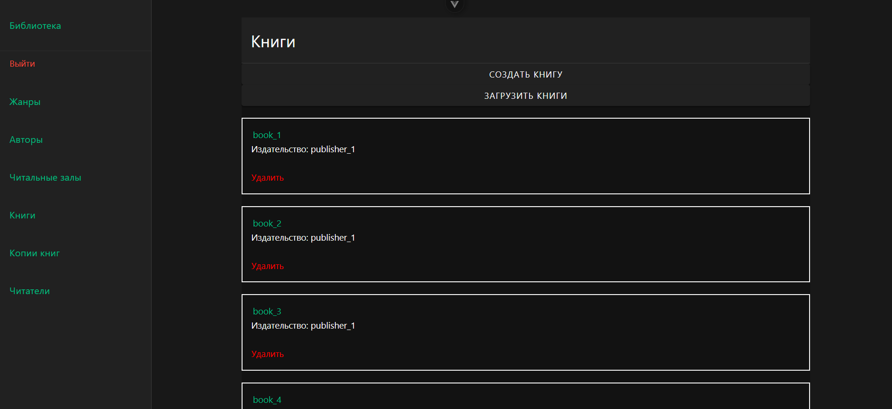
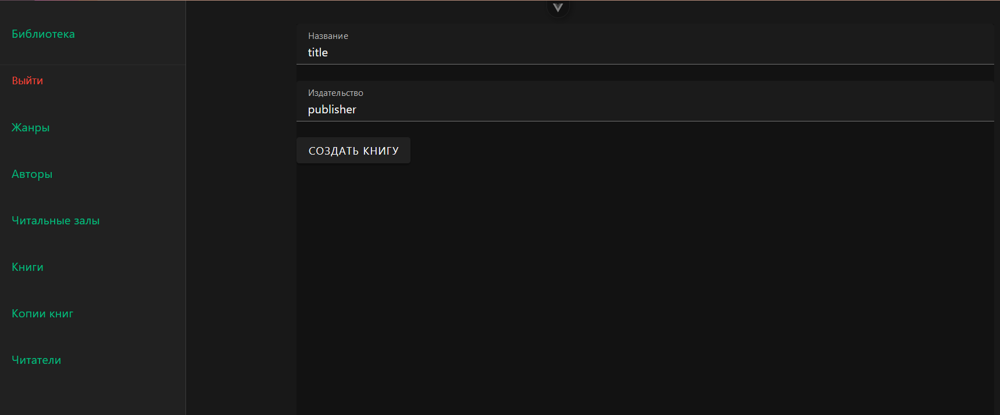
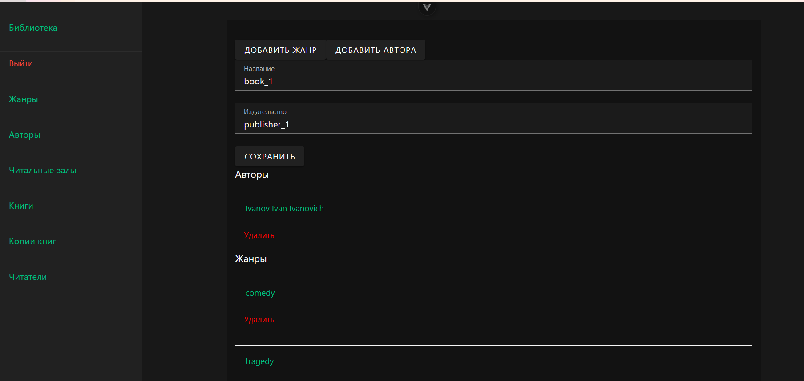
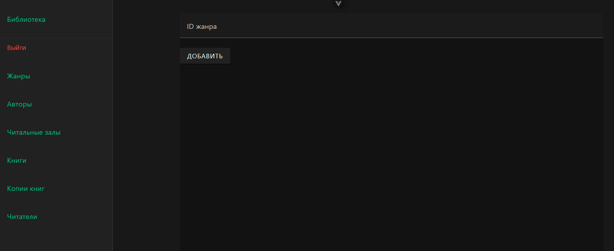
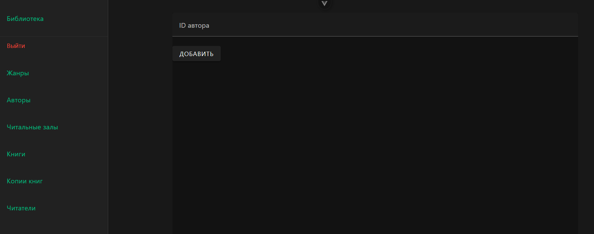

# Книги

В книгах видим список книг. Данные загружаются с бекэнда и рендерятся на клиентской стороне. Есть возможность удалить запись, добавить новую запись, посмотреть подробнее запись и обновить данные с бекэнда.

На странице создания есть форма, которая потом отправляется на сервер и обрабатывается. В случае успеха в базе появляется новая запись и происходит редирект на список.

На странице книги есть возможность изменить запись и сохранить её. Тут же отображется более подробная информация: жанры и авторы книги. Авторы и жанры добавляются в соотвествующих разделах на странице. Можно удалить жанр или автора у книги.

Добавление жанра книги

Добавление автора книги

