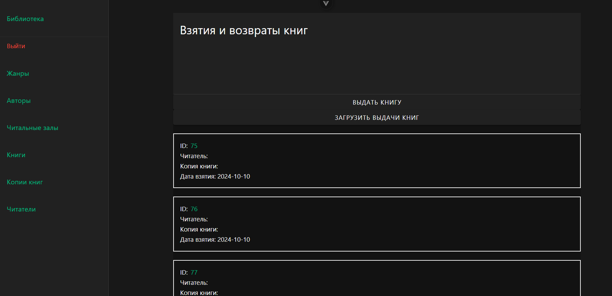
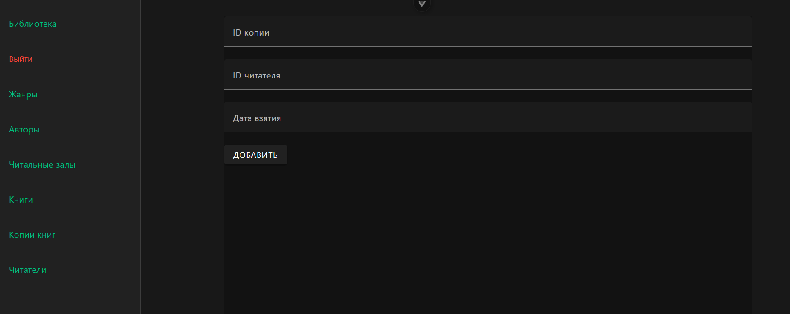
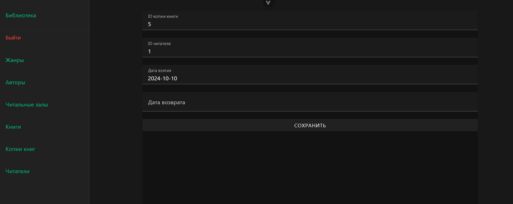

# Взятые книги

На странице взятых книг для данного читателя представлен список взятых и не возвращёных в библиотеку книг. Есть возможность выдать ещё книгу, обновить данные с бекенда и открыть более подробную запись выдачи.

На странице создания есть форма, которая потом отправляется на сервер и обрабатывается. В случае успеха в базе появляется новая запись и происходит редирект на читателя.

На странице акта выдачи есть возможность изменить запись и сохранить её. Изначально дата возврата не указана. Если указать дату возврата, то данная запись перестанет отображаться в списке данного читателя, т.к. книга была возвращена.

