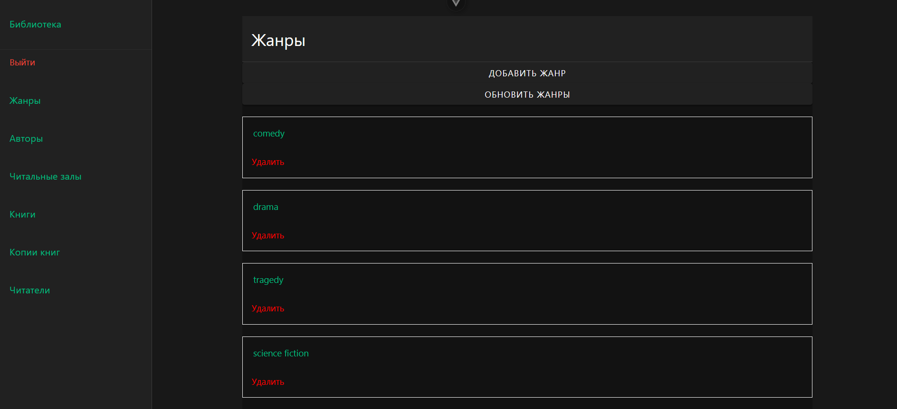
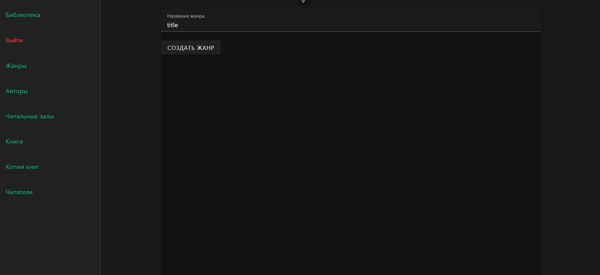
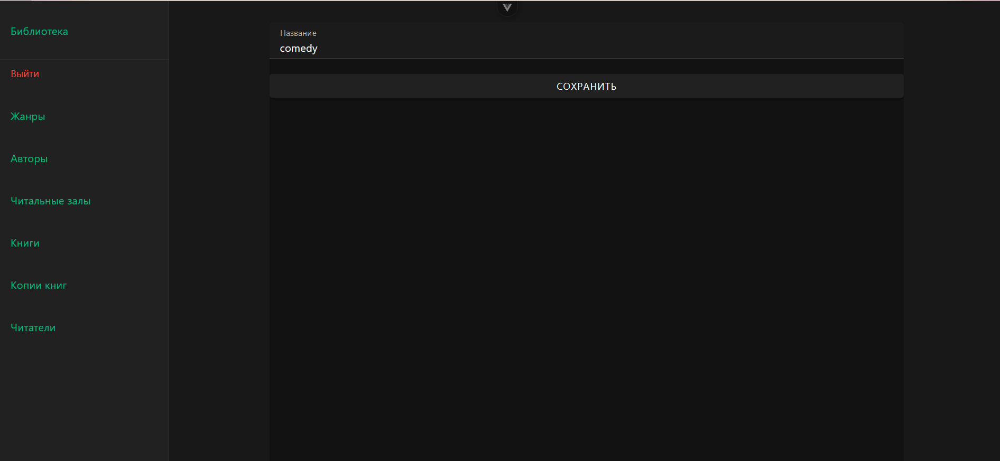

# Жанры

В жанрах видим список жанров. Данные загружаются с бекэнда и рендерятся на клиентской стороне. Есть возможность удалить запись, добавить новую запись, посмотреть подробнее запись и обновить данные с бекэнда.

На странице создания есть форма, которая потом отправляется на сервер и обрабатывается. В случае успеха в базе появляется новая запись и происходит редирект на список.

На странице жанра есть возможность изменить запись и сохранить её.

