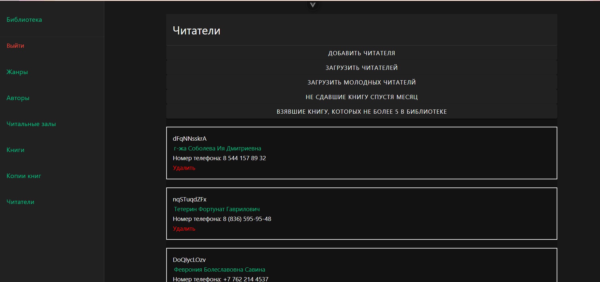
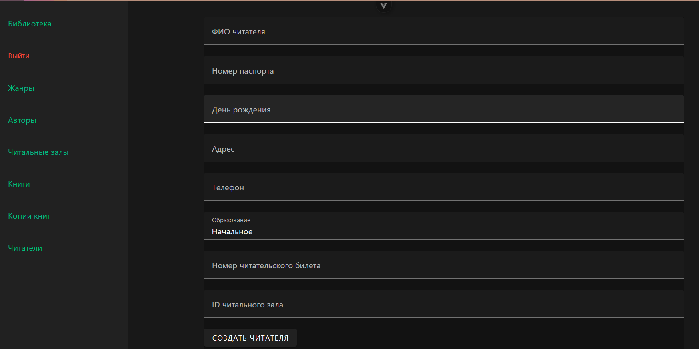
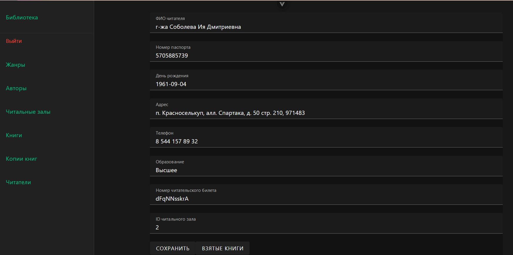

# Читатели

В читателях видим список читателей. Данные загружаются с бекэнда и рендерятся на клиентской стороне. Есть возможность удалить запись, добавить новую запись, посмотреть подробнее запись и обновить данные с бекэнда. Есть несколько вариантов фильтрации читателей.

На странице создания есть форма, которая потом отправляется на сервер и обрабатывается. В случае успеха в базе появляется новая запись и происходит редирект на список.

На странице автора есть возможность изменить запись и сохранить её. Здесь можно увидеть кнопку, переводящую на список взятых книг данным читателем.

