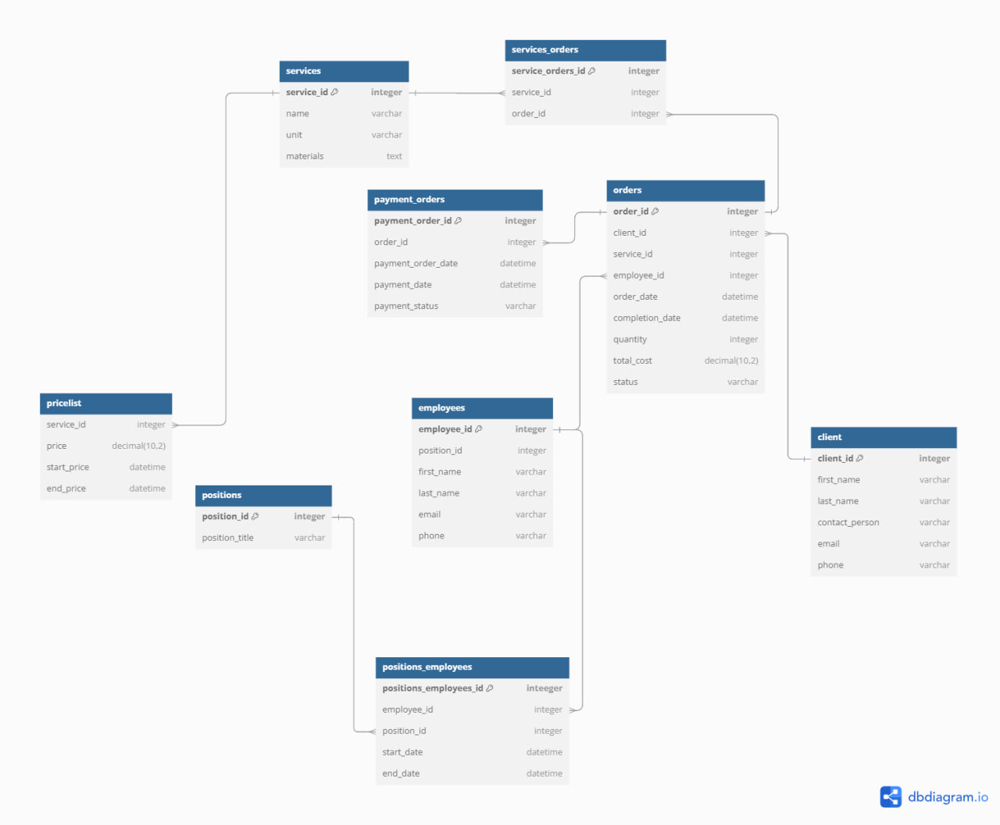

models.py

    from django.db import models
    
    class Client(models.Model):
        first_name = models.CharField(max_length=255)
        last_name = models.CharField(max_length=255)
        contact_person = models.CharField(max_length=255)
        email = models.EmailField()
        phone = models.CharField(max_length=20)
    
    class Service(models.Model):
        name = models.CharField(max_length=255)
        unit = models.CharField(max_length=50)
        materials = models.TextField()
    
    class PriceList(models.Model):
        service = models.ForeignKey(Service, on_delete=models.CASCADE)
        price = models.DecimalField(max_digits=10, decimal_places=2)
        start_price = models.DateTimeField()
        end_price = models.DateTimeField()
    
    class Position(models.Model):
        position_title = models.CharField(max_length=255)
    
    class Employee(models.Model):
        position = models.ForeignKey(Position, on_delete=models.CASCADE)
        first_name = models.CharField(max_length=255)
        last_name = models.CharField(max_length=255)
        email = models.EmailField()
        phone = models.CharField(max_length=20)
    
    class PositionEmployee(models.Model):
        employee = models.ForeignKey(Employee, on_delete=models.CASCADE)
        position = models.ForeignKey(Position, on_delete=models.CASCADE)
        start_date = models.DateTimeField()
        end_date = models.DateTimeField()
    
    class Order(models.Model):
        client = models.ForeignKey(Client, on_delete=models.CASCADE)
        service = models.ForeignKey(Service, on_delete=models.CASCADE)
        employee = models.ForeignKey(Employee, on_delete=models.CASCADE)
        order_date = models.DateTimeField()
        completion_date = models.DateTimeField()
        quantity = models.IntegerField()
        total_cost = models.DecimalField(max_digits=10, decimal_places=2)
        status = models.CharField(max_length=50)
    
    class PaymentOrder(models.Model):
        order = models.ForeignKey(Order, on_delete=models.CASCADE)
        payment_order_date = models.DateTimeField()
        payment_date = models.DateTimeField()
        payment_status = models.CharField(max_length=50)
    
    class ServiceOrder(models.Model):
        service = models.ForeignKey(Service, on_delete=models.CASCADE)
        order = models.ForeignKey(Order, on_delete=models.CASCADE)

sales_agency/urls.py

    from django.contrib import admin
    from django.urls import path, include
    from drf_spectacular.views import SpectacularAPIView, SpectacularSwaggerView, SpectacularRedocView
    
    urlpatterns = [
        path('admin/', admin.site.urls),
        path('', include('sales_agency_app.urls')),
    
        # --- Swagger/OpenAPI ---
        path('api/schema/', SpectacularAPIView.as_view(), name='schema'),
        path('api/docs/swagger/', SpectacularSwaggerView.as_view(url_name='schema'), name='swagger-ui'),
        path('api/docs/redoc/', SpectacularRedocView.as_view(url_name='schema'), name='redoc'),
    
        # Аутентификация
        path('api/auth/', include('djoser.urls.authtoken')),
        path('api/auth/', include('djoser.urls')),
        path('api/auth/', include('djoser.urls.jwt')),
    
        #DRF
        path('api-auth/', include("rest_framework.urls")),
    ]

sales_agency_app/urls.py

    from django.urls import path, include
    from rest_framework.routers import DefaultRouter
    from drf_yasg.views import get_schema_view
    from drf_yasg import openapi
    from rest_framework import permissions
    
    from .views import (
        ClientViewSet, UserClientInfo, ServiceViewSet, PriceListViewSet, PositionViewSet, EmployeeViewSet,
        PositionEmployeeViewSet, OrderViewSet, PaymentOrderViewSet, CompletedOrdersListView,
        PaymentOrdersByPeriodView, ServiceListView, OrdersByClientView, EmployeeOrdersCountView, QuarterlyReportView,
        RegisterView
    )
    
    # Swagger
    schema_view = get_schema_view(
        openapi.Info(
            title="Луч API",
            default_version='v1',
            description="Документация API",
            terms_of_service="https://www.example.com/terms/",
            contact=openapi.Contact(email="support@example.com"),
            license=openapi.License(name="BSD License"),
        ),
        public=True,
        permission_classes=(permissions.AllowAny,),
    )
    
    # Настройка маршрутов API
    router = DefaultRouter()
    router.register(r'clients', ClientViewSet)
    router.register(r'services', ServiceViewSet)
    router.register(r'price-list', PriceListViewSet)
    router.register(r'positions', PositionViewSet)
    router.register(r'employees', EmployeeViewSet)
    router.register(r'position-employees', PositionEmployeeViewSet)
    router.register(r'orders', OrderViewSet)
    router.register(r'payment-orders', PaymentOrderViewSet)
    
    urlpatterns = [
        path('api/', include(router.urls)),
        path('api/client-info/', UserClientInfo.as_view(), name='user-client-info'),
        path("api/auth/users/", RegisterView.as_view(), name="register"),
    
        path('api/completed-orders/', CompletedOrdersListView.as_view(), name='completed-orders'),
        path('api/payment-orders-by-period/', PaymentOrdersByPeriodView.as_view(), name='payment-orders-by-period'),
        path('api/service-list/', ServiceListView.as_view(), name='service-list'),
        path('api/orders-by-client/', OrdersByClientView.as_view(), name='orders-by-client'),
        path('api/employee-orders-count/', EmployeeOrdersCountView.as_view(), name='employee-orders-count'),
        path('api/quarterly-report/', QuarterlyReportView.as_view(), name='quarterly-report'),
    
        # --- Swagger UI ---
        path('api/docs/swagger/', schema_view.with_ui('swagger', cache_timeout=0), name='schema-swagger-ui'),
        path('api/docs/redoc/', schema_view.with_ui('redoc', cache_timeout=0), name='schema-redoc'),
        path('api/docs/swagger.json', schema_view.without_ui(cache_timeout=0), name='schema-json'),
        path('api/docs/swagger.yaml', schema_view.without_ui(cache_timeout=0), name='schema-yaml'),
    ]

serializers.py

    from rest_framework import serializers
    from django.contrib.auth.models import User
    from .models import Client, Service, PriceList, Position, Employee, PositionEmployee, Order, PaymentOrder
    
    
    class RegistrationSerializer(serializers.ModelSerializer):
        first_name = serializers.CharField(required=True)
        last_name = serializers.CharField(required=True)
        contact_person = serializers.CharField(required=True)
        phone = serializers.CharField(required=True)
        username = serializers.CharField(max_length=100)
        password = serializers.CharField(write_only=True, style={'input_type': 'password'})
        re_password = serializers.CharField(write_only=True, style={'input_type': 'password'})
    
        class Meta:
            model = User
            fields = (
            "id", "username", "email", "password", "re_password", "phone", "first_name", "last_name", "contact_person")
            extra_kwargs = {"password": {"write_only": True}}
    
        def validate(self, data):
            if data.get("password") != data.get("re_password"):
                raise serializers.ValidationError({"password": "Пароли не совпадают."})
            return data
    
        def create(self, validated_data):
            print("Сериализатор: начинаем создание пользователя и клиента")
    
            contact_person = validated_data.pop('contact_person', None)
            phone = validated_data.pop('phone', None)
            first_name = validated_data.pop('first_name', None)
            last_name = validated_data.pop('last_name', None)
    
            password = validated_data.pop('password')
            user = User.objects.create_user(**validated_data)
            user.set_password(password)
            user.save()
            print("Создан пользователь:", user)
            client = Client.objects.create(
                first_name=first_name,
                last_name=last_name,
                contact_person=contact_person,
                email=validated_data.get("email"),
                phone=phone
            )
    
            print("Создан клиент:", client)
            return user
    
    
    # User
    class UserSerializer(serializers.ModelSerializer):
        class Meta:
            model = User
            fields = ('id', 'username', 'email', 'is_staff')
    
    
    # Client
    class ClientSerializer(serializers.ModelSerializer):
        class Meta:
            model = Client
            fields = ['id', 'first_name', 'last_name', 'contact_person', 'email', 'phone']
    
    
    # Service
    class ServiceSerializer(serializers.ModelSerializer):
        class Meta:
            model = Service
            fields = '__all__'
    
    
    # PriceList
    class PriceListSerializer(serializers.ModelSerializer):
        service = ServiceSerializer(read_only=True)
        service_id = serializers.PrimaryKeyRelatedField(
            queryset=Service.objects.all(), source='service', write_only=True
        )
    
        class Meta:
            model = PriceList
            fields = ['id', 'service', 'service_id', 'price', 'start_price', 'end_price']
    
        def validate(self, data):
            if data['start_price'] >= data['end_price']:
                raise serializers.ValidationError("Дата начала действия цены должна быть раньше даты окончания.")
            return data
    
        def create(self, validated_data):
            return PriceList.objects.create(**validated_data)
    
        def update(self, instance, validated_data):
            for attr, value in validated_data.items():
                setattr(instance, attr, value)
            instance.save()
            return instance
    
    
    # Position
    class PositionSerializer(serializers.ModelSerializer):
        class Meta:
            model = Position
            fields = '__all__'
    
    
    # Employee
    class EmployeeSerializer(serializers.ModelSerializer):
        position = PositionSerializer(read_only=True)
        position_id = serializers.PrimaryKeyRelatedField(
            queryset=Position.objects.all(), write_only=True
        )
        order_count = serializers.SerializerMethodField()
    
        class Meta:
            model = Employee
            fields = ['id', 'first_name', 'last_name', 'email', 'phone', 'position', 'position_id', 'order_count']
    
        def create(self, validated_data):
            position = validated_data.pop('position_id', None)
            employee = Employee.objects.create(position=position, **validated_data)
            return employee
    
        def update(self, instance, validated_data):
            position = validated_data.pop('position_id', None)
            for attr, value in validated_data.items():
                setattr(instance, attr, value)
            if position is not None:
                instance.position = position
            instance.save()
            return instance
    
        def get_order_count(self, obj):
            # Подсчитываем количество заявок у этого сотрудника для отчета
            return Order.objects.filter(employee=obj, status='completed').count()
    
    
    # PositionEmployee
    class PositionEmployeeSerializer(serializers.ModelSerializer):
        employee = EmployeeSerializer(read_only=True)
        position = PositionSerializer(read_only=True)
        employee_id = serializers.PrimaryKeyRelatedField(
            queryset=Employee.objects.all(), write_only=True
        )
        position_id = serializers.PrimaryKeyRelatedField(
            queryset=Position.objects.all(), write_only=True
        )
    
        class Meta:
            model = PositionEmployee
            fields = ['id', 'employee', 'employee_id', 'position', 'position_id', 'start_date', 'end_date']
    
        def create(self, validated_data):
            employee = validated_data.pop('employee_id', None)
            position = validated_data.pop('position_id')
            position_employee = PositionEmployee.objects.create(employee=employee, position=position, **validated_data)
            return position_employee
    
    
    class OrderSerializer(serializers.ModelSerializer):
        client = ClientSerializer(read_only=True)
        service = ServiceSerializer(read_only=True)
        employee = EmployeeSerializer(read_only=True)
    
        client_id = serializers.PrimaryKeyRelatedField(
            queryset=Client.objects.all(), write_only=True
        )
        service_id = serializers.PrimaryKeyRelatedField(
            queryset=Service.objects.all(), write_only=True
        )
        employee_id = serializers.PrimaryKeyRelatedField(
            queryset=Employee.objects.all(), write_only=True
        )
    
        class Meta:
            model = Order
            fields = [
                'id', 'client', 'client_id', 'service', 'service_id', 'employee', 'employee_id',
                'order_date', 'completion_date', 'quantity', 'total_cost', 'status'
            ]
    
        def validate(self, data):
            if data.get('completion_date') and data.get('order_date'):
                if data['completion_date'] < data['order_date']:
                    raise serializers.ValidationError("Дата завершения заказа не может быть раньше даты создания.")
    
            if data.get('quantity') and data['quantity'] <= 0:
                raise serializers.ValidationError("Количество должно быть больше 0.")
    
            return data
    
        def create(self, validated_data):
            client = validated_data.pop('client_id')
            service = validated_data.pop('service_id')
            employee = validated_data.pop('employee_id')
            order_date = validated_data.get('order_date')
            completion_date = validated_data.get('completion_date')
            quantity = validated_data.get('quantity')
            total_cost = validated_data.get('total_cost')
            status = validated_data.get('status')
    
            order = Order.objects.create(
                client=client,
                service=service,
                employee=employee,
                order_date=order_date,
                completion_date=completion_date,
                quantity=quantity,
                total_cost=total_cost,
                status=status
            )
            return order
    
        def update(self, instance, validated_data):
            if 'client_id' in validated_data:
                raise serializers.ValidationError("Client cannot be changed.")
    
            for attr, value in validated_data.items():
                setattr(instance, attr, value)
    
            instance.save()
            return instance
    
    
    # PaymentOrder
    class PaymentOrderSerializer(serializers.ModelSerializer):
        order = serializers.PrimaryKeyRelatedField(queryset=Order.objects.all())
    
        class Meta:
            model = PaymentOrder
            fields = '__all__'

views.py

    from rest_framework import viewsets, generics, status
    from rest_framework.response import Response
    from rest_framework.permissions import IsAuthenticated, AllowAny
    from rest_framework.decorators import action
    from rest_framework_simplejwt.tokens import RefreshToken
    from rest_framework.exceptions import ValidationError as DRFValidationError
    from rest_framework.views import APIView
    
    from django.db.models import Sum, Count, Q
    from django.utils.timezone import now
    from django.utils.dateparse import parse_date
    from datetime import timedelta
    
    from .models import Client, Service, PriceList, Position, Employee, PositionEmployee, Order, PaymentOrder
    from .serializers import (
        ClientSerializer, ServiceSerializer, PriceListSerializer, PositionSerializer,
        EmployeeSerializer, PositionEmployeeSerializer, OrderSerializer, PaymentOrderSerializer,
        RegistrationSerializer
    )
    from .permissions import IsClient, IsAdmin
    
    
    class RegisterView(APIView):
        permission_classes = [AllowAny]
    
        def post(self, request):
            serializer = RegistrationSerializer(data=request.data)
            if serializer.is_valid():
                user = serializer.save()
    
                # Генерируем токены сразу после регистрации
                refresh = RefreshToken.for_user(user)
                return Response(
                    {
                        "user": {
                            "id": user.id,
                            "username": user.username,
                            "email": user.email,
                        },
                        "access": str(refresh.access_token),
                        "refresh": str(refresh),
                    },
                    status=status.HTTP_201_CREATED,
                )
    
            return Response(serializer.errors, status=status.HTTP_400_BAD_REQUEST)
    
    
    class UserClientInfo(APIView):
        permission_classes = [IsAuthenticated]
    
        def get(self, request):
            user = request.user
    
            try:
                client = Client.objects.get(email=user.email)
                return Response({
                    'id': client.id,
                    'first_name': client.first_name,
                    'last_name': client.last_name,
                    'phone': client.phone,
                    'contact_person': client.contact_person,
                })
            except Client.DoesNotExist:
                return Response({"detail": "Client not found."}, status=404)
    
    
    class ClientViewSet(viewsets.ModelViewSet):
        queryset = Client.objects.all()
        serializer_class = ClientSerializer
        permission_classes = [IsAuthenticated]
    
    
    class ServiceViewSet(viewsets.ModelViewSet):
        queryset = Service.objects.all()
        serializer_class = ServiceSerializer
        permission_classes = [IsAuthenticated]
    
        def perform_create(self, serializer):
            user = self.request.user
    
            if user.is_staff:
                serializer.save()
            else:
                raise DRFValidationError({"error": "Создание услуги доступно только администратору."})
    
        def perform_update(self, serializer):
            user = self.request.user
    
            if user.is_staff:
                serializer.save()
            else:
                raise DRFValidationError({"error": "Редактирование услуги доступно только администратору."})
    
        def perform_destroy(self, instance):
            user = self.request.user
    
            if user.is_staff:
                instance.delete()
            else:
                raise DRFValidationError({"error": "Удаление услуги доступно только администратору."})
    
    
    class PriceListViewSet(viewsets.ModelViewSet):
        queryset = PriceList.objects.all()
        serializer_class = PriceListSerializer
        permission_classes = [IsAuthenticated, IsClient | IsAdmin]
    
        def perform_create(self, serializer):
            user = self.request.user
    
            if user.is_staff:
                serializer.save()
            else:
                raise DRFValidationError({"error": "Создание цены доступно только администратору."})
    
        def perform_update(self, serializer):
            user = self.request.user
    
            if user.is_staff:
                serializer.save()
            else:
                raise DRFValidationError({"error": "Редактирование цены доступно только администратору."})
    
        def perform_destroy(self, instance):
            user = self.request.user
    
            if user.is_staff:
                instance.delete()
            else:
                raise DRFValidationError({"error": "Удаление цены доступно только администратору."})
    
    
    class PositionViewSet(viewsets.ModelViewSet):
        queryset = Position.objects.all()
        serializer_class = PositionSerializer
        permission_classes = [IsAuthenticated, IsAdmin]
    
        def perform_create(self, serializer):
            user = self.request.user
    
            if user.is_staff:
                serializer.save()
            else:
                raise DRFValidationError({"error": "Создание должности доступно только администратору."})
    
        def perform_update(self, serializer):
            user = self.request.user
    
            if user.is_staff:
                serializer.save()
            else:
                raise DRFValidationError({"error": "Редактирование должности доступно только администратору."})
    
        def perform_destroy(self, instance):
            user = self.request.user
    
            if user.is_staff:
                instance.delete()
            else:
                raise DRFValidationError({"error": "Удаление должности доступно только администратору."})
    
    
    class EmployeeViewSet(viewsets.ModelViewSet):
        queryset = Employee.objects.all()
        serializer_class = EmployeeSerializer
        permission_classes = [IsAuthenticated]
    
        def perform_create(self, serializer):
            user = self.request.user
    
            if user.is_staff:
                serializer.save()
            else:
                raise DRFValidationError({"error": "Создание сотрудника доступно только администратору."})
    
        def perform_update(self, serializer):
            user = self.request.user
    
            if user.is_staff:
                serializer.save()
            else:
                raise DRFValidationError({"error": "Редактирование сотрудника доступно только администратору."})
    
        def perform_destroy(self, instance):
            user = self.request.user
    
            if user.is_staff:
                instance.delete()
            else:
                raise DRFValidationError({"error": "Удаление сотрудника доступно только администратору."})
    
    
    class PositionEmployeeViewSet(viewsets.ModelViewSet):
        queryset = PositionEmployee.objects.all()
        serializer_class = PositionEmployeeSerializer
        permission_classes = [IsAuthenticated, IsAdmin]
    
    
    class OrderViewSet(viewsets.ModelViewSet):
        queryset = Order.objects.all()
        serializer_class = OrderSerializer
        permission_classes = [IsAuthenticated]
    
        def perform_create(self, serializer):
            user = self.request.user
    
            if not user.is_staff:
                try:
                    client = Client.objects.get(email=user.email)
                except Client.DoesNotExist:
                    raise DRFValidationError({"error": "У пользователя нет привязанного клиента."})
                serializer.save(client=client)
            else:
                serializer.save()
    
        def get_queryset(self):
            user = self.request.user
    
            if user.is_staff:
                return Order.objects.all()
    
            try:
                client = Client.objects.get(email=user.email)
            except Client.DoesNotExist:
                return Order.objects.none()
    
            return Order.objects.filter(client=client)
    
        def perform_update(self, serializer):
            user = self.request.user
    
            if user.is_staff:
                serializer.save()
            else:
                raise DRFValidationError({"error": "Редактирование заказа доступно только администратору."})
    
        def perform_destroy(self, instance):
            user = self.request.user
    
            if user.is_staff:
                instance.delete()
            else:
                raise DRFValidationError({"error": "Удаление заказа доступно только администратору."})
    
    
    class PaymentOrderViewSet(viewsets.ModelViewSet):
        queryset = PaymentOrder.objects.all()
        serializer_class = PaymentOrderSerializer
        permission_classes = [IsAuthenticated, IsAdmin | IsClient]
    
        def perform_create(self, serializer):
            user = self.request.user
    
            if user.is_staff:
                serializer.save()
                return
    
            try:
                client = Client.objects.get(email=user.email)
            except Client.DoesNotExist:
                raise DRFValidationError({"error": "У пользователя нет привязанного клиента."})
    
            order_id = self.request.data.get("order")
            if not order_id:
                raise DRFValidationError({"error": "Не указан order_id."})
    
            try:
                order = Order.objects.get(id=order_id)
            except Order.DoesNotExist:
                raise DRFValidationError({"error": "Заказ не найден."})
    
            if order.client != client:
                raise DRFValidationError({"error": "Вы не можете создать платежное поручение для чужого заказа."})
    
            total_amount = order.total_cost
            serializer.save(client=client, order_id=order.id, total_amount=total_amount)
    
        def get_queryset(self):
            user = self.request.user
    
            if user.is_staff:
                return PaymentOrder.objects.all()
    
            try:
                client = Client.objects.get(email=user.email)
            except Client.DoesNotExist:
                return PaymentOrder.objects.none()
    
            return PaymentOrder.objects.filter(order__client=client)
    
        def destroy(self, request, *args, **kwargs):
            if not request.user.is_staff:
                raise DRFValidationError({"error": "Вы не можете удалить это поручение."})
    
            return super().destroy(request, *args, **kwargs)
    
        def update(self, request, *args, **kwargs):
            if not request.user.is_staff:
                raise DRFValidationError({"error": "Вы не можете редактировать это поручение."})
    
            return super().update(request, *args, **kwargs)
    
    
    # 1. Список выполненных работ
    class CompletedOrdersListView(generics.ListAPIView):
        serializer_class = OrderSerializer
        permission_classes = [IsAuthenticated, IsAdmin]
    
        def get_queryset(self):
            return Order.objects.filter(status='completed').select_related('client', 'service', 'employee')
    
    
    # 2. Список платежных поручений за период
    class PaymentOrdersByPeriodView(generics.ListAPIView):
        serializer_class = PaymentOrderSerializer
        permission_classes = [IsAuthenticated, IsAdmin]
    
        def get_queryset(self):
            start_date = self.request.query_params.get('start_date')
            end_date = self.request.query_params.get('end_date')
    
            if start_date and end_date:
                try:
                    start_date = parse_date(start_date)
                    end_date = parse_date(end_date)
                    if start_date > end_date:
                        raise DRFValidationError({"error": "Дата начала не может быть позже даты окончания."})
                except:
                    raise DRFValidationError({"error": "Неверный формат даты. Используйте YYYY-MM-DD."})
    
                return PaymentOrder.objects.filter(payment_order_date__range=[start_date, end_date])
            return PaymentOrder.objects.all()
    
    
    # 3. Просмотр номенклатуры рекламных услуг
    class ServiceListView(generics.ListAPIView):
        queryset = Service.objects.all()
        serializer_class = ServiceSerializer
        permission_classes = [IsAuthenticated, IsClient | IsAdmin]
    
        def get_queryset(self):
            services = Service.objects.all()
    
            for service in services:
                service.prices = PriceList.objects.filter(service=service)
    
            return services
    
        def list(self, request, *args, **kwargs):
            queryset = self.get_queryset()
            serializer = self.get_serializer(queryset, many=True)
    
            for i, service in enumerate(queryset):
                prices = PriceListSerializer(service.prices, many=True).data
                serializer.data[i]["prices"] = prices
    
            return Response(serializer.data)
    
    
    # 4. Список заявок заказчика за период
    class OrdersByClientView(generics.ListAPIView):
        serializer_class = OrderSerializer
        permission_classes = [IsAuthenticated, IsAdmin]
    
        def get_queryset(self):
            start_date = self.request.query_params.get('start_date')
            end_date = self.request.query_params.get('end_date')
            client_id = self.request.query_params.get('client_id')
    
            if not client_id:
                raise DRFValidationError({"error": "Не выбран клиент для фильтрации."})
    
            try:
                client = Client.objects.get(id=client_id)
            except Client.DoesNotExist:
                raise DRFValidationError({"error": "Клиент не найден."})
    
            if start_date and end_date:
                try:
                    start_date = parse_date(start_date)
                    end_date = parse_date(end_date)
                    if start_date > end_date:
                        raise DRFValidationError({"error": "Дата начала не может быть позже даты окончания."})
                except:
                    raise DRFValidationError({"error": "Неверный формат даты. Используйте YYYY-MM-DD."})
    
                return Order.objects.filter(client=client, order_date__range=[start_date, end_date])
    
            return Order.objects.filter(client=client)
    
    
    # 5. Список сотрудников с количеством выполненных заявок
    class EmployeeOrdersCountView(generics.ListAPIView):
        serializer_class = EmployeeSerializer
        permission_classes = [IsAuthenticated, IsAdmin]
    
        def get_queryset(self):
            start_date = self.request.query_params.get('start_date')
            end_date = self.request.query_params.get('end_date')
    
            filtered_orders = Order.objects.filter(
                status='completed',
                order_date__range=[start_date, end_date]
            )
    
            employees = Employee.objects.filter(order__in=filtered_orders).distinct()
    
            return employees
    
    
    # 6. Отчет о стоимости работ за последний квартал
    class QuarterlyReportView(generics.ListAPIView):
        permission_classes = [IsAuthenticated, IsAdmin]
    
        def get(self, request, *args, **kwargs):
            last_quarter = now() - timedelta(days=90)
            report = Order.objects.filter(
                completion_date__gte=last_quarter, status="completed"
            ).aggregate(total_cost=Sum('total_cost'))
            return Response(report)