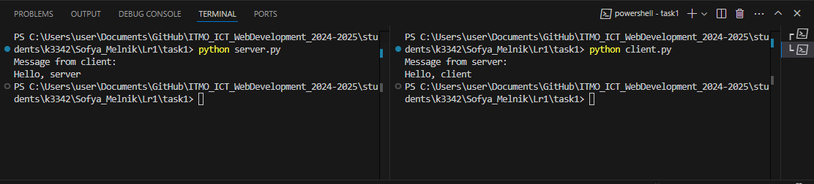

# Задание 1

Реализовать клиентскую и серверную часть приложения. Клиент отправляет серверу сообщение «Hello, server», и оно должно отобразиться на стороне сервера. В ответ сервер отправляет клиенту сообщение «Hello, client», которое должно отобразиться у клиента.

Требования:
Обязательно использовать библиотеку socket.
Реализовать с помощью протокола UDP.

**client.py:**
```python
from socket import socket, AF_INET, SOCK_DGRAM

def client(_Host, _port):

    client = socket(AF_INET, SOCK_DGRAM)
    client.sendto(b'\nHello, server', (_Host, _port))

    response, _ = client.recvfrom(2024)
    print(f'Message from server: {response.decode()}')

    client.close()


if __name__ == '__main__':
    client('localhost', 2024)
```

**server.py:**
```python
from socket import socket, AF_INET, SOCK_DGRAM

def server():
   server = socket(AF_INET, SOCK_DGRAM)
   server.bind(('localhost', 2024))

   message, client_port = server.recvfrom(2024)

   print(f'Message from client: {message.decode()}')

   server.sendto(b'\nHello, client', client_port)
   server.close()

if __name__ == "__main__":
    server()

```


