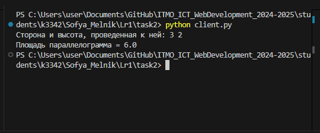

# Задание 2

Реализовать клиентскую и серверную часть приложения. Клиент запрашивает выполнение математической операции, параметры которой вводятся с клавиатуры. Сервер обрабатывает данные и возвращает результат клиенту.

Вариант 4. Поиск площади параллелограмма.

Требования:

Обязательно использовать библиотеку socket.
Реализовать с помощью протокола TCP.

**client.py:**
```python
import socket
import json

server_host = socket.gethostname()
server_port = 8000

input_data = input("Сторона и высота, проведенная к ней: ").strip().split(" ")
side, height = float(input_data[0].strip()), float(input_data[1].strip())


client = socket.socket(socket.AF_INET, socket.SOCK_STREAM)
client.connect((server_host, server_port))
client.send(json.dumps(dict(side=side, height=height)).encode())

response_data = client.recv(1024)

print(f"Площадь параллелограмма = {response_data.decode()}")
client.close()
```

**server.py:**
```python
import socket
import json

host = socket.gethostname()
port = 8000


def server():
    server = socket.socket(socket.AF_INET, socket.SOCK_STREAM)
    server.bind((host, port))
    server.listen(7)

    print(f'http://{host}:{port}')

    while True:
        client, _ = server.accept()
        request_data = client.recv(1024)
        variables = json.loads(request_data)
        square = variables['side'] * variables['height']
        client.send(f"{square}".encode())
        client.close()


if __name__ == "__main__":
    server()
```

