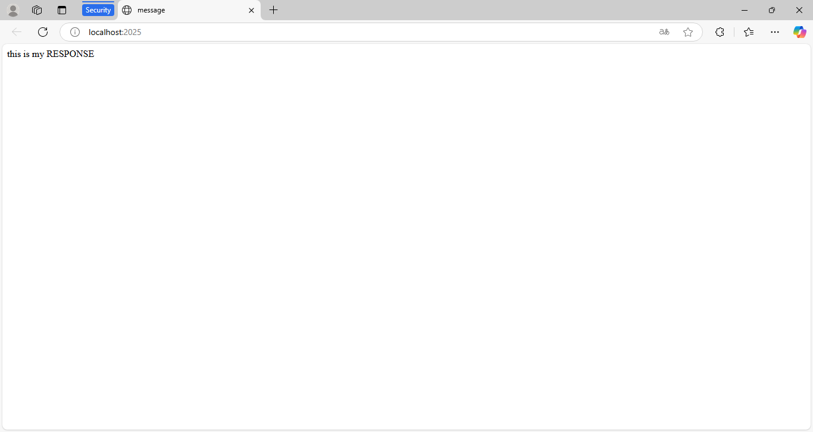

# Задание 3

Реализовать серверную часть приложения. Клиент подключается к серверу, и в ответ получает HTTP-сообщение, содержащее HTML-страницу, которая сервер подгружает из файла index.html.

Требования:

Обязательно использовать библиотеку socket.

**server.py:**
```python
from socket import socket, AF_INET, SOCK_STREAM


def encode_args(*args) -> bytes:
    return (''.join(args) + '\r\n').encode('utf-8')


def server(address: tuple[str, int] = ('localhost', 2024)) -> None:
    server = socket(AF_INET, SOCK_STREAM)
    server.bind(address)
    server.listen(7)

    print(address)
    print(f'http://{address[0]}:{address[1]}')

    headers = [
        'HTTP/1.1 200 OK\r\n',
        'Content-Type: text/html; charset=utf-8\r\n',
        '\r\n'
    ]

    while True:
        try:
            with open('index.html', 'r') as f:
                html = f.read()
            client_socket, client_address = server.accept()
            print(f'Подключен из {client_address}')
            client_socket.recv(1024)
            client_socket.send(encode_args(*headers, *html))
        except KeyboardInterrupt:
            server.close()
            return


if __name__ == '__main__':
    server()
```
**index.html:**
```html
<!DOCTYPE html>
<html lang="en">
<head>
    <meta charset="UTF-8">
    <title>message</title>
</head>
<body>
this is my RESPONSE
</body>
</html>
```

