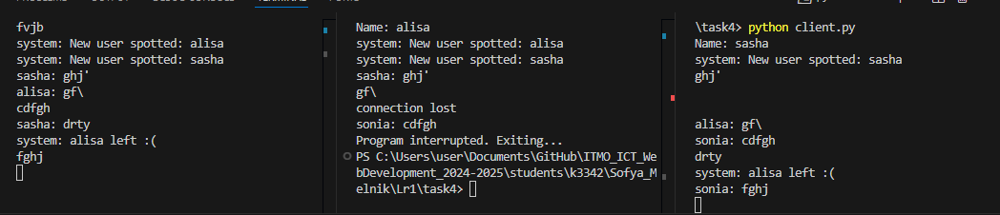

# Задание 4

Реализовать двухпользовательский или многопользовательский чат. Для максимального количества баллов реализуйте многопользовательский чат.

Требования:

Обязательно использовать библиотеку socket.

Для многопользовательского чата необходимо использовать библиотеку threading.


**client.py:**
```python
from socket import socket, AF_INET, SOCK_STREAM
import threading
import sys

active = True


def receive_messages(client_socket: socket) -> None:
    global active
    while active:
        try:
            message = client_socket.recv(1024).decode()
            if message:
                print(message)
            else:
                continue
        except (ConnectionResetError, KeyboardInterrupt):
            active = False
            break


def send_messages(client_socket: socket) -> None:
    global active
    while active:
        try:
            message = input()
            client_socket.send(message.encode('utf-8'))
        except (ConnectionResetError, KeyboardInterrupt, EOFError):
            print('connection lost')
            active = False
            break


def start(socket_address: tuple[str, int] = ('localhost', 2024)) -> None:
    name = input('Name: ')

    client_socket = socket(AF_INET, SOCK_STREAM)
    client_socket.connect(socket_address)
    client_socket.send(name.encode('utf-8'))

    receive_thread = threading.Thread(target=receive_messages, args=(client_socket,))
    receive_thread.start()

    send_thread = threading.Thread(target=send_messages, args=(client_socket,))
    send_thread.start()

    try:
        receive_thread.join()
        send_thread.join()
    except KeyboardInterrupt:
        global active
        active = False
        print("Program interrupted. Exiting...")
        receive_thread.join()
        send_thread.join()
        client_socket.close()
        sys.exit(0)


if __name__ == "__main__":
    try:
        start()
    except KeyboardInterrupt:
        print("Program interrupted. Exiting...")
```

**server.py:**

```python
from socket import socket, AF_INET, SOCK_STREAM
import threading
import sys

clients = {}
lock_clients = threading.Lock()

def broadcast(message: str, current_client: socket = None) -> None:
    for client in clients.keys():
        if current_client is None:
            output = f'system: {message}'
        elif client != current_client:
            output = f'{clients[current_client]}: {message}'
        else:
            continue
        with lock_clients:
            try:
                client.send(output.encode())
            except (BrokenPipeError, ConnectionResetError):
                pass


def handle_client(client_socket: socket):
    name = client_socket.recv(1024).decode()
    with lock_clients:
        clients[client_socket] = name

    broadcast(f"New user spotted: {name}", current_client=None)

    try:
        while True:
            message = client_socket.recv(1024).decode()
            if message:
                broadcast(message, current_client=client_socket)
            else:
                continue
    except (ConnectionResetError, BrokenPipeError, KeyboardInterrupt):
        pass
    finally:
        with lock_clients:
            if client_socket in clients:
                name = clients[client_socket]
                del clients[client_socket]
        client_socket.close()
        broadcast(f"{name} left :(", current_client=None)


def start_server(socket_address: tuple[str, int] = ('localhost', 2024)) -> None:
    server = socket(AF_INET, SOCK_STREAM)
    server.bind(socket_address)
    server.listen()

    print(f"Server listening on {':'.join(map(str, socket_address))}")

    while True:
        try:
            print("Waiting for a connection...")
            client_socket, client_address = server.accept()
            print(f"New connection: {client_address}")

            thread = threading.Thread(target=handle_client, args=(client_socket,))
            thread.start()
        except KeyboardInterrupt:
            print(f'Server closed')
            server.close()
            break
        except Exception as e:
            print(f"Error: {e}")
            continue


if __name__ == "__main__":
    try:
        start_server()
    except KeyboardInterrupt:
        print("Server interrupted. Exiting...")
        sys.exit(0)
```

